# ShadowSpeak User Flow Diagram

## Document Metadata

| Field         | Value             |
| ------------- | ----------------- |
| Project       | ShadowSpeak       |
| Document Type | User Flow Diagram |
| Date          | 2026-05-13        |
| Status        | Draft             |
| Version       | 1.1               |
| Owner         | UX Design         |

## Source Basis

This diagram set is derived from:

- [User Story Documents](../02-analysis/06-user-story/)
- [Use Case Specification](../02-analysis/05-Use-Case-Specification.md)
- [Functional Requirements Specification](../02-analysis/03-Functional-Requirements-Specification.md)

## Scope and Notation

- The diagrams reflect the MVP only: no real-time AI, no speech recognition, no subscriptions, and ad support is limited to non-blocking audio interstitials.
- Screen names are conservative UX labels inferred from the source docs where the specs describe behavior but do not name the screen explicitly.
- Actor tags are shown in the flow labels and in the flow notes below each diagram.
- Decision diamonds in Mermaid represent explicit branches called out by the use cases, functional requirements, or business rules.
- Lesson search is intentionally out of scope for the MVP catalog flow; filtering is the supported discovery pattern in the current source docs.
- Ads are limited to audio interstitials at session boundaries, with no blocking behavior.

## Master Navigation Map

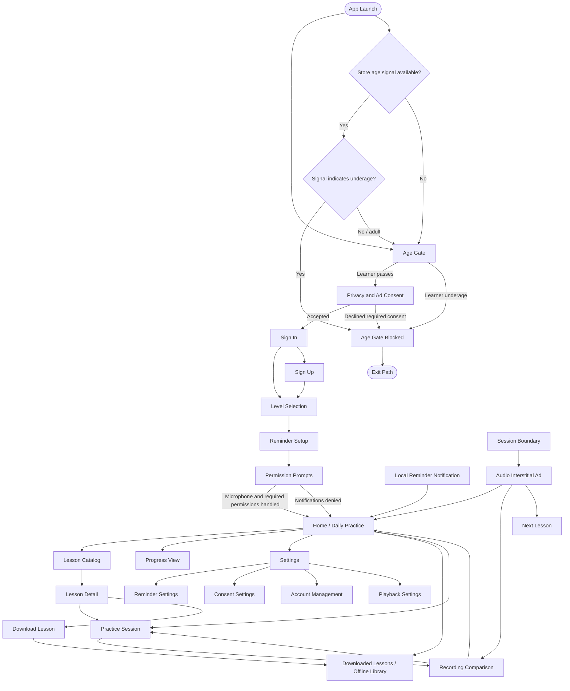

## 1. First-Time Onboarding Flow

**Trigger:** First app open after install.  
**Entry Point:** App Launch.  
**Exit Points:** Home / Daily Practice, Age Gate Blocked, Sign-In Retry, Permission Recovery.  
**Primary Actor:** Learner.  
**Supporting Actors:** Authentication Provider, Mobile OS, Consent Store.

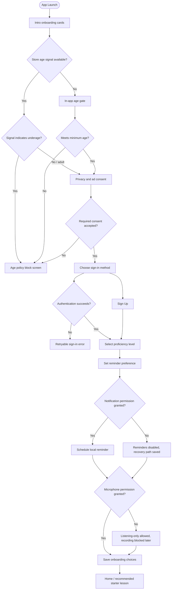

**Decision Points**

- Meets minimum age?
- Store age signal available?
- Store signal indicates underage?
- Required consent accepted?
- Authentication succeeds?
- Notification permission granted?
- Microphone permission granted?

**Actor Notes**

- Learner advances through age gate, consent, sign-in, level selection, and reminder choice.
- A store-provided age signal, when available, can short-circuit the flow before the in-app age gate.
- Authentication Provider validates credentials during sign-in.
- Mobile OS presents microphone and notification permission prompts.
- Consent Store persists age-gate and privacy choices.

**Error and Edge Cases**

- Underage learners are blocked before account creation.
- If a store-provided age signal exists and indicates underage status, the app blocks onboarding before sign-in.
- Sign-in failure keeps the learner on the sign-in step with a retry path.
- Notification denial does not block onboarding; it disables reminders and saves recovery access in Settings.
- Microphone denial does not block listening preview, but it prevents recording until permission is restored.

## 2. Browse and Select a Lesson Flow

**Trigger:** Learner opens Home or Lesson Catalog.  
**Entry Point:** Home / Daily Practice or Lesson Catalog.  
**Exit Points:** Lesson Detail, Practice Session, Downloaded Lessons, Home.  
**Primary Actor:** Learner.  
**Supporting Actor:** Content Service.

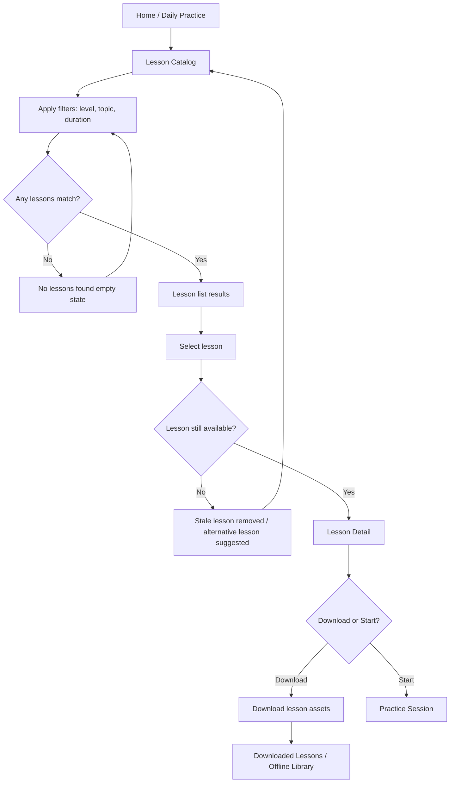

**Decision Points**

- Any lessons match the chosen filters?
- Is the lesson still available?
- Download or start immediately?

**Actor Notes**

- Learner filters the catalog and chooses a lesson.
- Content Service returns lesson metadata, script, and asset availability.
- The app guards against stale or unpublished lessons.

**Error and Edge Cases**

- Empty filter results show a clear empty state and keep filters editable.
- Network loss shows cached lessons if available and marks the online catalog as unavailable.
- Unpublished or deleted lessons cannot launch from stale entry points.

## 3. Shadowing Practice Session Flow

**Trigger:** Learner taps Start on a lesson.  
**Entry Point:** Lesson Detail or Resume Practice.  
**Exit Points:** Recording Comparison, Home, Progress View, Retry / Recovery.  
**Primary Actor:** Learner.  
**Supporting Actors:** Mobile OS, Content Service, Progress Service.

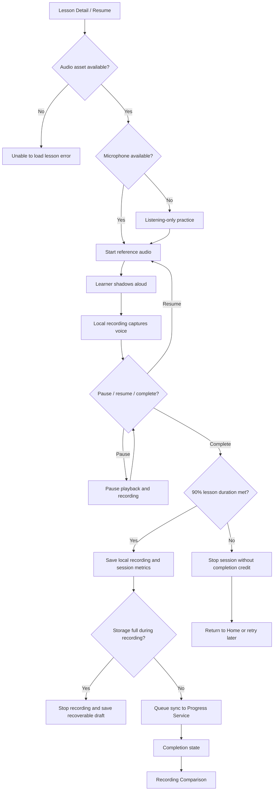

**Decision Points**

- Is the lesson audio available?
- Is the microphone available?
- Pause, resume, or complete?
- Has the lesson reached the 90% completion threshold?
- Does storage fill during recording?

**Actor Notes**

- Learner controls playback and recording.
- Mobile OS enforces audio routing, lock-screen, and interruption behavior.
- Content Service supplies the lesson assets.
- Progress Service receives queued metrics after completion.

**Error and Edge Cases**

- Audio load failure shows a retryable error.
- Microphone denial or revocation allows listening-only practice but blocks recording until recovery.
- Incoming calls, Bluetooth route changes, and backgrounding may pause or safely resume the session.
- Storage exhaustion stops recording while preserving any recoverable draft.
- Network sync failure queues metrics locally for later retry.
- A session only counts as complete once the 90% lesson threshold is met.

## 4. Recording Playback Comparison Flow

**Trigger:** Learner finishes or exits a practice session.  
**Entry Point:** Post-session completion screen.  
**Exit Points:** Home, Progress View, Repeat Practice Session, Next Lesson.  
**Primary Actor:** Learner.  
**Supporting Actor:** Mobile OS.

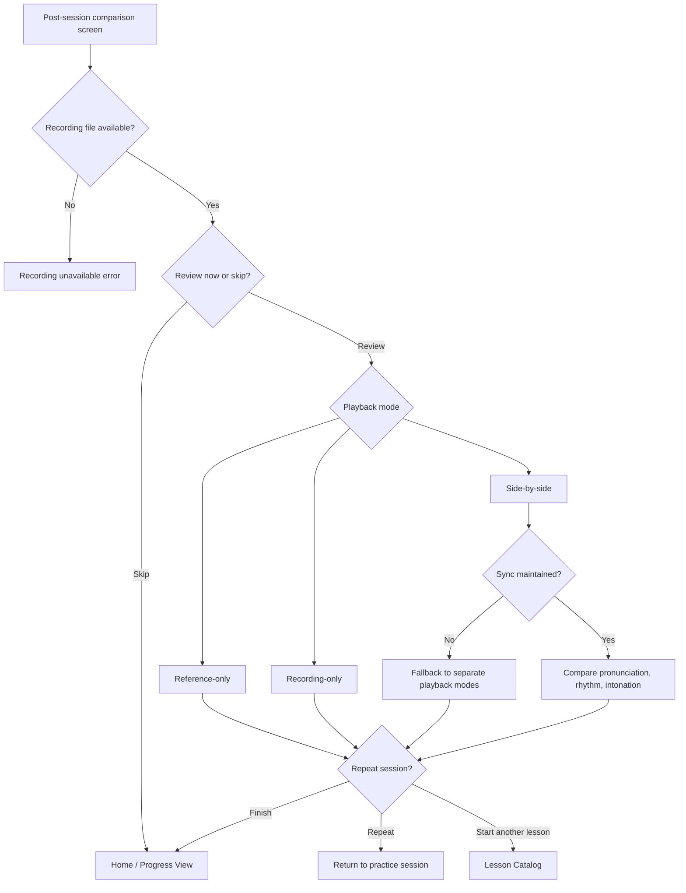

**Decision Points**

- Is the recording file available and valid?
- Does the learner want to review now or skip comparison?
- Which playback mode does the learner choose?
- Can side-by-side sync be maintained?
- Repeat, finish, or start another lesson?

**Actor Notes**

- Learner chooses the comparison mode and reviews the recording manually.
- Mobile OS provides local playback support.

**Error and Edge Cases**

- Missing or corrupted recordings show a clear retry-oriented error.
- If synchronized playback cannot be maintained, the app falls back to separate modes without crashing.
- Skipping comparison is allowed and should not block completion or navigation.

## 5. Returning-User Daily Practice Flow

**Trigger:** Learner opens the app on a later day or taps a reminder notification.  
**Entry Point:** App Launch or Local Reminder Notification.  
**Exit Points:** Practice Session, Progress View, Home, Browse Flow.  
**Primary Actor:** Learner.  
**Supporting Actors:** Progress Service, Content Service, Mobile OS.

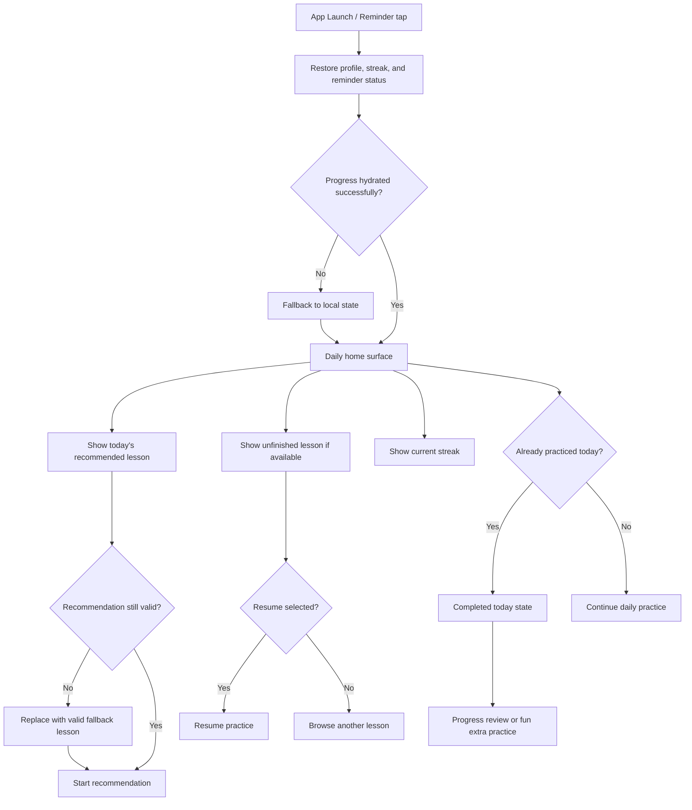

**Decision Points**

- Can the app hydrate progress successfully?
- Is today’s recommendation still valid?
- Resume, start recommendation, or browse another lesson?
- Has the learner already earned today’s streak credit?

**Actor Notes**

- Learner returns to the daily practice surface.
- Progress Service provides streak and completion data when online.
- Content Service validates lesson availability.
- Mobile OS may be the entry point when a local reminder is tapped.

**Error and Edge Cases**

- If backend hydration fails, the app falls back to local state and still offers a valid starter lesson.
- Deleted or unpublished recommendations are replaced before launch.
- The app does not double-count a same-day streak.

### Progress View and Sync Path

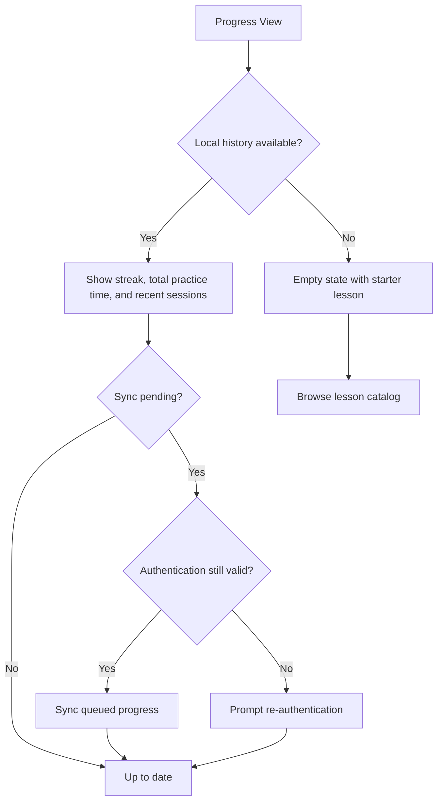

**Decision Points**

- Does local progress history exist?
- Is a sync still pending?
- Is authentication still valid for retry?

**Actor Notes**

- Learner can review progress history at any time from the home surface or after a session.
- Progress Service provides synced streak and history data when the session is online and authenticated.

**Error and Edge Cases**

- First-time or cleared-history users see an explicit empty state with a starter lesson action.
- If sync was queued while offline, the app retries when connectivity and auth return.
- Expired auth should not erase local progress history.

## 6. Offline Lesson Download and Practice Flow

**Trigger:** Learner taps Download on a lesson and later opens it offline.  
**Entry Point:** Lesson Detail or Downloaded Lessons / Offline Library.  
**Exit Points:** Offline Practice Session, Downloaded Lessons, Storage Guidance, Home.  
**Primary Actor:** Learner.  
**Supporting Actors:** Content Service, Mobile OS.

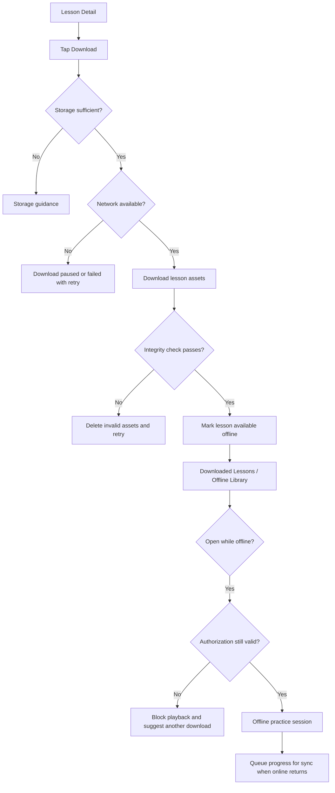

**Decision Points**

- Is storage sufficient?
- Is network available during download?
- Does the integrity check pass?
- Is the offline authorization still valid?

**Actor Notes**

- Learner initiates download and later practices without network connectivity.
- Content Service provides the lesson package.
- Mobile OS stores the files locally and supports offline playback.

**Error and Edge Cases**

- Insufficient storage cancels the download and shows guidance.
- Network drop during download pauses or fails the download with retry.
- Failed integrity checks remove invalid assets.
- Expired authorization or removed content blocks offline launch.
- Metrics remain queued locally until connectivity returns.

## 7. Manage Settings and Reminder Notifications Flow

**Trigger:** Learner opens reminder settings or returns after re-enabling permissions.  
**Entry Point:** Settings / Reminder Settings.  
**Exit Points:** Scheduled Local Reminder, Disabled Reminder State, Home.  
**Primary Actor:** Learner.  
**Supporting Actor:** Mobile OS.

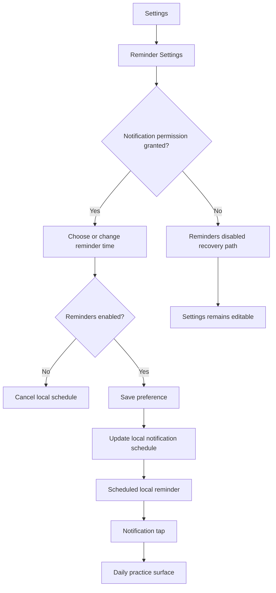

**Decision Points**

- Is notification permission granted?
- Are reminders enabled or disabled?
- What reminder time should be scheduled?

**Actor Notes**

- Learner manages the reminder preference in Settings.
- Mobile OS delivers the local notification at the scheduled time.

**Error and Edge Cases**

- If permission is denied, no reminder is scheduled.
- Disabling reminders cancels the local schedule immediately.
- Re-enabling notifications later should reschedule using the saved local preference.

### Settings and Account Management Path

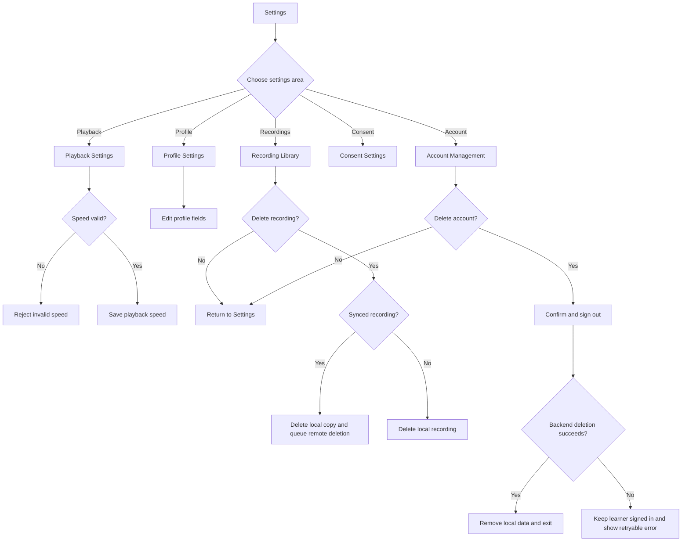

**Decision Points**

- Which settings area did the learner open?
- Is the playback speed value valid?
- Is the selected recording synced?
- Does backend account deletion succeed?

**Actor Notes**

- Learner can manage playback, profile, consent, recordings, and account settings from the same Settings surface.
- Authentication Provider and Progress Service support the destructive account and recording paths.

**Error and Edge Cases**

- Invalid playback speed should be rejected before saving.
- Synced recordings need both a local delete and a queued remote delete.
- Account deletion failures should remain retryable and must not silently sign the learner out.

## 8. Ad Interstitial Flow

**Trigger:** A lesson session reaches the post-completion ad boundary.  
**Entry Point:** Practice Session completion boundary.  
**Exit Points:** Home, Comparison, Next Lesson, Continued Session Flow.  
**Primary Actor:** Learner.  
**Secondary Actor:** Ad Network.  
**Supporting Actors:** Mobile OS, Consent Store.

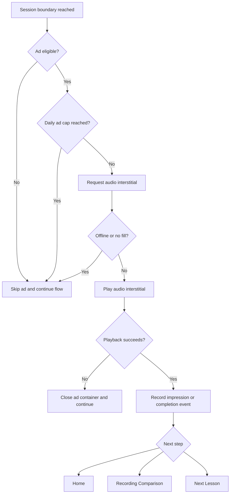

**Decision Points**

- Is the learner eligible for ads under privacy and age rules?
- Is the app offline, at frequency cap, or receiving no fill?
- Does ad playback succeed?
- Where should the learner go after the ad?

**Actor Notes**

- Ad Network supplies the audio interstitial when allowed.
- Learner is not blocked from completion or navigation if the ad fails.
- Consent Store controls whether personalized ad targeting is permitted.

**Error and Edge Cases**

- Offline status skips the request.
- No fill skips the ad and records the result.
- Playback failure closes the container and returns the learner to the app flow.
- Personalized targeting is not used unless age and consent requirements are satisfied.
- Ads are limited to a single non-blocking audio interstitial at the session boundary, capped at 3 per day.

## 9. Cross-Cutting Error and Edge-Case Flows

**Trigger:** Permission denial, audio failure, storage pressure, network loss, or age-gate block.  
**Entry Point:** Any flow where the failure occurs.  
**Exit Points:** Recovery path, retry, Settings, Home, or Exit Path.  
**Primary Actor:** Learner.  
**Supporting Actors:** Mobile OS, Authentication Provider, Content Service, Progress Service.

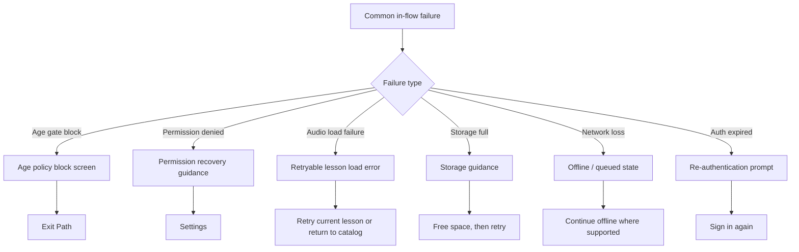

**Decision Points**

- Which failure occurred?
- Can the learner retry immediately?
- Is recovery handled inside the current flow or in Settings?

**Actor Notes**

- The app should never silently fail on consent, permission, or storage issues.
- Mobile OS and authentication services may surface the initial failure condition.
- The app should preserve local state whenever recovery is possible.

**Error and Edge Cases**

- Underage learners are blocked before account creation and before personalized ad consent is requested.
- Permission denials must preserve the path to later recovery in Settings.
- Audio and network failures should be retryable without clearing the learner’s current progress.
- Authentication expiry should preserve queued local progress while prompting re-authentication.

## Assumptions

- `Home / Daily Practice`, `Lesson Catalog`, `Lesson Detail`, `Practice Session`, `Recording Comparison`, `Progress View`, `Settings`, and `Downloaded Lessons / Offline Library` are inferred screen labels used to organize the navigation logic.
- The catalog, comparison, and progress surfaces may be implemented as dedicated screens or as tabs/modals inside a larger home shell, but the navigation behavior remains the same.
- Age-gate and required consent are treated as hard preconditions for account creation and access to practice content.
- Store-provided age signals may be used as a shortcut when available, but the in-app age gate remains the fallback and final decision.
