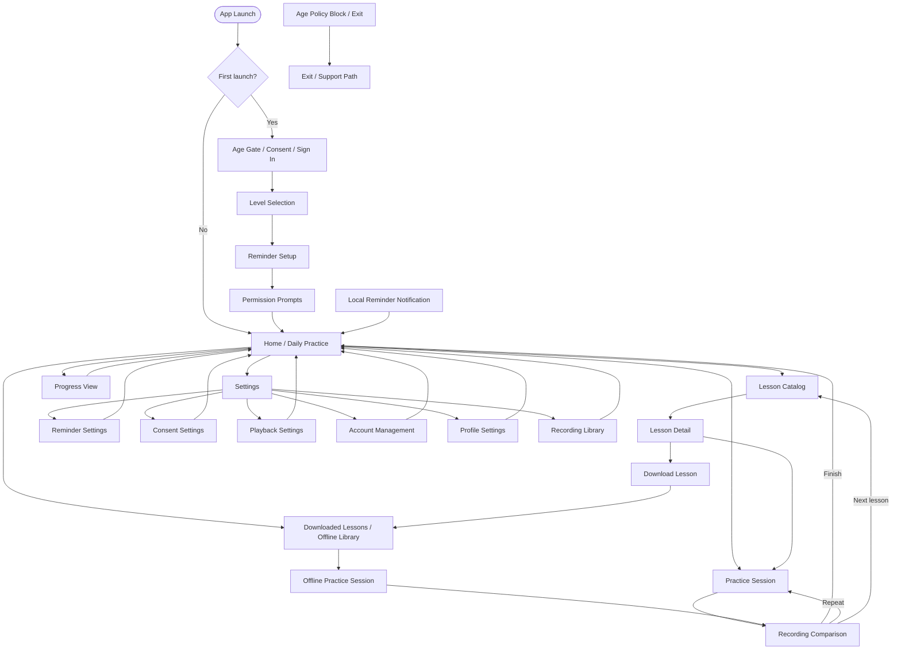

# ShadowSpeak Information Architecture Document

## Document Metadata

| Field | Value |
|-------|-------|
| Project | ShadowSpeak |
| Document Type | Information Architecture Document |
| Date | 2026-05-13 |
| Status | Draft |
| Version | 1.0 |
| Owner | UX Design |

## Source Basis

This IA is derived from:

- [User Flow Diagram](01-User-Flow-Diagram.md)
- [Use Case Specification](../02-analysis/05-Use-Case-Specification.md)
- [Functional Requirements Specification](../02-analysis/03-Functional-Requirements-Specification.md)
- [User Story Document](../02-analysis/06-User-Story-Document.md)

## Scope

### In Scope

- MVP screen structure and navigation hierarchy for iOS and Android
- Home-centered navigation for an audio-first, hands-free practice app
- Lesson discovery, lesson detail, practice, comparison, progress, downloads, reminders, settings, and compliance screens
- Content grouping for lessons, recordings, progress, profile, consent, and offline assets
- Navigation patterns for stack, tab, and modal interactions
- Traceability from screens to use cases and functional requirements
- Metadata and naming conventions for screens and content objects

### Out of Scope

- Real-time AI coaching or pronunciation scoring
- Speech recognition or transcription
- Subscriptions, premium tiers, or in-app purchases
- Social features, leaderboards, sharing, or user-generated content
- Advanced discovery search in the current MVP IA
- Waveform visualization or other advanced comparison tooling
- Server-side push notification campaigns

### Scope Note

The current source set supports browse, filter, recommendation, and download flows for lesson discovery. While the broader FRS mentions search at a high level, the detailed use cases and Phase 3 flow set emphasize filtering and recommendation. This IA follows the detailed MVP behavior and treats global lesson search as a future enhancement rather than a core IA element.

## IA Principles

- Keep Home as the primary orientation surface for returning learners.
- Make audio-first tasks reachable in one or two taps from the main shell.
- Separate compliance and permission recovery from the core practice loop.
- Keep destructive settings actions explicit and recoverable.
- Treat offline access as a first-class path, not a fallback edge case.
- Keep labels short, concrete, and consistent across screens and content types.

## Screen Taxonomy

### 1. Entry, Compliance, and Onboarding

| Screen | Description | Primary Function |
|--------|-------------|------------------|
| App Launch | Startup state while the app resolves age, consent, and session state. | Route to onboarding or home |
| Age Gate | Self-attested age confirmation when no store signal is available. | Enforce minimum age |
| Age Policy Block | Blocking screen for underage users or failed eligibility. | Stop access and offer support path |
| Privacy and Ad Consent | Consent capture for privacy and ad targeting choices. | Record legal and monetization consent |
| Sign In | Email/social authentication entry. | Authenticate learner |
| Level Selection | Choose proficiency level. | Seed recommendation and practice difficulty |
| Reminder Setup | Choose reminder preference during onboarding. | Schedule local reminder |
| Permission Prompts | Microphone and notification permission handling. | Restore access to practice and reminders |

### 2. Core Daily Practice

| Screen | Description | Primary Function |
|--------|-------------|------------------|
| Home / Daily Practice | Primary landing screen with recommendation, streak, and current action. | Orient the learner and drive the next step |
| Lesson Catalog | Lesson discovery surface with filters and recommended content. | Browse and filter lessons |
| Lesson Detail | Detail view for a selected lesson. | Review metadata and start or download |
| Practice Session | Active audio-first practice state. | Play reference audio and capture recording |
| Recording Comparison | Post-session playback and manual self-comparison. | Review recording against reference audio |
| Progress View | History, streak, and completion summary. | Show retention and progress status |

### 3. Offline and Return Paths

| Screen | Description | Primary Function |
|--------|-------------|------------------|
| Downloaded Lessons / Offline Library | Library of locally stored lessons. | Access downloaded content offline |
| Offline Practice Session | Practice mode when a downloaded lesson is opened offline. | Continue practice without network |
| Local Reminder Notification | OS-delivered reminder entry point that deep-links into the app. | Return learner to daily practice |

### 4. Settings and Control

| Screen | Description | Primary Function |
|--------|-------------|------------------|
| Settings | Primary control center for preferences and account actions. | Manage app configuration |
| Reminder Settings | Reminder-specific preference management. | Edit local schedule |
| Consent Settings | Privacy and ad consent management. | Review or change stored consent |
| Playback Settings | Audio playback speed and related controls. | Tune listening experience |
| Account Management | Sign-out, account deletion, and profile-related account actions. | Manage account lifecycle |
| Profile Settings | Learner profile and preference fields. | Update user profile data |
| Recording Library | Saved recordings and deletion actions. | Manage local and synced recordings |

### 5. Recovery and Support

| Screen | Description | Primary Function |
|--------|-------------|------------------|
| Retryable Error States | Contextual error surfaces for audio, auth, storage, or network failures. | Preserve state and offer recovery |
| Exit / Support Path | Final blocked path for underage or non-recoverable onboarding outcomes. | Exit or direct to support |

## Navigation Architecture

### Primary Navigation Model

- The app uses a **home-centered tab shell** for the MVP.
- The shell prioritizes fast returns to practice while keeping the number of top-level destinations small.
- Recommended top-level tabs:
  - Home
  - Lessons
  - Downloads
  - Progress
  - Settings

### Hierarchy Depth

- Depth 0: App Launch and blocking compliance states
- Depth 1: Home shell tabs and primary landing surfaces
- Depth 2: Detail pages, practice sessions, and settings subsections
- Depth 3: Destructive or recovery confirmations, where needed

### Navigation Patterns

- **Tab navigation** for the main shell
- **Stack navigation** for lesson detail, practice, comparison, and settings subsections
- **Modal or full-screen blocking states** for age gate, consent, permissions, and critical errors
- **Deep link navigation** from reminder notifications into Home or the current daily practice surface
- **Return navigation** from comparison, progress, and downloads back to Home or the originating lesson

### Key IA Rules

- Practice and comparison must always remain reachable from lesson detail or the home recommendation.
- Settings must be accessible from the shell without forcing a lesson flow interruption.
- Downloads must be reachable both from lesson detail and from the dedicated offline library.
- Compliance and recovery states should never masquerade as normal content screens.

## Content Inventory

| Content Type | Core Attributes | Relationships |
|--------------|-----------------|---------------|
| Lesson | lesson ID, title, level, topic, duration, description, script, audio URL, download eligibility, availability status | Belongs to catalog, may be downloaded, can generate practice sessions |
| Lesson Metadata | level, topic, duration, difficulty, recommendation rank, availability | Attached to lesson and used in catalog and home recommendation |
| Lesson Asset Package | reference audio, script, cover image, checksum, version, file size | Stored locally when downloaded; tied to a lesson |
| Practice Session | session ID, lesson ID, start time, end time, duration, completion state, interruption state | Produces recording, progress metrics, and comparison entry |
| Recording | recording ID, session ID, local file path, sync status, retention status | Attached to a practice session and accessible in recordings / comparison |
| Progress Record | streak, practice minutes, completion count, recent sessions, sync queue state | Derived from completed sessions and shown in Progress View |
| Reminder Preference | reminder enabled flag, time of day, permission state, last scheduled time | Drives local notification schedule |
| Consent Record | age status, privacy consent, ad consent, consent timestamp, source | Required for onboarding and ad eligibility |
| User Profile | display name, email, level, preferences, account status | Used in onboarding, settings, and home personalization |
| Download Record | lesson ID, download state, local storage path, checksum status, last verified time | Powers offline library and offline practice access |
| Error Record | error type, context, retryability, timestamp | Used by recovery screens and support flows |

### Content Relationships

- A lesson can have many practice sessions.
- A practice session can produce one recording and one progress record.
- A lesson may exist in both online catalog form and downloaded offline form.
- A consent record governs age eligibility and personalized ad behavior.
- Reminder preference determines whether the OS schedules a local notification.

## Information Hierarchy

### Home / Daily Practice

1. Today’s recommendation or resume action
2. Current streak and progress status
3. Unfinished lesson or last practice action
4. Secondary shortcuts: Lessons, Downloads, Progress, Settings

### Lesson Catalog

1. Recommended lesson and filter state
2. Filtered lesson list
3. Lesson cards with level, topic, and duration
4. Empty state or offline state

### Lesson Detail

1. Start practice action
2. Download action
3. Lesson metadata
4. Supporting description and availability state

### Practice Session

1. Reference audio playback state
2. Recording state and controls
3. Lesson progress or completion state
4. Interruptions and recovery cues

### Recording Comparison

1. Skip or continue decision
2. Playback mode selection
3. Manual self-comparison controls
4. Repeat, finish, or next lesson action

### Progress View

1. Streak and total practice minutes
2. Recent sessions and completion history
3. Sync state and retry status
4. Empty state starter action

### Downloads / Offline Library

1. Offline-available lessons
2. Storage and verification status
3. Open or manage downloaded content
4. Recovery if content is stale or invalid

### Settings

1. Playback settings
2. Reminder settings
3. Consent settings
4. Profile and account management
5. Recording management

## Search & Discovery Architecture

- **Primary discovery pattern:** recommendations plus filters.
- **Filter dimensions:** level, topic, duration.
- **Entry points:** Home / Daily Practice and Lesson Catalog.
- **Empty-state behavior:** show a clear empty state with editable filters and a reset path.
- **Recommendation behavior:** the home surface should always show a recommended next action when one is available.
- **Offline discovery:** downloaded lessons remain visible in the offline library even when the online catalog is unavailable.
- **Deferred capability:** global lesson search is not part of the current MVP IA. If added later, it should live in the Lessons area and reuse the same lesson metadata hierarchy.

## Offline Content Architecture

### Offline Organization

- Offline content is organized by lesson, not by session.
- Each downloaded lesson includes:
  - Lesson metadata
  - Reference audio
  - Script
  - Integrity checksum
  - Download status
  - Version marker

### Offline Access Rules

- Only downloaded lessons may be opened offline.
- An offline lesson must be verified before playback when possible.
- If the lesson is stale, removed, or invalid, the app should block playback and route the learner to another valid lesson.
- Practice progress created offline should queue locally and sync when connectivity and auth return.

### Offline Surface

- The offline library should make it obvious which lessons are ready to play.
- The screen should support both browse and manage actions.
- Storage guidance should be displayed when download limits are reached.

## Metadata & Labeling

### Screen Labeling Rules

- Use noun-based, learner-facing labels.
- Keep labels short and consistent across tabs, headers, and flow nodes.
- Prefer `Home / Daily Practice` over multiple variants of the same home concept.
- Use `Lesson Catalog`, `Lesson Detail`, `Practice Session`, `Recording Comparison`, `Progress View`, `Downloads / Offline Library`, and `Settings` as canonical labels.

### Content Labeling Rules

- Use `lesson`, `session`, `recording`, `progress`, `consent`, and `download` as canonical content nouns.
- Use `available`, `queued`, `synced`, `pending`, `blocked`, and `stale` as status descriptors.
- Use `starter lesson` only for a recommended first action, not as a content type.

### Navigation Labeling Rules

- Tabs should use simple destination names: `Home`, `Lessons`, `Downloads`, `Progress`, `Settings`.
- Secondary settings pages should use action labels, such as `Reminder Settings`, `Consent Settings`, or `Playback Settings`.
- Blocking states should be explicit: `Age Policy Block`, `Retryable Error`, `Permission Recovery`.

## Navigation Map

## Traceability

| Screen / Area | Related Use Cases | Related Functional Requirements |
|---------------|-------------------|----------------------------------|
| App Launch, Age Gate, Consent, Sign In | UC-01, UC-11 | FR-1, FR-8, FR-9 |
| Home / Daily Practice | UC-05, UC-08 | FR-5, FR-8 |
| Lesson Catalog | UC-02 | FR-2, FR-7 |
| Lesson Detail | UC-02, UC-03 | FR-2, FR-3 |
| Practice Session | UC-03 | FR-3, FR-5 |
| Recording Comparison | UC-04, UC-03 | FR-4 |
| Progress View | UC-05, UC-08 | FR-5, FR-8 |
| Downloads / Offline Library | UC-06, UC-02 | FR-7 |
| Reminder Settings | UC-07 | FR-8 |
| Consent Settings | UC-11 | FR-9, FR-6 |
| Playback Settings | UC-10 | FR-8 |
| Account Management | UC-10 | FR-8 |
| Profile Settings | UC-10 | FR-8 |
| Recording Library | UC-10 | FR-4, FR-8 |
| Error and Recovery States | UC-03, UC-06, UC-08, UC-10, UC-11 | FR-1, FR-3, FR-4, FR-5, FR-7, FR-8, FR-9 |

## Design Notes

- The IA assumes a thin, fast shell optimized for daily repetition rather than exploration-heavy browsing.
- Home should always answer the question: "What should I do next?"
- Lessons and downloads should feel like two views of the same content system, not separate products.
- Settings should be easy to reach but never visually dominant over the practice loop.
- Recovery states should preserve local progress and context whenever possible.

