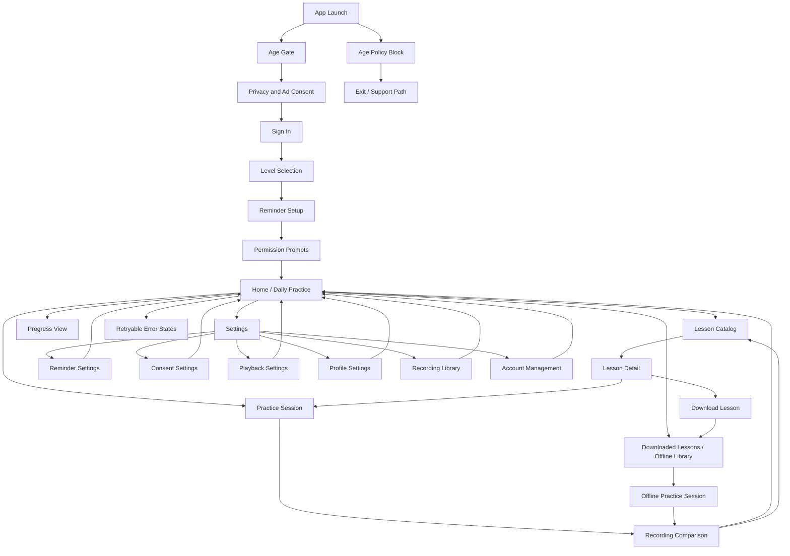

# ShadowSpeak Wireframe Document

## Document Metadata

| Field | Value |
|-------|-------|
| Project | ShadowSpeak |
| Document Type | Wireframe Document |
| Date | 2026-05-13 |
| Status | Draft |
| Version | 1.0 |
| Owner | UX Design |

## Source Basis

This wireframe set is derived from:

- [User Flow Diagram](01-User-Flow-Diagram.md)
- [Information Architecture Document](02-Information-Architecture-Document.md)
- [Use Case Specification](../02-analysis/05-Use-Case-Specification.md)
- [Functional Requirements Specification](../02-analysis/03-Functional-Requirements-Specification.md)
- [User Story Document](../02-analysis/06-User-Story-Document.md)

## Scope

### In Scope

- Low-fidelity screen-by-screen layouts for the MVP screens defined in the IA
- Component placement, hierarchy, navigation, and state handling
- Audio-first interaction patterns and hands-free practice cues
- Offline practice, downloads, reminders, consent, and recovery states
- Traceability back to the user flow and IA documents

### Out of Scope

- High-fidelity visual design
- Typography, color, iconography, and branding polish
- Motion design beyond basic state transitions
- Real-time AI coaching, pronunciation scoring, or speech recognition
- Social features, subscriptions, and premium-only flows

## Wireframe Conventions

- `Top bar` means the screen header with title and back action where applicable.
- `Bottom tabs` means the home-centered shell tab bar used on the main app surfaces.
- `Primary CTA` means the largest action on the screen and the one most likely to be used next.
- `Secondary action` means a smaller supportive action, such as browse, skip, or edit.
- `Blocking states` mean full-screen compliance or error surfaces that replace the normal shell.
- `Audio-first` means the screen should work well with minimal tapping and short screen sessions.
- `Hands-free` means the learner can start, pause, resume, and finish a session with large, obvious controls.

## Wireframe Index Map



## Shared Shell Pattern

The following shell is used for the core app surfaces after onboarding: Home, Lesson Catalog, Lesson Detail, Downloads, Progress, and Settings.

```text
+--------------------------------------------------+
| Top bar: [Back?] Screen Title                    |
|--------------------------------------------------|
| Main content area                                |
|                                                  |
|                                                  |
|                                                  |
|--------------------------------------------------|
| Optional inline actions / empty state / cards    |
|--------------------------------------------------|
| Bottom tabs: Home | Lessons | Downloads |        |
|             Progress | Settings                  |
+--------------------------------------------------+
```

## 1. Entry, Compliance, and Onboarding

### 1.1 App Launch

Purpose: Resolve session state, age/consent readiness, and route to the correct next screen.

```text
+--------------------------------------------------+
| App Launch                                       |
|--------------------------------------------------|
| Brand / loading indicator                        |
| "Checking your setup..."                         |
|                                                  |
| Short status text for age / consent / session    |
|--------------------------------------------------|
| No actions unless loading fails                  |
+--------------------------------------------------+
```

| Placement | Component |
|-----------|-----------|
| Center | Loading indicator and status text |
| Bottom | Optional retry if startup fails |

| State | Behavior |
|-------|----------|
| Loading | App resolves age, consent, and session state |
| Error | Show retryable startup error |
| Success | Route to onboarding or Home |

Audio-first note: keep this screen brief so the learner reaches the practice flow quickly.

### 1.2 Age Gate

Purpose: Confirm age eligibility when no store signal is available.

```text
+--------------------------------------------------+
| Back | Age Gate                                  |
|--------------------------------------------------|
| Short explanation of eligibility requirement     |
| Age input / confirmation control                  |
| Legal/help copy                                   |
|--------------------------------------------------|
| Primary CTA: Continue                             |
| Secondary CTA: Exit / Support                    |
+--------------------------------------------------+
```

| Placement | Component |
|-----------|-----------|
| Top | Back action and title |
| Middle | Age attestation control and explanation |
| Bottom | Continue and support actions |

| State | Behavior |
|-------|----------|
| Default | Learner confirms age and continues |
| Validation error | Show in-place age requirement message |
| Success | Route to Privacy and Ad Consent |

Audio-first note: keep the copy short and readable on a small screen.

### 1.3 Age Policy Block

Purpose: Block onboarding for underage learners and route them to support.

```text
+--------------------------------------------------+
| Age Policy Block                                |
|--------------------------------------------------|
| Blocking message                                 |
| Brief reason for restriction                     |
|--------------------------------------------------|
| Primary CTA: Exit                                |
| Secondary CTA: Support                            |
+--------------------------------------------------+
```

| Placement | Component |
|-----------|-----------|
| Center | Eligibility block message |
| Bottom | Exit and support actions |

| State | Behavior |
|-------|----------|
| Default | Inform learner the app cannot continue |
| Support path | Open exit/support flow |

Audio-first note: this should be a dead-end state with no practice navigation.

### 1.4 Privacy and Ad Consent

Purpose: Capture required privacy and ad consent before account creation continues.

```text
+--------------------------------------------------+
| Back | Privacy and Ad Consent                    |
|--------------------------------------------------|
| Consent explanation                              |
| Consent toggles / choices                        |
| Support copy                                    |
|--------------------------------------------------|
| Primary CTA: Accept and Continue                 |
| Secondary CTA: Decline and Exit                  |
+--------------------------------------------------+
```

| Placement | Component |
|-----------|-----------|
| Top | Back action and title |
| Middle | Consent copy and choices |
| Bottom | Accept / decline actions |

| State | Behavior |
|-------|----------|
| Default | Learner accepts or declines consent |
| Declined required consent | Block onboarding |
| Success | Route to Sign In |

Audio-first note: consent text must remain concise enough to scan quickly.

### 1.5 Sign In

Purpose: Authenticate the learner through email/password or social sign-in.

```text
+--------------------------------------------------+
| Back | Sign In                                   |
|--------------------------------------------------|
| Email field                                      |
| Password field                                   |
| Social sign-in buttons                           |
| Forgot password / help link                      |
|--------------------------------------------------|
| Primary CTA: Sign In                             |
| Secondary CTA: Create account / Switch method    |
+--------------------------------------------------+
```

| Placement | Component |
|-----------|-----------|
| Top | Back action and title |
| Middle | Credential fields and social options |
| Bottom | Sign in CTA and helper actions |

| State | Behavior |
|-------|----------|
| Loading | Show signing-in state |
| Error | Keep fields visible and show retryable error |
| Success | Route to Level Selection |

Audio-first note: minimize typing where possible and keep error copy short.

### 1.6 Level Selection

Purpose: Capture proficiency level to seed the first recommendation.

```text
+--------------------------------------------------+
| Back | Level Selection                           |
|--------------------------------------------------|
| Short guidance                                  |
| Level cards or picker                            |
| Recommendation hint                              |
|--------------------------------------------------|
| Primary CTA: Continue                             |
| Secondary CTA: Skip / choose later               |
+--------------------------------------------------+
```

| Placement | Component |
|-----------|-----------|
| Middle | Level choice cards or segmented control |
| Bottom | Continue action |

| State | Behavior |
|-------|----------|
| Default | Pick a level and continue |
| Error | Highlight required choice |
| Success | Route to Reminder Setup |

Audio-first note: use a simple choice set, not a dense form.

### 1.7 Reminder Setup

Purpose: Capture local reminder preference during onboarding.

```text
+--------------------------------------------------+
| Back | Reminder Setup                            |
|--------------------------------------------------|
| Reminder explanation                             |
| Time picker / enable toggle                      |
| Permission note                                  |
|--------------------------------------------------|
| Primary CTA: Continue                             |
| Secondary CTA: Skip reminders                    |
+--------------------------------------------------+
```

| Placement | Component |
|-----------|-----------|
| Middle | Reminder toggle and time picker |
| Bottom | Continue / skip actions |

| State | Behavior |
|-------|----------|
| Enabled | Save preferred time |
| Disabled | Continue without reminder |
| Success | Route to Permission Prompts |

Audio-first note: reminders are a support feature, not a prerequisite for practice.

### 1.8 Permission Prompts

Purpose: Handle notification and microphone permissions before the learner enters the main shell.

```text
+--------------------------------------------------+
| Permission Prompts                               |
|--------------------------------------------------|
| Permission card 1: Notifications                |
| Permission card 2: Microphone                   |
| Recovery copy / explanation                     |
|--------------------------------------------------|
| Primary CTA: Continue                            |
| Secondary CTA: Open Settings                    |
+--------------------------------------------------+
```

| Placement | Component |
|-----------|-----------|
| Middle | Permission cards and rationale |
| Bottom | Continue and settings actions |

| State | Behavior |
|-------|----------|
| Permission granted | Save and continue |
| Notification denied | Continue with reminders disabled |
| Microphone denied | Continue with listening-only capability |

Audio-first note: microphone permission may be deferred just-in-time in implementation, but the wireframe should still show the recovery path.

## 2. Core Daily Practice

### 2.1 Home / Daily Practice

Purpose: Orchestrate the learner’s next action, daily recommendation, and streak status.

```text
+--------------------------------------------------+
| Home / Daily Practice                            |
|--------------------------------------------------|
| [Daily recommendation card]                      |
| [Streak / progress summary card]                 |
| [Resume unfinished lesson card]                  |
|--------------------------------------------------|
| Primary CTA: Start practice                      |
| Secondary CTA row: Lessons | Downloads |         |
| Progress | Settings                              |
|--------------------------------------------------|
| Bottom tabs                                      |
+--------------------------------------------------+
```

| Placement | Component |
|-----------|-----------|
| Top | Home title and optional reminder status |
| Upper content | Recommendation card |
| Mid content | Streak, resume, and progress cards |
| Bottom | Shell tabs |

| State | Behavior |
|-------|----------|
| Loading | Skeleton cards while progress hydrates |
| Empty | Show starter lesson and first-step guidance |
| Offline | Show cached recommendation and local state |
| Error | Surface retryable sync or hydration error |

Audio-first note: the recommendation card should be the largest tap target on the screen.

### 2.2 Lesson Catalog

Purpose: Let learners browse and filter lessons quickly.

```text
+--------------------------------------------------+
| Back | Lesson Catalog                            |
|--------------------------------------------------|
| Recommendation strip                              |
| Filter chips: Level | Topic | Duration           |
| Search not shown in MVP                           |
|--------------------------------------------------|
| Lesson list                                       |
|  - Lesson card                                    |
|  - Lesson card                                    |
|  - Lesson card                                    |
|--------------------------------------------------|
| Bottom tabs                                      |
+--------------------------------------------------+
```

| Placement | Component |
|-----------|-----------|
| Top | Title and back navigation |
| Upper content | Recommendation strip and filter chips |
| Middle | Scrollable lesson cards |
| Bottom | Shell tabs |

| State | Behavior |
|-------|----------|
| Loading | Show catalog skeletons |
| Empty | Show no-results state with editable filters |
| Offline | Show cached lessons and offline note |
| Error | Show retry and catalog recovery path |

Audio-first note: keep filters compact and accessible with one-handed interaction.

### 2.3 Lesson Detail

Purpose: Present lesson summary and give direct paths to start or download.

```text
+--------------------------------------------------+
| Back | Lesson Detail                             |
|--------------------------------------------------|
| Lesson title / level / duration                  |
| Short description                                |
| Audio / script availability                      |
|--------------------------------------------------|
| Primary CTA: Start practice                      |
| Secondary CTA: Download lesson                   |
| Secondary CTA: Back to catalog                   |
+--------------------------------------------------+
```

| Placement | Component |
|-----------|-----------|
| Top | Back action and title |
| Middle | Metadata and preview summary |
| Bottom | Start and download actions |

| State | Behavior |
|-------|----------|
| Default | Show lesson metadata and actions |
| Stale lesson | Replace with valid lesson choice |
| Downloaded | Show downloaded badge / status |
| Error | Show retry if asset data fails to load |

Audio-first note: the primary action should be obvious and high priority.

### 2.4 Practice Session

Purpose: Support the audio-first practice loop with minimal screen interaction.

```text
+--------------------------------------------------+
| Practice Session                                 |
|--------------------------------------------------|
| Lesson title / timer / progress                  |
| Reference audio status                           |
| Large central control: Play / Pause / Resume     |
|--------------------------------------------------|
| Recording status / mic indicator                 |
| Script / cue text                                 |
| Large action strip: Repeat | Pause | Finish      |
|--------------------------------------------------|
| Optional bottom sheet: lock-screen / route notes |
+--------------------------------------------------+
```

| Placement | Component |
|-----------|-----------|
| Top | Title, timer, and progress |
| Center | Large playback control |
| Lower center | Recording and cue status |
| Bottom | Hands-free action strip |

| State | Behavior |
|-------|----------|
| Loading | Show audio loading state |
| Recording | Highlight mic and recording state |
| Paused | Show paused playback and resume CTA |
| Error | Retryable lesson load / recording error |
| Offline | Allow downloaded-offline practice if available |

Audio-first note: the largest control should always be the next likely audio action.

### 2.5 Practice Session State Variants

The practice screen needs explicit low-fidelity variants for the main edge states.

```text
Loading
+--------------------------------------------------+
| Loading lesson audio...                          |
|--------------------------------------------------|
| Skeleton progress                                 |
| Disabled controls                                 |
+--------------------------------------------------+

Error
+--------------------------------------------------+
| Unable to load lesson                             |
|--------------------------------------------------|
| Retry button                                      |
| Return to catalog button                          |
+--------------------------------------------------+

Offline
+--------------------------------------------------+
| Offline practice available                        |
|--------------------------------------------------|
| Downloaded lesson badge                           |
| Continue button                                   |
+--------------------------------------------------+
```

### 2.6 Recording Comparison

Purpose: Let learners manually compare their recording with the reference audio.

```text
+--------------------------------------------------+
| Back | Recording Comparison                      |
|--------------------------------------------------|
| Recording available status                       |
|--------------------------------------------------|
| Playback mode selector                            |
|   Reference-only | Recording-only | Side-by-side |
|--------------------------------------------------|
| Playback controls                                 |
| Compare notes / timeline                         |
|--------------------------------------------------|
| Primary CTA: Continue                             |
| Secondary CTA: Skip comparison                   |
| Secondary CTA: Repeat session                    |
+--------------------------------------------------+
```

| Placement | Component |
|-----------|-----------|
| Top | Title and back action |
| Middle | Playback mode selector |
| Lower middle | Comparison playback controls and notes |
| Bottom | Continue, skip, repeat actions |

| State | Behavior |
|-------|----------|
| Recording missing | Show retry-oriented error |
| Sync unavailable | Fall back to separate playback modes |
| Skip selected | Continue without forcing review |

Audio-first note: keep comparison optional and fast to exit.

### 2.7 Progress View

Purpose: Show streak, practice history, and sync status.

```text
+--------------------------------------------------+
| Back | Progress View                             |
|--------------------------------------------------|
| Streak summary                                   |
| Practice minutes / completed lessons             |
|--------------------------------------------------|
| Recent sessions list                             |
| Sync status / retry note                         |
|--------------------------------------------------|
| Primary CTA: Start a lesson                      |
| Secondary CTA: View downloads                    |
+--------------------------------------------------+
```

| Placement | Component |
|-----------|-----------|
| Top | Title and back action |
| Upper content | Streak summary |
| Mid content | Recent sessions and stats |
| Bottom | Start lesson and downloads actions |

| State | Behavior |
|-------|----------|
| Loading | Hydrating progress data |
| Empty | Show starter lesson and no-history state |
| Sync pending | Show retry / queued state |
| Error | Preserve local progress and surface retry |

Audio-first note: progress is support content, not the main loop.

## 3. Offline and Return Paths

### 3.1 Downloaded Lessons / Offline Library

Purpose: Provide access to lessons that have been downloaded for offline practice.

```text
+--------------------------------------------------+
| Back | Downloaded Lessons / Offline Library      |
|--------------------------------------------------|
| Offline storage summary                          |
| Downloaded lesson cards                          |
| Verification / stale status                      |
|--------------------------------------------------|
| Primary CTA: Open lesson                         |
| Secondary CTA: Manage downloads                  |
|--------------------------------------------------|
| Bottom tabs                                      |
+--------------------------------------------------+
```

| Placement | Component |
|-----------|-----------|
| Top | Title and storage summary |
| Middle | Downloaded lesson cards |
| Bottom | Manage and open actions |

| State | Behavior |
|-------|----------|
| Empty | Show no downloaded lessons state |
| Offline | Normal operation with local content |
| Invalid | Block playback and point to another download |
| Error | Show storage / verification recovery |

Audio-first note: downloaded content should feel directly playable, not buried behind management UI.

### 3.2 Offline Practice Session

Purpose: Let the learner continue practice without network connectivity.

```text
+--------------------------------------------------+
| Back | Offline Practice Session                 |
|--------------------------------------------------|
| Offline badge / lesson title                     |
| Reference audio status                           |
| Large play / pause control                       |
|--------------------------------------------------|
| Recording status                                 |
| Minimal cue text                                 |
| Finish / save controls                           |
+--------------------------------------------------+
```

| Placement | Component |
|-----------|-----------|
| Top | Offline badge and title |
| Center | Large audio control |
| Lower center | Recording status |
| Bottom | Finish and save actions |

| State | Behavior |
|-------|----------|
| Offline available | Continue normally |
| Authorization invalid | Block and suggest another download |
| Sync queued | Save progress locally |

Audio-first note: the learner should be able to start immediately after opening a downloaded lesson.

### 3.3 Local Reminder Notification

Purpose: Deep-link the learner back into the app at the reminder time.

```text
+--------------------------------------------------+
| Local Reminder Notification                      |
|--------------------------------------------------|
| Notification title                               |
| Reminder message                                 |
|--------------------------------------------------|
| Tap target opens Home / Daily Practice           |
| Optional dismiss action                          |
+--------------------------------------------------+
```

| Placement | Component |
|-----------|-----------|
| Whole surface | OS notification card |

| State | Behavior |
|-------|----------|
| Delivered | Tapping routes to Home |
| Dismissed | No app state change |

Audio-first note: this is a return path, not a content screen.

## 4. Settings and Control

### 4.1 Settings

Purpose: Act as the control center for preferences, consent, account, and recording management.

```text
+--------------------------------------------------+
| Settings                                         |
|--------------------------------------------------|
| Playback Settings                                |
| Reminder Settings                                |
| Consent Settings                                 |
| Profile Settings                                 |
| Recording Library                                |
| Account Management                               |
|--------------------------------------------------|
| Bottom tabs                                      |
+--------------------------------------------------+
```

| Placement | Component |
|-----------|-----------|
| Top | Title |
| Middle | Settings category list |
| Bottom | Shell tabs |

| State | Behavior |
|-------|----------|
| Default | Show all settings entry points |
| Offline | Keep local settings accessible |
| Error | Preserve current state and show retry if needed |

Audio-first note: settings should be accessible but secondary to practice.

### 4.2 Reminder Settings

Purpose: Edit reminder time and permission state.

```text
+--------------------------------------------------+
| Back | Reminder Settings                         |
|--------------------------------------------------|
| Current reminder status                          |
| Time picker / enable toggle                      |
| Permission recovery note                         |
|--------------------------------------------------|
| Primary CTA: Save changes                        |
| Secondary CTA: Disable reminders                 |
+--------------------------------------------------+
```

| Placement | Component |
|-----------|-----------|
| Top | Back and title |
| Middle | Time picker and status |
| Bottom | Save / disable actions |

| State | Behavior |
|-------|----------|
| Permission denied | Show recovery path |
| Disabled | Cancel local schedule |
| Success | Return to Settings or Home |

Audio-first note: remind the learner this is a local device schedule.

### 4.3 Consent Settings

Purpose: Review and update privacy and ad consent decisions.

```text
+--------------------------------------------------+
| Back | Consent Settings                          |
|--------------------------------------------------|
| Age / consent status                              |
| Privacy consent toggle                            |
| Ad consent toggle                                 |
|--------------------------------------------------|
| Primary CTA: Save changes                         |
| Secondary CTA: Back to settings                  |
+--------------------------------------------------+
```

| Placement | Component |
|-----------|-----------|
| Top | Back and title |
| Middle | Consent state controls |
| Bottom | Save action |

| State | Behavior |
|-------|----------|
| Default | Show current consent state |
| Withdrawn consent | Stop personalized ad requests |
| Success | Persist immediately |

Audio-first note: keep the language concise and mobile-readable.

### 4.4 Playback Settings

Purpose: Control audio playback speed and related listening preferences.

```text
+--------------------------------------------------+
| Back | Playback Settings                         |
|--------------------------------------------------|
| Playback speed selector                          |
| Optional audio behavior notes                    |
|--------------------------------------------------|
| Primary CTA: Save                                |
| Secondary CTA: Reset to default                  |
+--------------------------------------------------+
```

| Placement | Component |
|-----------|-----------|
| Middle | Speed selector |
| Bottom | Save and reset actions |

| State | Behavior |
|-------|----------|
| Invalid value | Reject and keep current setting |
| Success | Apply to future playback sessions |

Audio-first note: speed controls should be simple and touch-friendly.

### 4.5 Profile Settings

Purpose: Update learner profile and preference fields.

```text
+--------------------------------------------------+
| Back | Profile Settings                          |
|--------------------------------------------------|
| Display name / profile fields                    |
| Level summary / account email                    |
|--------------------------------------------------|
| Primary CTA: Save profile                        |
| Secondary CTA: Cancel                            |
+--------------------------------------------------+
```

| Placement | Component |
|-----------|-----------|
| Middle | Editable profile fields |
| Bottom | Save and cancel actions |

| State | Behavior |
|-------|----------|
| Default | Show current profile values |
| Validation error | Keep fields visible and highlight errors |
| Success | Return to Settings |

Audio-first note: avoid unnecessary typing and keep editable fields few.

### 4.6 Recording Library

Purpose: Manage saved recordings, including deletion of local and synced copies.

```text
+--------------------------------------------------+
| Back | Recording Library                         |
|--------------------------------------------------|
| Recording list                                   |
| Sync / delete status                             |
|--------------------------------------------------|
| Primary CTA: Play recording                      |
| Secondary CTA: Delete                            |
| Secondary CTA: Back to settings                  |
+--------------------------------------------------+
```

| Placement | Component |
|-----------|-----------|
| Middle | Recording cards |
| Bottom | Play, delete, and back actions |

| State | Behavior |
|-------|----------|
| Empty | Show no recordings state |
| Synced delete | Queue remote deletion after local delete |
| Error | Show retryable delete failure |

Audio-first note: recordings are support artifacts for comparison and management.

### 4.7 Account Management

Purpose: Handle sign-out and account deletion.

```text
+--------------------------------------------------+
| Back | Account Management                        |
|--------------------------------------------------|
| Account summary                                  |
| Sign out action                                  |
| Account deletion action                          |
| Warning / confirmation text                      |
|--------------------------------------------------|
| Primary CTA: Delete account                      |
| Secondary CTA: Sign out                          |
+--------------------------------------------------+
```

| Placement | Component |
|-----------|-----------|
| Top | Title and back action |
| Middle | Account summary and warning copy |
| Bottom | Destructive and non-destructive actions |

| State | Behavior |
|-------|----------|
| Confirmed deletion | Remove local data and exit |
| Backend failure | Keep learner signed in and show retryable error |
| Sign out | End session without data deletion |

Audio-first note: destructive actions should require explicit confirmation.

## 5. Recovery and Support

### 5.1 Retryable Error States

Purpose: Preserve context and give the learner a clear recovery path for common failures.

```text
+--------------------------------------------------+
| Retryable Error                                 |
|--------------------------------------------------|
| Error title                                      |
| Short explanation                                |
| Context-specific action                          |
|--------------------------------------------------|
| Primary CTA: Retry                               |
| Secondary CTA: Return / Settings / Catalog       |
+--------------------------------------------------+
```

| Placement | Component |
|-----------|-----------|
| Center | Error message and explanation |
| Bottom | Retry and recovery actions |

| State | Behavior |
|-------|----------|
| Audio load failure | Retry current lesson |
| Auth expired | Sign in again |
| Storage full | Free space and retry |
| Network loss | Continue offline where supported |

Audio-first note: error states should keep the learner’s place whenever possible.

### 5.2 Exit / Support Path

Purpose: Final support exit for blocked onboarding or non-recoverable flows.

```text
+--------------------------------------------------+
| Exit / Support Path                              |
|--------------------------------------------------|
| Final message                                    |
| Support / help link                              |
|--------------------------------------------------|
| Primary CTA: Exit                                |
| Secondary CTA: Support                           |
+--------------------------------------------------+
```

| Placement | Component |
|-----------|-----------|
| Center | Blocked state message |
| Bottom | Exit and support actions |

| State | Behavior |
|-------|----------|
| Default | End the flow safely |

Audio-first note: this should be rare and clearly distinct from normal navigation.

## 6. Ad Placement Wireframe Note

The MVP uses non-blocking audio interstitial ads at session boundaries only.

```text
+--------------------------------------------------+
| Audio Interstitial Overlay                       |
|--------------------------------------------------|
| Ad label / playback status                       |
| Audio interstitial content                       |
|--------------------------------------------------|
| Continue button appears only after completion    |
+--------------------------------------------------+
```

| Placement | Component |
|-----------|-----------|
| Overlay | Temporary modal sheet at session boundary |

| State | Behavior |
|-------|----------|
| No fill / offline | Skip and continue flow |
| Playback failure | Close container and return to learner flow |
| Success | Record impression and continue |

Audio-first note: the ad must not block lesson completion or navigation beyond the session boundary.

## 7. Traceability

| Screen / Wireframe | Related User Flow | Related IA Area | Related Use Cases | Related Functional Requirements |
|-------------------|-------------------|-----------------|-------------------|----------------------------------|
| App Launch | First-Time Onboarding | Entry, Compliance, Onboarding | UC-01, UC-11 | FR-1, FR-8, FR-9 |
| Age Gate | First-Time Onboarding | Entry, Compliance, Onboarding | UC-01, UC-11 | FR-9 |
| Age Policy Block | Cross-Cutting Error / Edge Case | Recovery and Support | UC-11 | FR-9 |
| Privacy and Ad Consent | First-Time Onboarding | Entry, Compliance, Onboarding | UC-01, UC-11 | FR-9 |
| Sign In | First-Time Onboarding | Entry, Compliance, Onboarding | UC-01 | FR-1 |
| Level Selection | First-Time Onboarding | Entry, Compliance, Onboarding | UC-01 | FR-8 |
| Reminder Setup | First-Time Onboarding | Entry, Compliance, Onboarding | UC-01, UC-07 | FR-8 |
| Permission Prompts | First-Time Onboarding | Entry, Compliance, Onboarding | UC-01 | FR-8 |
| Home / Daily Practice | Returning-User Daily Practice | Core Daily Practice | UC-05, UC-08 | FR-5, FR-8 |
| Lesson Catalog | Browse and Select a Lesson | Core Daily Practice | UC-02 | FR-2, FR-7 |
| Lesson Detail | Browse and Select a Lesson | Core Daily Practice | UC-02, UC-03 | FR-2, FR-3 |
| Practice Session | Shadowing Practice Session | Core Daily Practice | UC-03 | FR-3, FR-5 |
| Recording Comparison | Recording Playback Comparison | Core Daily Practice | UC-04 | FR-4 |
| Progress View | Returning-User Daily Practice | Core Daily Practice | UC-05, UC-08 | FR-5, FR-8 |
| Downloaded Lessons / Offline Library | Offline Lesson Download and Practice | Offline and Return Paths | UC-06, UC-02 | FR-7 |
| Offline Practice Session | Offline Lesson Download and Practice | Offline and Return Paths | UC-06 | FR-7 |
| Local Reminder Notification | Manage Local Reminder Notifications | Offline and Return Paths | UC-07 | FR-8 |
| Settings | Manage Settings and Account | Settings and Control | UC-10 | FR-8 |
| Reminder Settings | Manage Local Reminder Notifications | Settings and Control | UC-07 | FR-8 |
| Consent Settings | Handle Age Gate and Consent | Settings and Control | UC-11 | FR-9 |
| Playback Settings | Manage Settings and Account | Settings and Control | UC-10 | FR-8 |
| Profile Settings | Manage Settings and Account | Settings and Control | UC-10 | FR-8 |
| Recording Library | Manage Settings and Account | Settings and Control | UC-10 | FR-4, FR-8 |
| Account Management | Manage Settings and Account | Settings and Control | UC-10 | FR-8 |
| Retryable Error States | Cross-Cutting Error and Edge-Case Flows | Recovery and Support | UC-03, UC-06, UC-08, UC-10, UC-11 | FR-1, FR-3, FR-4, FR-5, FR-7, FR-8, FR-9 |
| Exit / Support Path | Cross-Cutting Error and Edge-Case Flows | Recovery and Support | UC-11 | FR-9 |

## Revision History

| Version | Date | Author | Description |
|---------|------|--------|-------------|
| 1.0 | 2026-05-13 | UX Design | Initial wireframe document for ShadowSpeak MVP |

