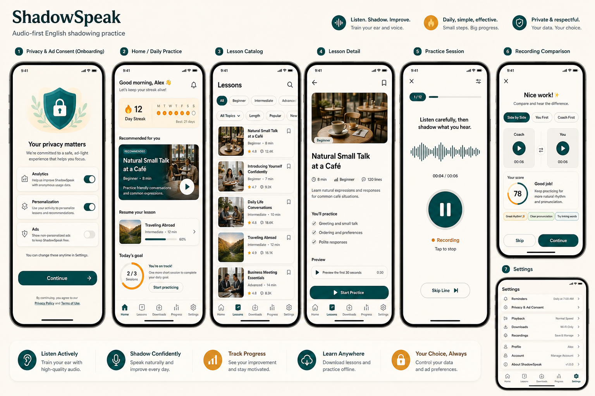
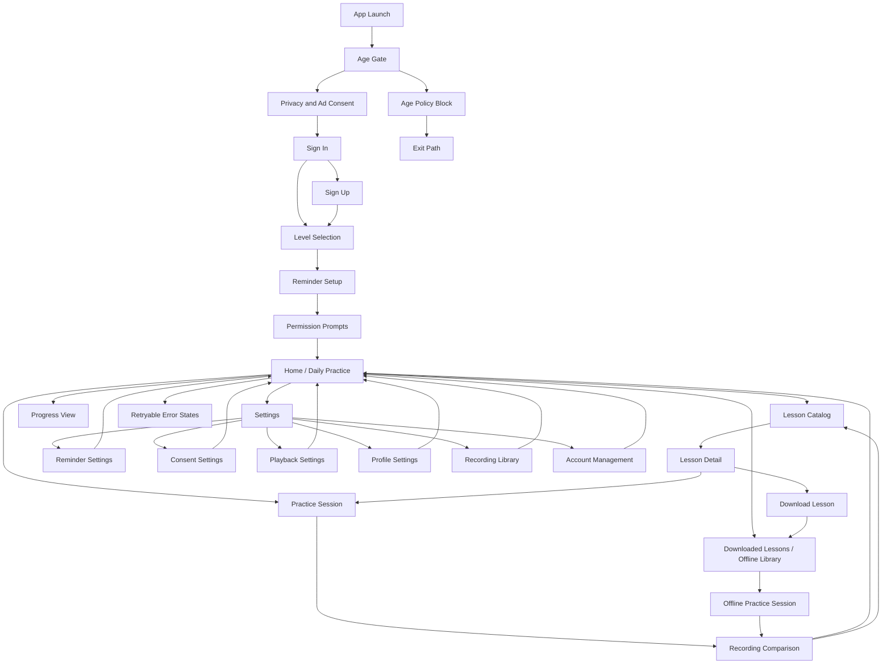
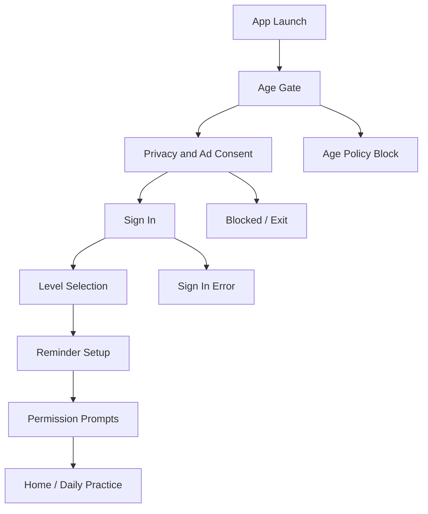
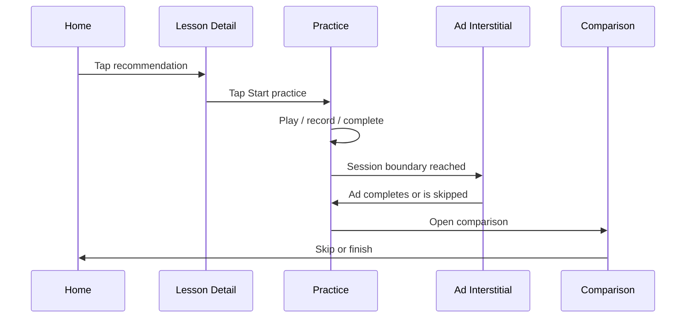
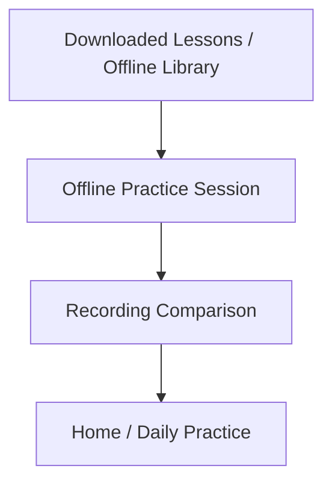

# ShadowSpeak Interactive Prototype

## Document Metadata

| Field         | Value                          |
| ------------- | ------------------------------ |
| Project       | ShadowSpeak                    |
| Document Type | Interactive Prototype Document |
| Date          | 2026-05-13                     |
| Status        | Draft                          |
| Version       | 1.2                            |
| Owner         | UX Design                      |

## Source Basis

This prototype specification is derived from:

- [User Flow Diagram](01-User-Flow-Diagram.md)
- [Information Architecture Document](02-Information-Architecture-Document.md)
- [Wireframe Document](03-Wireframe-Document.md)
- [UI Design Specification](04-UI-Design-Specification.md)
- [Use Case Specification](../02-analysis/05-Use-Case-Specification.md)
- [Functional Requirements Specification](../02-analysis/03-Functional-Requirements-Specification.md)
- [User Story Document](../02-analysis/06-User-Story-Document.md)

## Prototype Overview

### Prototype Goal

The prototype should demonstrate the complete MVP interaction model for ShadowSpeak:

- audio-first onboarding
- home-centered daily practice
- lesson selection and practice loop
- recording comparison
- offline practice
- reminder and settings recovery
- ad interstitial boundaries
- error and blocked-state handling

### Recommended Tooling

| Tool            | Use                                                  |
| --------------- | ---------------------------------------------------- |
| Figma           | Primary clickable prototype authoring and review     |
| ProtoPie        | Optional for audio-state and gesture-rich simulation |
| Maze / Useberry | Optional for lightweight prototype testing           |

### Frame Sizes

| Platform | Frame Size | Notes                                                           |
| -------- | ---------- | --------------------------------------------------------------- |
| iOS      | 375 x 812  | Reference iPhone-sized frame with safe areas                    |
| Android  | 360 x 800  | Reference Pixel-sized frame with Android bottom nav conventions |

### Prototype Presentation Rules

- Use separate device frames for iOS and Android where navigation or safe-area behavior differs.
- Keep both platforms visually equivalent in hierarchy, with only system bars and back behavior adjusted.
- Prototype interaction should emphasize tap targets, bottom tabs, and state transitions.
- Avoid adding full fidelity artwork that distracts from interaction testing.

### Prototype Goals by Experience Area

- Onboarding should feel sequential and low friction.
- Practice should feel audio-led and minimal.
- Comparison should be optional and easy to exit.
- Offline and error states should preserve context.
- Ads should never interrupt the practice session mid-flow.

## Visual Concept Board

This is the generated high-level UI concept board for the ShadowSpeak MVP.

## Prototype Map

## Interaction Standards

### Gesture and Navigation Conventions

| Interaction     | Standard                                                             |
| --------------- | -------------------------------------------------------------------- |
| Tap             | Primary action on cards, buttons, tabs, and controls                 |
| Long-press      | Context actions only in recordings or lesson lists if needed         |
| Swipe back      | iOS stacked screens only; Android uses system back                   |
| Pull-to-refresh | Home, Lesson Catalog, Progress, and Downloads where data can refresh |
| Drag            | Optional for sliders or scrubbers in playback                        |

### Timing and Easing Standards

| Transition Type       | Duration   | Easing             | Use                                     |
| --------------------- | ---------- | ------------------ | --------------------------------------- |
| Button press feedback | 120-200 ms | Spring / ease-out  | Tap feedback on active controls         |
| Card selection        | 180-220 ms | Ease-out           | Catalog and home card activation        |
| Screen push           | 280-320 ms | Ease-in-out        | Navigation between stacked screens      |
| Modal / bottom sheet  | 320-400 ms | Ease-in-out        | Permissions, ad overlays, confirmations |
| Cross-dissolve        | 200-240 ms | Ease-in-out        | State changes within the same screen    |
| Progress updates      | 250-300 ms | Linear or ease-out | Streak, downloads, completion progress  |

### Audio Interaction Standards

- Play, pause, and resume controls must respond instantly with clear visual feedback.
- Recording start and stop should show a visible state change within 100 ms.
- Timers should update once per second during active practice.
- Comparison playback should allow users to switch modes without leaving the screen.
- Interstitial ads should use a distinct full-screen container and return to the learner flow automatically when done.

## Screen-by-Screen Prototype Specifications

### 1. Entry, Compliance, and Onboarding

#### 1.1 App Launch

Purpose: Resolve startup state and route the learner into onboarding or Home.

Visual reference:

- Wireframe: [1.1 App Launch](03-Wireframe-Document.md#11-app-launch)
- UI spec: [1.1 App Launch](04-UI-Design-Specification.md#11-app-launch)

Component interactions:

| Element      | Tap             | Long-press | Swipe | Drag |
| ------------ | --------------- | ---------- | ----- | ---- |
| Retry button | Retries startup | None       | None  | None |

State transitions:

| From           | To                    | Trigger                       | Transition          | Duration | Easing      | Overlay |
| -------------- | --------------------- | ----------------------------- | ------------------- | -------- | ----------- | ------- |
| Launch loading | Home                  | Startup resolves successfully | Cross-dissolve      | 200 ms   | ease-in-out | No      |
| Launch loading | Onboarding / Age Gate | First launch requires setup   | Cross-dissolve      | 200 ms   | ease-in-out | No      |
| Launch loading | Retryable Error       | Startup failure               | Fade in error state | 220 ms   | ease-out    | Yes     |

Navigation connections:

- Startup success routes directly to the next required state.
- Error route stays on the same screen with retry.

Gesture map:

- No gesture-based navigation on this screen.

Audio interaction patterns:

- None beyond any optional system startup audio cue.

Micro-interactions:

- Loader pulses gently.
- Retry button depresses with spring feedback.

Platform notes:

- iOS and Android should both use a minimal splash-to-app transition.

#### 1.2 Age Gate

Purpose: Confirm age eligibility when no store signal is available.

Visual reference:

- Wireframe: [1.2 Age Gate](03-Wireframe-Document.md#12-age-gate)
- UI spec: [1.2 Age Gate](04-UI-Design-Specification.md#12-age-gate)

Component interactions:

| Element                 | Tap                    | Long-press | Swipe | Drag |
| ----------------------- | ---------------------- | ---------- | ----- | ---- |
| Age input / affirmation | Selects or fills value | None       | None  | None |
| Continue                | Validates and advances | None       | None  | None |
| Exit                    | Leaves flow            | None       | None  | None |

State transitions:

| From     | To                     | Trigger                | Transition          | Duration | Easing      | Overlay |
| -------- | ---------------------- | ---------------------- | ------------------- | -------- | ----------- | ------- |
| Age Gate | Privacy and Ad Consent | Valid age entered      | Push                | 300 ms   | ease-in-out | No      |
| Age Gate | Age Policy Block       | Underage / invalid age | Fade to block state | 240 ms   | ease-out    | No      |

Navigation connections:

- Back returns to App Launch only in prototype contexts where needed.
- Continue advances to consent.

Gesture map:

- No swipe navigation required.

Audio interaction patterns:

- None.

Micro-interactions:

- Continue button enables only after valid input.
- Validation message appears inline.

Platform notes:

- Keep fields large enough for both keyboard and touch.

#### 1.3 Age Policy Block

Purpose: Stop underage onboarding and end the flow safely.

Visual reference:

- Wireframe: [1.3 Age Policy Block](03-Wireframe-Document.md#13-age-policy-block)
- UI spec: [1.3 Age Policy Block](04-UI-Design-Specification.md#13-age-policy-block)

Component interactions:

| Element | Tap                | Long-press | Swipe | Drag |
| ------- | ------------------ | ---------- | ----- | ---- |
| Exit    | Ends flow          | None       | None  | None |

State transitions:

| From             | To                  | Trigger                | Transition          | Duration   | Easing   | Overlay |
| ---------------- | ------------------- | ---------------------- | ------------------- | ---------- | -------- | ------- |
| Age Policy Block | Exit Path           | User taps exit         | Instant or fade out | 150-200 ms | ease-out | No      |

Navigation connections:

- Blocked flow has no forward path into onboarding.

Gesture map:

- No gestures.

Audio interaction patterns:

- None.

Micro-interactions:

- Buttons use strong pressed feedback to avoid ambiguity.

Platform notes:

- Keep it visually distinct from normal error states.

#### 1.4 Privacy and Ad Consent

Purpose: Capture privacy and ad consent before sign-in continues.

Visual reference:

- Wireframe: [1.4 Privacy and Ad Consent](03-Wireframe-Document.md#14-privacy-and-ad-consent)
- UI spec: [1.4 Privacy and Ad Consent](04-UI-Design-Specification.md#14-privacy-and-ad-consent)

Component interactions:

| Element                   | Tap                            | Long-press | Swipe | Drag |
| ------------------------- | ------------------------------ | ---------- | ----- | ---- |
| Privacy checkbox / toggle | Selects state                  | None       | None  | None |
| Ad preference control     | Selects state                  | None       | None  | None |
| Accept and Continue       | Validates consent and advances | None       | None  | None |
| Decline and Exit          | Leaves flow                    | None       | None  | None |

State transitions:

| From    | To             | Trigger                   | Transition               | Duration | Easing      | Overlay |
| ------- | -------------- | ------------------------- | ------------------------ | -------- | ----------- | ------- |
| Consent | Sign In        | Accepted                  | Push                     | 300 ms   | ease-in-out | No      |
| Consent | Blocked / Exit | Declined required consent | Fade out / route to exit | 200 ms   | ease-out    | No      |

Navigation connections:

- Back returns to Age Gate.
- Decline routes to blocked path.

Gesture map:

- No swipe.

Audio interaction patterns:

- None.

Micro-interactions:

- Toggle changes animate with short easing.
- Primary button enables only when required choices are complete.

Platform notes:

- Keep consent choices explicit and easy to review on both platforms.

#### 1.5 Sign In

Purpose: Authenticate the learner.

Visual reference:

- Wireframe: [1.5 Sign In](03-Wireframe-Document.md#15-sign-in)
- UI spec: [1.5 Sign In](04-UI-Design-Specification.md#15-sign-in)

Component interactions:

| Element                 | Tap             | Long-press | Swipe | Drag |
| ----------------------- | --------------- | ---------- | ----- | ---- |
| Email / password fields | Focus and edit  | None       | None  | None |
| Social buttons          | Opens auth flow | None       | None  | None |
| Sign In                 | Submits form    | None       | None  | None |

State transitions:

| From    | To              | Trigger      | Transition                  | Duration | Easing      | Overlay |
| ------- | --------------- | ------------ | --------------------------- | -------- | ----------- | ------- |
| Sign In | Level Selection | Auth success | Push                        | 300 ms   | ease-in-out | No      |
| Sign In | Sign In error   | Auth failure | In-place error              | 200 ms   | ease-out    | No      |
| Sign In | Loading         | Submit       | Spinner / disabled controls | 0-100 ms | linear      | No      |

Navigation connections:

- Back returns to Privacy and Ad Consent.
- "Create account" navigates to Sign Up.

Gesture map:

- No gesture navigation; keyboard and tap interactions only.

Audio interaction patterns:

- None.

Micro-interactions:

- Button disables during auth request.
- Error shakes or highlights field group subtly.

Platform notes:

- Preserve platform-native keyboard behavior.

#### 1.6 Sign Up

Purpose: Create a new account with email/password validation.

Visual reference:

- Wireframe: [1.6 Sign Up](03-Wireframe-Document.md#16-sign-up)
- UI spec: [1.6 Sign Up](04-UI-Design-Specification.md#16-sign-up)

Component interactions:

| Element                | Tap                              | Long-press | Swipe | Drag |
| ---------------------- | -------------------------------- | ---------- | ----- | ---- |
| Email field            | Focus and edit                   | None       | None  | None |
| Password field         | Focus and edit, show/hide toggle | None       | None  | None |
| Confirm password field | Focus and edit, show/hide toggle | None       | None  | None |
| Terms link             | Opens external browser           | None       | None  | None |
| Create Account         | Submits form                     | None       | None  | None |

State transitions:

| From    | To              | Trigger                       | Transition                  | Duration | Easing      | Overlay |
| ------- | --------------- | ----------------------------- | --------------------------- | -------- | ----------- | ------- |
| Sign Up | Level Selection | Registration success          | Push                        | 300 ms   | ease-in-out | No      |
| Sign Up | Sign Up error   | Validation or network failure | In-place error              | 200 ms   | ease-out    | No      |
| Sign Up | Loading         | Submit                        | Spinner / disabled controls | 0-100 ms | linear      | No      |

Navigation connections:

- Back returns to Sign In.
- "Already have account? Sign In" returns to Sign In.

Gesture map:

- No gesture navigation; keyboard and tap interactions only.

Audio interaction patterns:

- None.

Micro-interactions:

- Password strength indicator updates in real-time as user types.
- Confirm password field shows match/mismatch feedback on blur.
- Button disables during registration request.
- Error highlights the relevant field group subtly.

Platform notes:

- Preserve platform-native keyboard behavior with "Next" and "Done" keyboard return keys.
- Password auto-fill should be supported on both platforms.

#### 1.7 Level Selection

Purpose: Capture proficiency level.

Visual reference:

- Wireframe: [1.7 Level Selection](03-Wireframe-Document.md#17-level-selection)
- UI spec: [1.7 Level Selection](04-UI-Design-Specification.md#17-level-selection)

Component interactions:

| Element     | Tap          | Long-press | Swipe | Drag |
| ----------- | ------------ | ---------- | ----- | ---- |
| Level cards | Select level | None       | None  | None |
| Continue    | Advances     | None       | None  | None |

State transitions:

| From            | To             | Trigger  | Transition | Duration | Easing      | Overlay |
| --------------- | -------------- | -------- | ---------- | -------- | ----------- | ------- |
| Level Selection | Reminder Setup | Continue | Push       | 300 ms   | ease-in-out | No      |

Navigation connections:

- Back returns to Sign In.

Gesture map:

- No gesture navigation.

Audio interaction patterns:

- None.

Micro-interactions:

- Selected card expands or highlights subtly.

Platform notes:

- Keep the selection affordance obvious for both platforms.

#### 1.8 Reminder Setup

Purpose: Set reminder time.

Visual reference:

- Wireframe: [1.8 Reminder Setup](03-Wireframe-Document.md#18-reminder-setup)
- UI spec: [1.8 Reminder Setup](04-UI-Design-Specification.md#18-reminder-setup)

Component interactions:

| Element        | Tap                       | Long-press | Swipe                            | Drag           |
| -------------- | ------------------------- | ---------- | -------------------------------- | -------------- |
| Toggle         | Enable/disable reminders  | None       | None                             | None           |
| Time picker    | Select time               | None       | Scroll wheel / drag where native | Drag in picker |
| Continue       | Advances                  | None       | None                             | None           |
| Skip reminders | Advances without schedule | None       | None                             | None           |

State transitions:

| From           | To                 | Trigger  | Transition | Duration | Easing      | Overlay |
| -------------- | ------------------ | -------- | ---------- | -------- | ----------- | ------- |
| Reminder Setup | Permission Prompts | Continue | Push       | 300 ms   | ease-in-out | No      |

Navigation connections:

- Back returns to Level Selection.

Gesture map:

- Native picker scroll/drag behavior.

Audio interaction patterns:

- None.

Micro-interactions:

- Toggle animation on/off with short ease.

Platform notes:

- iOS may use a wheel picker; Android may use a time dialog or bottom sheet.

#### 1.9 Permission Prompts

Purpose: Handle notification and microphone permissions.

Visual reference:

- Wireframe: [1.9 Permission Prompts](03-Wireframe-Document.md#19-permission-prompts)
- UI spec: [1.9 Permission Prompts](04-UI-Design-Specification.md#19-permission-prompts)

Component interactions:

| Element           | Tap                                        | Long-press | Swipe | Drag |
| ----------------- | ------------------------------------------ | ---------- | ----- | ---- |
| Notification card | Opens system prompt                        | None       | None  | None |
| Microphone card   | Opens system prompt                        | None       | None  | None |
| Continue          | Advances based on current permission state | None       | None  | None |
| Open Settings     | Opens OS settings                          | None       | None  | None |

State transitions:

| From               | To   | Trigger                | Transition | Duration | Easing      | Overlay |
| ------------------ | ---- | ---------------------- | ---------- | -------- | ----------- | ------- |
| Permission Prompts | Home | Granted / accepted     | Push       | 300 ms   | ease-in-out | No      |
| Permission Prompts | Home | Denied but recoverable | Push       | 300 ms   | ease-in-out | No      |

Navigation connections:

- Back returns to Reminder Setup.

Gesture map:

- No special gestures.

Audio interaction patterns:

- None.

Micro-interactions:

- Permission badges update immediately after response.

Platform notes:

- Platform system dialogs are outside the prototype but should be linked from card taps.

## Core Daily Practice Prototype

### 2.1 Home / Daily Practice

Purpose: Orchestrate the next action.

Visual reference:

- Wireframe: [2.1 Home / Daily Practice](03-Wireframe-Document.md#21-home--daily-practice)
- UI spec: [2.1 Home / Daily Practice](04-UI-Design-Specification.md#21-home--daily-practice)

Component interactions:

| Element             | Tap                             | Long-press                | Swipe                       | Drag |
| ------------------- | ------------------------------- | ------------------------- | --------------------------- | ---- |
| Recommendation card | Opens lesson or resume flow     | Context options if needed | None                        | None |
| Streak card         | Opens Progress                  | None                      | None                        | None |
| Resume card         | Reopens practice or comparison  | None                      | None                        | None |
| Bottom tabs         | Switches sections               | None                      | None                        | None |

State transitions:

| From | To                             | Trigger             | Transition         | Duration   | Easing      | Overlay |
| ---- | ------------------------------ | ------------------- | ------------------ | ---------- | ----------- | ------- |
| Home | Lesson Detail                  | Tap recommendation  | Push               | 300 ms     | ease-in-out | No      |
| Home | Progress                       | Tap streak          | Push               | 300 ms     | ease-in-out | No      |
| Home | Settings / Downloads / Lessons | Tap bottom tab      | Tab switch         | 200-300 ms | ease-in-out | No      |

Navigation connections:

- Central hub for the prototype.
- Pull-to-refresh can refresh home progress without navigation.

Gesture map:

- Pull-to-refresh to reload progress and recommendation.
- Long-press optional on lesson cards if context menus are needed later.

Audio interaction patterns:

- Primary recommendation should lead to the next audio action in one tap.

Micro-interactions:

- Streak count animates upward on new completion.
- Cards use subtle lift on selection.

Platform notes:

- Keep tab bar persistent on both platforms.

### 2.2 Lesson Catalog

Purpose: Browse and filter lessons.

Visual reference:

- Wireframe: [2.2 Lesson Catalog](03-Wireframe-Document.md#22-lesson-catalog)
- UI spec: [2.2 Lesson Catalog](04-UI-Design-Specification.md#22-lesson-catalog)

Component interactions:

| Element      | Tap                  | Long-press            | Swipe                               | Drag |
| ------------ | -------------------- | --------------------- | ----------------------------------- | ---- |
| Filter chips | Toggle filter states | None                  | Horizontal swipe to reveal overflow | None |
| Lesson card  | Opens Lesson Detail  | Optional context menu | None                                | None |
| Bottom tabs  | Switch sections      | None                  | None                                | None |

State transitions:

| From    | To            | Trigger                   | Transition              | Duration | Easing      | Overlay |
| ------- | ------------- | ------------------------- | ----------------------- | -------- | ----------- | ------- |
| Catalog | Lesson Detail | Tap lesson card           | Push                    | 300 ms   | ease-in-out | No      |
| Catalog | Empty state   | Filters eliminate results | In-place cross-dissolve | 200 ms   | ease-in-out | No      |

Navigation connections:

- Back returns to Home.

Gesture map:

- Pull-to-refresh to refresh catalog.

Audio interaction patterns:

- Lesson card should highlight whether it is immediately playable or downloadable.

Micro-interactions:

- Chip toggles animate selection state.

Platform notes:

- Chips may scroll horizontally on smaller screens.

### 2.3 Lesson Detail

Purpose: Let the learner start or download a lesson.

Visual reference:

- Wireframe: [2.3 Lesson Detail](03-Wireframe-Document.md#23-lesson-detail)
- UI spec: [2.3 Lesson Detail](04-UI-Design-Specification.md#23-lesson-detail)

Component interactions:

| Element         | Tap                    | Long-press | Swipe | Drag |
| --------------- | ---------------------- | ---------- | ----- | ---- |
| Start practice  | Opens Practice Session | None       | None  | None |
| Download lesson | Starts download flow   | None       | None  | None |
| Back to catalog | Returns to catalog     | None       | None  | None |

State transitions:

| From   | To               | Trigger           | Transition                | Duration | Easing      | Overlay |
| ------ | ---------------- | ----------------- | ------------------------- | -------- | ----------- | ------- |
| Detail | Practice Session | Start practice    | Push                      | 300 ms   | ease-in-out | No      |
| Detail | Downloads        | Download complete | Push or return via status | 300 ms   | ease-in-out | No      |
| Detail | Error            | Asset failure     | In-place error            | 200 ms   | ease-out    | No      |

Navigation connections:

- Back returns to Catalog.

Gesture map:

- Standard back gesture on iOS.

Audio interaction patterns:

- Start is the dominant audio action.

Micro-interactions:

- Download button shows progress and completion badge.

Platform notes:

- Keep the start CTA above the fold.

### 2.4 Practice Session

Purpose: Support the core audio practice loop.

Visual reference:

- Wireframe: [2.4 Practice Session](03-Wireframe-Document.md#24-practice-session)
- UI spec: [2.4 Practice Session](04-UI-Design-Specification.md#24-practice-session)

Component interactions:

| Element               | Tap                               | Long-press | Swipe                               | Drag                             |
| --------------------- | --------------------------------- | ---------- | ----------------------------------- | -------------------------------- |
| Play / pause / resume | Toggles playback                  | None       | None                                | None                             |
| Repeat                | Replays current segment or lesson | None       | None                                | Optional scrub if supported      |
| Finish                | Ends session and opens comparison | None       | None                                | None                             |
| Timer/progress        | Opens optional detail state       | None       | Scrub if allowed by prototype scope | Drag if progress scrubber exists |

State transitions:

| From     | To              | Trigger                           | Transition           | Duration | Easing      | Overlay |
| -------- | --------------- | --------------------------------- | -------------------- | -------- | ----------- | ------- |
| Practice | Recording       | Start recording                   | Control state change | 100 ms   | ease-out    | No      |
| Practice | Comparison      | Finish after completion threshold | Push                 | 300 ms   | ease-in-out | No      |
| Practice | Error           | Load failure                      | In-place error       | 220 ms   | ease-out    | No      |
| Practice | Ad interstitial | Session boundary reached          | Full-screen present  | 350 ms   | ease-in-out | Yes     |

Navigation connections:

- Back returns to Lesson Detail or a resume path depending on state.

Gesture map:

- Pull-to-refresh not applicable.
- Minimal gesture dependence; controls are tap-first.

Audio interaction patterns:

- Timer updates once per second.
- Large primary control must reflect play, pause, resume, and recording states clearly.

Micro-interactions:

- Recording indicator pulses.
- Progress bar fills smoothly.

Platform notes:

- Preserve the same core layout on both platforms.

### 2.5 Practice Session State Variants

Purpose: Represent loading, error, and offline states within the practice session.

Visual reference:

- Wireframe: [2.5 Practice Session State Variants](03-Wireframe-Document.md#25-practice-session-state-variants)
- UI spec: [2.5 Practice Session State Variants](04-UI-Design-Specification.md#25-practice-session-state-variants)

Component interactions:

| Element       | Tap                    | Long-press | Swipe | Drag |
| ------------- | ---------------------- | ---------- | ----- | ---- |
| Retry         | Reloads current lesson | None       | None  | None |
| Continue      | Continues offline      | None       | None  | None |
| Return action | Returns to catalog     | None       | None  | None |

State transitions:

| From     | To       | Trigger             | Transition        | Duration | Easing      | Overlay |
| -------- | -------- | ------------------- | ----------------- | -------- | ----------- | ------- |
| Practice | Loading  | Lesson audio starts | In-place skeleton | 200 ms   | ease-out    | No      |
| Loading  | Practice | Audio ready         | Cross-dissolve    | 220 ms   | ease-in-out | No      |
| Loading  | Error    | Load failure        | In-place error    | 220 ms   | ease-out    | No      |
| Practice | Offline  | Network unavailable | Badge fade in     | 180 ms   | ease-out    | No      |

Navigation connections:

- Retry returns to the current Practice Session when successful.
- Return action goes back to Lesson Catalog.
- Offline continue stays in Practice Session.

### 2.6 Recording Comparison

Purpose: Compare the learner recording with reference audio.

Visual reference:

- Wireframe: [2.6 Recording Comparison](03-Wireframe-Document.md#26-recording-comparison)
- UI spec: [2.6 Recording Comparison](04-UI-Design-Specification.md#26-recording-comparison)

Component interactions:

| Element                | Tap                                            | Long-press | Swipe                      | Drag |
| ---------------------- | ---------------------------------------------- | ---------- | -------------------------- | ---- |
| Playback mode selector | Chooses mode                                   | None       | Horizontal switch possible | None |
| Continue               | Completes comparison and returns home/progress | None       | None                       | None |
| Skip comparison        | Returns without review                         | None       | None                       | None |
| Repeat session         | Returns to practice                            | None       | None                       | None |

State transitions:

| From       | To          | Trigger           | Transition     | Duration | Easing      | Overlay |
| ---------- | ----------- | ----------------- | -------------- | -------- | ----------- | ------- |
| Comparison | Home        | Skip or finish    | Push           | 300 ms   | ease-in-out | No      |
| Comparison | Practice    | Repeat session    | Push           | 300 ms   | ease-in-out | No      |
| Comparison | Error state | Recording missing | In-place error | 220 ms   | ease-out    | No      |

Navigation connections:

- Back returns to Practice Session.

Gesture map:

- Optional horizontal swipe for playback mode switching.

Audio interaction patterns:

- Playback controls must remain visible at all times.
- Comparison can be skipped without penalty.

Micro-interactions:

- Active mode highlights with a short fade or slide.

Platform notes:

- Keep the skip action visible and easy to access.

### 2.7 Progress View

Purpose: Show streak and history.

Visual reference:

- Wireframe: [2.7 Progress View](03-Wireframe-Document.md#27-progress-view)
- UI spec: [2.7 Progress View](04-UI-Design-Specification.md#27-progress-view)

Component interactions:

| Element        | Tap                          | Long-press    | Swipe | Drag |
| -------------- | ---------------------------- | ------------- | ----- | ---- |
| Start a lesson | Opens Home or Lesson Catalog | None          | None  | None |
| View downloads | Opens Downloads              | None          | None  | None |
| Session row    | Opens session detail if used | Optional menu | None  | None |

State transitions:

| From     | To          | Trigger        | Transition              | Duration | Easing      | Overlay |
| -------- | ----------- | -------------- | ----------------------- | -------- | ----------- | ------- |
| Progress | Home        | Start a lesson | Push                    | 300 ms   | ease-in-out | No      |
| Progress | Empty state | No history     | In-place cross-dissolve | 200 ms   | ease-in-out | No      |

Navigation connections:

- Back returns to Home.

Gesture map:

- Pull-to-refresh for data sync refresh.

Audio interaction patterns:

- Not a primary audio screen, but it should reinforce habit completion.

Micro-interactions:

- Streak counter may animate on sync updates.

Platform notes:

- Ensure the history list is still readable on smaller Android frames.

## Offline and Return Paths Prototype

### 3.1 Downloaded Lessons / Offline Library

Purpose: Let the learner access downloaded lessons locally.

Visual reference:

- Wireframe: [3.1 Downloaded Lessons / Offline Library](03-Wireframe-Document.md#31-downloaded-lessons--offline-library)
- UI spec: [3.1 Downloaded Lessons / Offline Library](04-UI-Design-Specification.md#31-downloaded-lessons--offline-library)

Component interactions:

| Element          | Tap                                     | Long-press                   | Swipe                          | Drag |
| ---------------- | --------------------------------------- | ---------------------------- | ------------------------------ | ---- |
| Lesson card      | Opens offline practice or lesson detail | Context actions if supported | Swipe to reveal manage actions | None |
| Manage downloads | Opens manage state                      | None                         | None                           | None |
| Bottom tabs      | Switch sections                         | None                         | None                           | None |

State transitions:

| From      | To               | Trigger         | Transition              | Duration | Easing      | Overlay |
| --------- | ---------------- | --------------- | ----------------------- | -------- | ----------- | ------- |
| Downloads | Offline Practice | Tap lesson card | Push                    | 300 ms   | ease-in-out | No      |
| Downloads | Empty state      | No downloads    | In-place cross-dissolve | 200 ms   | ease-in-out | No      |

Navigation connections:

- Back returns to Home or previous screen.

Gesture map:

- Pull-to-refresh to check stale content if online.

Audio interaction patterns:

- Open lesson should be one tap away.

Micro-interactions:

- Status badges update when downloads finish or become invalid.

Platform notes:

- Swipe-to-manage is optional and should not replace explicit buttons.

### 3.2 Offline Practice Session

Purpose: Continue practice without network.

Visual reference:

- Wireframe: [3.2 Offline Practice Session](03-Wireframe-Document.md#32-offline-practice-session)
- UI spec: [3.2 Offline Practice Session](04-UI-Design-Specification.md#32-offline-practice-session)

Component interactions:

| Element      | Tap                            | Long-press | Swipe | Drag |
| ------------ | ------------------------------ | ---------- | ----- | ---- |
| Play / pause | Toggles playback               | None       | None  | None |
| Finish       | Saves local progress and exits | None       | None  | None |

State transitions:

| From             | To         | Trigger               | Transition          | Duration | Easing      | Overlay |
| ---------------- | ---------- | --------------------- | ------------------- | -------- | ----------- | ------- |
| Offline Practice | Comparison | Finish                | Push                | 300 ms   | ease-in-out | No      |
| Offline Practice | Error      | Authorization invalid | Fade to error state | 220 ms   | ease-out    | No      |

Navigation connections:

- Back returns to Downloads.

Gesture map:

- No special gestures beyond standard back.

Audio interaction patterns:

- Same core control semantics as online Practice Session.

Micro-interactions:

- Offline badge stays persistent throughout the session.

Platform notes:

- Screen should feel nearly identical to online practice.

### 3.3 Local Reminder Notification

Purpose: Return the learner to Home or Daily Practice.

Visual reference:

- Wireframe: [3.3 Local Reminder Notification](03-Wireframe-Document.md#33-local-reminder-notification)
- UI spec: [3.3 Local Reminder Notification](04-UI-Design-Specification.md#33-local-reminder-notification)

Component interactions:

| Element           | Tap        | Long-press | Swipe                     | Drag |
| ----------------- | ---------- | ---------- | ------------------------- | ---- |
| Notification card | Opens Home | None       | Dismiss on system gesture | None |

State transitions:

| From         | To   | Trigger | Transition       | Duration | Easing | Overlay |
| ------------ | ---- | ------- | ---------------- | -------- | ------ | ------- |
| Notification | Home | Tap     | System deep link | Instant  | linear | No      |

Navigation connections:

- Deep link routes directly into Home.

Gesture map:

- OS-native notification swipe-to-dismiss only.

Audio interaction patterns:

- None.

Micro-interactions:

- Notification delivery should be standard OS behavior.

Platform notes:

- Keep platform behavior native and not custom-built.

## Settings and Control Prototype

### 4.1 Settings

Purpose: Navigate to preferences and account management.

Visual reference:

- Wireframe: [4.1 Settings](03-Wireframe-Document.md#41-settings)
- UI spec: [4.1 Settings](04-UI-Design-Specification.md#41-settings)

Component interactions:

| Element      | Tap              | Long-press            | Swipe | Drag |
| ------------ | ---------------- | --------------------- | ----- | ---- |
| Settings row | Opens subsection | Optional context menu | None  | None |
| Bottom tabs  | Switch sections  | None                  | None  | None |

State transitions:

| From     | To                                                                      | Trigger | Transition | Duration | Easing      | Overlay |
| -------- | ----------------------------------------------------------------------- | ------- | ---------- | -------- | ----------- | ------- |
| Settings | Reminder Settings / Consent / Playback / Profile / Recordings / Account | Tap row | Push       | 300 ms   | ease-in-out | No      |

Navigation connections:

- Back returns to Home.

Gesture map:

- Pull-to-refresh not required.

Audio interaction patterns:

- None.

Micro-interactions:

- Rows depress subtly on tap.

Platform notes:

- Preserve the same list structure across iOS and Android.

### 4.2 Reminder Settings

Purpose: Adjust reminder preferences.

Visual reference:

- Wireframe: [4.2 Reminder Settings](03-Wireframe-Document.md#42-reminder-settings)
- UI spec: [4.2 Reminder Settings](04-UI-Design-Specification.md#42-reminder-settings)

Component interactions:

| Element     | Tap                        | Long-press | Swipe                | Drag        |
| ----------- | -------------------------- | ---------- | -------------------- | ----------- |
| Toggle      | Enable / disable reminders | None       | None                 | None        |
| Time picker | Change time                | None       | Native picker scroll | Drag/scroll |
| Save        | Save changes               | None       | None                 | None        |
| Disable     | Cancel schedule            | None       | None                 | None        |

State transitions:

| From              | To              | Trigger | Transition     | Duration   | Easing      | Overlay |
| ----------------- | --------------- | ------- | -------------- | ---------- | ----------- | ------- |
| Reminder Settings | Home / Settings | Save    | Push or return | 250-300 ms | ease-in-out | No      |

Navigation connections:

- Back returns to Settings.

Gesture map:

- Native picker gestures only.

Audio interaction patterns:

- None.

Micro-interactions:

- Toggle flips with short spring or ease.

Platform notes:

- iOS wheel picker vs Android time dialog may differ.

### 4.3 Consent Settings

Purpose: Update privacy and ad consent decisions.

Visual reference:

- Wireframe: [4.3 Consent Settings](03-Wireframe-Document.md#43-consent-settings)
- UI spec: [4.3 Consent Settings](04-UI-Design-Specification.md#43-consent-settings)

Component interactions:

| Element          | Tap              | Long-press | Swipe | Drag |
| ---------------- | ---------------- | ---------- | ----- | ---- |
| Consent controls | Toggle state     | None       | None  | None |
| Save             | Persists changes | None       | None  | None |

State transitions:

| From             | To              | Trigger | Transition    | Duration | Easing      | Overlay |
| ---------------- | --------------- | ------- | ------------- | -------- | ----------- | ------- |
| Consent Settings | Home / Settings | Save    | Return / push | 250 ms   | ease-in-out | No      |

Navigation connections:

- Back returns to Settings.

Gesture map:

- No special gestures.

Audio interaction patterns:

- None.

Micro-interactions:

- Toggle state updates instantly.

Platform notes:

- Keep labels short and explicit.

### 4.4 Playback Settings

Purpose: Adjust playback speed and listening preference.

Visual reference:

- Wireframe: [4.4 Playback Settings](03-Wireframe-Document.md#44-playback-settings)
- UI spec: [4.4 Playback Settings](04-UI-Design-Specification.md#44-playback-settings)

Component interactions:

| Element        | Tap              | Long-press | Swipe | Drag                |
| -------------- | ---------------- | ---------- | ----- | ------------------- |
| Speed selector | Chooses speed    | None       | None  | Slider drag if used |
| Save           | Saves settings   | None       | None  | None                |
| Reset          | Restores default | None       | None  | None                |

State transitions:

| From              | To              | Trigger | Transition    | Duration | Easing      | Overlay |
| ----------------- | --------------- | ------- | ------------- | -------- | ----------- | ------- |
| Playback Settings | Settings / Home | Save    | Return / push | 250 ms   | ease-in-out | No      |

Navigation connections:

- Back returns to Settings.

Gesture map:

- If slider is used, drag adjusts speed.

Audio interaction patterns:

- Settings should reflect the next playback speed after save.

Micro-interactions:

- Selected step should animate clearly.

Platform notes:

- Ensure labeled steps are clear on both platforms.

### 4.5 Profile Settings

Purpose: Edit profile fields.

Visual reference:

- Wireframe: [4.5 Profile Settings](03-Wireframe-Document.md#45-profile-settings)
- UI spec: [4.5 Profile Settings](04-UI-Design-Specification.md#45-profile-settings)

Component interactions:

| Element         | Tap            | Long-press | Swipe | Drag |
| --------------- | -------------- | ---------- | ----- | ---- |
| Editable fields | Focus and edit | None       | None  | None |
| Save            | Saves profile  | None       | None  | None |
| Cancel          | Discards edits | None       | None  | None |

State transitions:

| From             | To       | Trigger       | Transition | Duration | Easing      | Overlay |
| ---------------- | -------- | ------------- | ---------- | -------- | ----------- | ------- |
| Profile Settings | Settings | Save / cancel | Return     | 250 ms   | ease-in-out | No      |

Navigation connections:

- Back returns to Settings.

Gesture map:

- No special gestures.

Audio interaction patterns:

- None.

Micro-interactions:

- Validation appears inline.

Platform notes:

- Keyboard behavior should remain native.

### 4.6 Recording Library

Purpose: Manage recordings.

Visual reference:

- Wireframe: [4.6 Recording Library](03-Wireframe-Document.md#46-recording-library)
- UI spec: [4.6 Recording Library](04-UI-Design-Specification.md#46-recording-library)

Component interactions:

| Element | Tap               | Long-press            | Swipe                                  | Drag |
| ------- | ----------------- | --------------------- | -------------------------------------- | ---- |
| Play    | Opens playback    | None                  | None                                   | None |
| Delete  | Deletes recording | Optional context menu | Swipe to reveal delete where supported | None |

State transitions:

| From              | To       | Trigger     | Transition | Duration | Easing      | Overlay |
| ----------------- | -------- | ----------- | ---------- | -------- | ----------- | ------- |
| Recording Library | Settings | Back / done | Return     | 250 ms   | ease-in-out | No      |

Navigation connections:

- Back returns to Settings.

Gesture map:

- Swipe-to-delete only if the platform pattern supports it.

Audio interaction patterns:

- Playback opens a supporting audio state, not a new main flow.

Micro-interactions:

- Delete should require explicit confirmation.

Platform notes:

- iOS swipe actions may be more common; Android should retain explicit actions.

### 4.7 Account Management

Purpose: Sign out or delete account.

Visual reference:

- Wireframe: [4.7 Account Management](03-Wireframe-Document.md#47-account-management)
- UI spec: [4.7 Account Management](04-UI-Design-Specification.md#47-account-management)

Component interactions:

| Element        | Tap                                         | Long-press | Swipe | Drag |
| -------------- | ------------------------------------------- | ---------- | ----- | ---- |
| Sign out       | Ends session                                | None       | None  | None |
| Delete account | Opens confirmation and deletes if confirmed | None       | None  | None |

State transitions:

| From               | To              | Trigger                      | Transition     | Duration   | Easing      | Overlay |
| ------------------ | --------------- | ---------------------------- | -------------- | ---------- | ----------- | ------- |
| Account Management | Settings / Exit | Sign out or completed delete | Return or exit | 250-300 ms | ease-in-out | No      |
| Account Management | Retryable Error | Backend deletion failure     | In-place error | 220 ms     | ease-out    | No      |

Navigation connections:

- Back returns to Settings.

Gesture map:

- No special gestures.

Audio interaction patterns:

- None.

Micro-interactions:

- Destructive confirmation should be explicit and unmissable.

Platform notes:

- Use strong confirmation patterns on both platforms.

## Onboarding Flow Prototype

The onboarding prototype is sequential and should be presented as a guided flow with visible step continuity.

Onboarding rules:

- Keep all steps in a single forward-moving sequence.
- Recovery should return to the point of failure, not restart the entire flow unless required.
- Permission recovery should be available both inline and through OS settings.

Exit and recovery paths:

- Underage users exit through the blocked path.
- Consent decline exits the flow.
- Sign-in errors keep the learner on the sign-in step.
- Permission denial can continue with reduced capability.

## Practice Loop Prototype

The core habit loop is the most important interaction in the prototype.

Practice loop behavior:

- Home recommendation leads to lesson detail in one tap.
- Practice uses the same audio control model for play, pause, resume, and record.
- Session boundary triggers an interstitial ad only after completion.
- Comparison is optional and should not block return to Home.

## Offline Flow Prototype

Offline behavior:

- Downloaded lessons should open even when network is unavailable.
- Offline practice should mirror the online practice screen closely.
- Comparison should still work with cached local recording.
- Progress should queue locally until sync returns.

## Error and Edge Case Prototypes

### Retryable Errors

Prototype the following errors as full-screen or in-place recovery states:

- startup failure
- audio load failure
- auth expiration
- storage full
- network loss
- recording unavailable
- unknown / generic fallback error

### Permission Recovery

- Show a clear recovery path when microphone or notification permission is denied.
- Include an Open Settings action that deep-links to OS settings.
- Returning from settings should restore the state in-place where possible.

### Age Block and Consent Decline

- Age block should exit cleanly with no route back into core content.
- Consent decline should stop the onboarding flow before sign-in.

### Offline Fallback

- Offline fallback should preserve the current lesson and any cached state.
- Avoid dead ends that force app restart unless required by the OS.

## Ad Interstitial Prototype

Ad behavior should be modeled as a full-screen interstitial at a session boundary.

Rules:

- Trigger only after a lesson completes or at the approved boundary.
- Do not interrupt recording or playback mid-session.
- Show a distinct full-screen ad container with a short progress, countdown, playback, or completion state appropriate to the allowed ad format.
- Allow the learner to continue immediately if the ad fails or is unavailable.

Interaction sequence:

1. Practice reaches completion boundary.
2. Full-screen ad interstitial appears.
3. Allowed ad creative plays, displays, or skips due to no fill / offline / cap.
4. Overlay closes automatically.
5. Learner continues to Home, Comparison, or Next Lesson.

Timing:

- Full-screen presentation: 350-400 ms, ease-in-out
- Close / return: 200 ms, ease-out

## Animation and Transition Specs

| Trigger             | From                   | To                                   | Transition Type        | Duration   | Easing      | Platform Parity Notes                   |
| ------------------- | ---------------------- | ------------------------------------ | ---------------------- | ---------- | ----------- | --------------------------------------- |
| App launch resolves | Launch                 | Age Gate / Home                      | Cross-dissolve         | 200 ms     | ease-in-out | Same on iOS and Android                 |
| Valid age / consent | Age Gate / Consent     | Next onboarding step                 | Push                   | 300 ms     | ease-in-out | Same                                    |
| Sign-in success     | Sign In                | Level Selection                      | Push                   | 300 ms     | ease-in-out | Same                                    |
| Continue onboarding | Reminder / Permissions | Home                                 | Push                   | 300 ms     | ease-in-out | Same                                    |
| Open lesson         | Home / Catalog         | Lesson Detail                        | Push from right        | 300 ms     | ease-in-out | Same                                    |
| Start practice      | Lesson Detail          | Practice Session                     | Push from right        | 300 ms     | ease-in-out | Same                                    |
| Session boundary ad | Practice               | Ad Interstitial                      | Full-screen present    | 350-400 ms | ease-in-out | Same                                    |
| Ad completes        | Ad Interstitial        | Practice / Comparison                | Cross-dissolve or push | 200 ms     | ease-out    | Same                                    |
| Finish session      | Practice               | Comparison                           | Push                   | 300 ms     | ease-in-out | Same                                    |
| Skip comparison     | Comparison             | Home                                 | Push                   | 300 ms     | ease-in-out | Same                                    |
| Open settings item  | Settings               | Settings subsection                  | Push                   | 300 ms     | ease-in-out | Same                                    |
| Error appears       | Any screen             | Retryable Error                      | Fade in                | 220 ms     | ease-out    | Same                                    |
| Error recovery      | Retryable Error        | Source screen or related destination | Push or instant        | 200-300 ms | ease-in-out | Same                                    |
| Download completes  | Downloads              | Downloaded state                     | Cross-dissolve         | 250 ms     | ease-in-out | Same                                    |

## Prototype Testing Checklist

- All screens in the taxonomy are represented in the prototype.
- All onboarding steps connect in sequence and have clear recovery paths.
- Practice loop includes Home, Lesson Detail, Practice, Ad Interstitial, Comparison, and return.
- Offline flow includes downloaded lesson access and offline practice continuity.
- Error states are connected to retry or recovery actions.
- Audio controls are functional in the prototype spec, including play, pause, resume, record, and finish.
- Ad interstitial is non-blocking and does not appear mid-session.
- Bottom tabs are consistent and limited to five destinations.
- Touch targets meet the minimum size guidance from the UI spec.
- iOS and Android navigation conventions are respected.
- Back behavior is defined for all stacked screens.
- Gesture behavior does not conflict with core tap interactions.
- Loading, empty, error, offline, and success states are covered where relevant.

## Traceability Matrix

| Prototype Screen                     | Wireframe Reference | UI Spec Reference | IA Screen Taxonomy                   |
| ------------------------------------ | ------------------- | ----------------- | ------------------------------------ |
| App Launch                           | 1.1                 | 1.1               | App Launch                           |
| Age Gate                             | 1.2                 | 1.2               | Age Gate                             |
| Age Policy Block                     | 1.3                 | 1.3               | Age Policy Block                     |
| Privacy and Ad Consent               | 1.4                 | 1.4               | Privacy and Ad Consent               |
| Sign In                              | 1.5                 | 1.5               | Sign In                              |
| Sign Up                              | 1.6                 | 1.6               | Sign Up                              |
| Level Selection                      | 1.7                 | 1.7               | Level Selection                      |
| Reminder Setup                       | 1.8                 | 1.8               | Reminder Setup                       |
| Permission Prompts                   | 1.9                 | 1.9               | Permission Prompts                   |
| Home / Daily Practice                | 2.1                 | 2.1               | Home / Daily Practice                |
| Lesson Catalog                       | 2.2                 | 2.2               | Lesson Catalog                       |
| Lesson Detail                        | 2.3                 | 2.3               | Lesson Detail                        |
| Practice Session                     | 2.4 / 2.5           | 2.4 / 2.5         | Practice Session                     |
| Recording Comparison                 | 2.6                 | 2.6               | Recording Comparison                 |
| Progress View                        | 2.7                 | 2.7               | Progress View                        |
| Downloaded Lessons / Offline Library | 3.1                 | 3.1               | Downloaded Lessons / Offline Library |
| Offline Practice Session             | 3.2                 | 3.2               | Offline Practice Session             |
| Local Reminder Notification          | 3.3                 | 3.3               | Local Reminder Notification          |
| Settings                             | 4.1                 | 4.1               | Settings                             |
| Reminder Settings                    | 4.2                 | 4.2               | Reminder Settings                    |
| Consent Settings                     | 4.3                 | 4.3               | Consent Settings                     |
| Playback Settings                    | 4.4                 | 4.4               | Playback Settings                    |
| Profile Settings                     | 4.5                 | 4.5               | Profile Settings                     |
| Recording Library                    | 4.6                 | 4.6               | Recording Library                    |
| Account Management                   | 4.7                 | 4.7               | Account Management                   |
| Retryable Error States               | 5.1                 | 5.1               | Retryable Error States               |
| Exit Path                            | 5.2                 | 5.2               | Exit Path                            |
