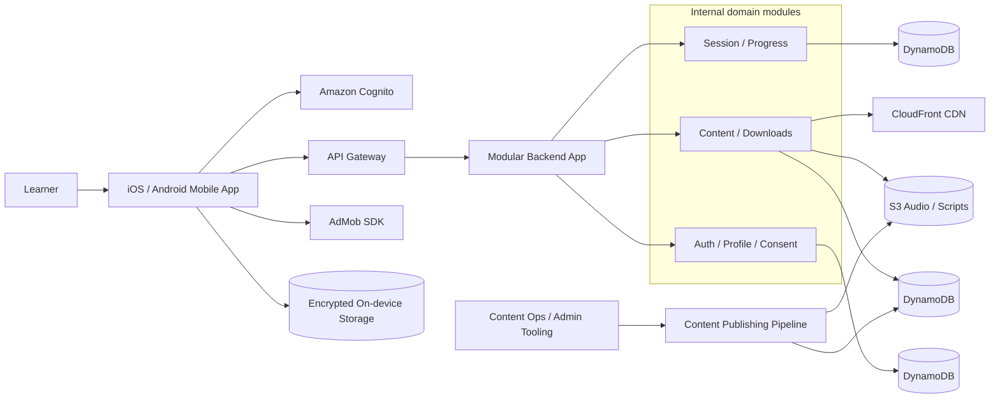
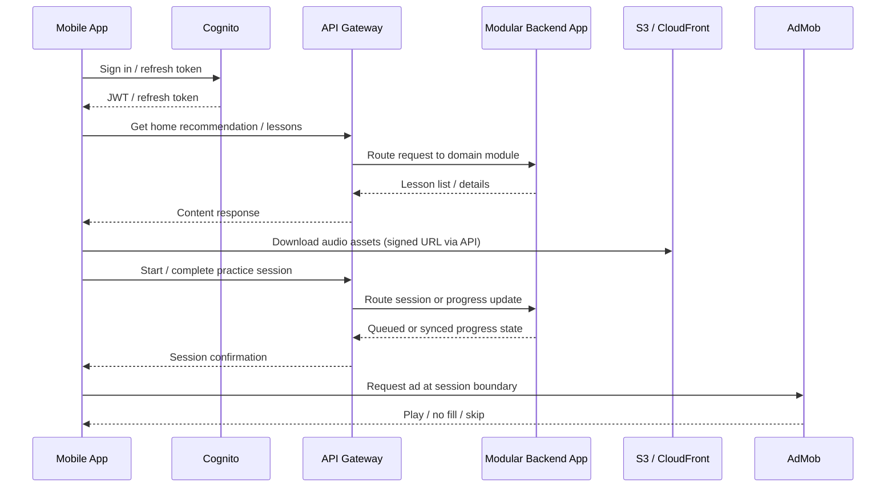
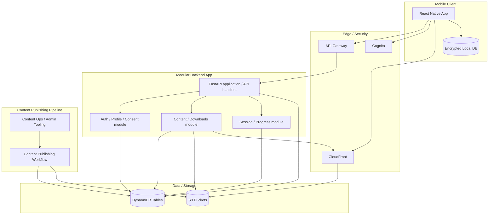

# ShadowSpeak Solution Architecture Document

## Document Metadata

| Field         | Value                          |
| ------------- | ------------------------------ |
| Project       | ShadowSpeak                    |
| Document Type | Solution Architecture Document |
| Phase         | 04 - Solution Architecture     |
| Date          | 2026-05-14                     |
| Status        | Draft                          |
| Version       | 1.3                            |
| Owner         | Solution Architecture          |

## Source Basis

This SAD is derived from:

- [Functional Requirements Specification](../02-analysis/03-Functional-Requirements-Specification.md)
- [Non-Functional Requirements Document](../02-analysis/04-Non-Functional-Requirements-Document.md)
- [Use Case Specification](../02-analysis/05-Use-Case-Specification.md)
- [User Story Document](../02-analysis/06-User-Story-Document.md)
- [User Flow Diagram](../03-ux-ui-design/01-User-Flow-Diagram.md)
- [Information Architecture Document](../03-ux-ui-design/02-Information-Architecture-Document.md)
- [Wireframe Document](../03-ux-ui-design/03-Wireframe-Document.md)
- [UI Design Specification](../03-ux-ui-design/04-UI-Design-Specification.md)

## Executive Summary

ShadowSpeak MVP is an audio-first English shadowing practice app for iOS and Android. The technical architecture must prioritize fast startup, low-latency audio playback, offline lesson access, local progress queuing, and ad-supported monetization without real-time AI.

This SAD recommends a **single modular backend deployment on AWS** with a **single cross-platform mobile client**. The architecture uses managed identity, API Gateway, Python FastAPI-backed domain modules, DynamoDB for operational data, S3 + CloudFront for audio content, and local-first synchronization for progress and offline playback.

Key architectural decisions:

- **Mobile client**: React Native + TypeScript, with native audio modules for playback and recording
- **Backend style**: One modular Python FastAPI backend with clear internal domain modules
- **Primary cloud**: AWS serverless
- **Identity**: Amazon Cognito
- **Operational data**: DynamoDB
- **Content storage**: S3 + CloudFront
- **Eventing**: Deferred until needed; MVP keeps runtime synchronous and local-first
- **Ads**: Client-side AdMob SDK, with backend telemetry only
- **Offline-first**: Local encrypted storage and sync queue on-device

Firebase can substitute for some AWS services in a simplified MVP, but this document defines the AWS baseline so module boundaries, security, and scaling remain explicit.

## Architecture Goals and Principles

- Support an audio-first, hands-free practice loop with minimal taps.
- Keep the backend stateless and horizontally scalable.
- Preserve offline practice and queued sync when connectivity is lost.
- Avoid any runtime AI or speech recognition in the MVP.
- Treat ad insertion as a non-blocking client-side experience.
- Minimize backend coupling through clear internal modules and local-first queues.
- Use managed services wherever they reduce operational burden.

## MVP Constraints and Optimization Strategy

The MVP architecture intentionally prioritizes:

- low operational complexity
- rapid iteration speed
- low infrastructure cost
- minimal deployment overhead
- solo or small-team maintainability

The architecture intentionally defers:

- distributed microservices
- advanced event infrastructure
- heavy orchestration
- complex observability tooling
- non-essential operational automation

until product validation and operational scale justify them.

## Architecture Overview

### System Context

### Logical Architecture

The MVP architecture is intentionally compact:

- One mobile application
- One API edge layer
- One modular backend deployment with internal domain modules
- One or a few DynamoDB tables, with logical domain ownership kept in code
- One content delivery layer for audio assets

The architecture separates **runtime user traffic** from **offline content production**:

- Runtime traffic serves learners, sessions, downloads, and progress.
- Offline content production handles lesson script generation, TTS generation, validation, and publishing.

### High-Level Data Flow

## Service Decomposition

### Module Boundary Strategy

The MVP uses **one modular backend deployment**, not a fleet of independently deployed microservices. Each module owns one cohesive business capability and its own logical data shape, but the runtime is kept together to reduce operational friction.

| Module                   | Responsibility                                                                                 | Data Store                                         | Notes                                               |
| ------------------------ | ---------------------------------------------------------------------------------------------- | -------------------------------------------------- | --------------------------------------------------- |
| Identity (managed)       | Authentication, token issuance, refresh flows                                                  | Cognito user pool                                  | Managed service, not part of the backend deployment |
| Auth / Profile / Consent | Profile data, age gate, privacy consent, ad consent, settings persistence                      | DynamoDB                                           | Owns user preferences and legal state               |
| Content / Downloads      | Lesson metadata, recommendation surfaces, availability, filters, signed URLs                   | DynamoDB + S3 + CloudFront                         | Handles browse and offline asset access             |
| Session / Progress       | Session start/complete, completion threshold, local sync acceptance, streaks, practice minutes | DynamoDB                                           | No real-time AI or scoring                          |
| Offline Content Pipeline | Admin / batch ingestion of lessons, scripts, TTS assets, checksums                             | Manual or semi-manual during MVP; automation later | Kept outside the runtime MVP path where possible    |

### Baseline MVP Runtime

To keep the MVP maintainable, the runtime should be treated as:

1. One API Gateway entry point
2. One modular backend deployment
3. Three internal domain modules
4. One content delivery layer

This keeps ownership clear while avoiding premature fragmentation.

### Why Not More Runtime Components?

- Reminder scheduling is local on-device, so it does not need a backend service.
- Ads are client-side via AdMob, so no ad-serving service is required.
- Real-time pronunciation scoring is out of scope for the MVP, so no inference service is needed.
- Search can be handled by DynamoDB query patterns for MVP rather than a separate search cluster.
- Event-driven infrastructure is intentionally deferred until operational volume or asynchronous workload complexity justifies it.

## Data Architecture

### Core Data Domains

| Domain               | Key Entities                                                               | Primary Characteristics                       |
| -------------------- | -------------------------------------------------------------------------- | --------------------------------------------- |
| Identity and consent | User, age status, privacy consent, ad consent                              | Sensitive, strongly audited, low write volume |
| Content catalog      | Lesson metadata, recommendation rank, availability, level, topic, duration | Read-heavy, cache-friendly                    |
| Asset delivery       | Lesson package, audio file, script, thumbnail, checksum, version           | Large binary objects, CDN-backed              |
| Practice session     | Session start, timing, completion threshold, recording reference           | Event-like writes, idempotent                 |
| Progress             | Streak, practice minutes, completion history, sync queue state             | Small records, high read frequency            |
| Offline queue        | Pending session metrics, upload status, retry count                        | Device-local first, server reconciled later   |
| Telemetry            | App events, ad events, playback events, error events                       | Append-only / analytical                      |

### Storage Recommendations

| Data Type                             | Storage                               | Rationale                                    |
| ------------------------------------- | ------------------------------------- | -------------------------------------------- |
| User profile, consent, progress state | DynamoDB                              | Low-latency, serverless, flexible schema     |
| Lesson metadata                       | DynamoDB                              | Fast filter and recommendation queries       |
| Audio assets and lesson scripts       | S3                                    | Durable binary store with lifecycle policies |
| CDN delivery                          | CloudFront                            | Low-latency asset delivery worldwide         |
| Event archive                         | S3                                    | Cheap append-only analytics storage          |
| Mobile offline DB                     | SQLite / Realm + encrypted file store | Local-first queue and playback metadata      |

Logical domain ownership does not require physical database separation during the MVP stage. The backend can use a shared DynamoDB schema or a small number of tables if that reduces development and operational overhead.

### Offline Data Model

- Lesson assets are downloaded to the device and verified with checksums.
- Practice session metrics are written locally first and then synced.
- The mobile app keeps a local queue for offline progress and retry logic.
- Recording files must be encrypted at rest on the device and before upload where required by policy.

### Data Retention

- Session and progress data should follow the 2-year retention guidance in the FRS/NFR docs unless deleted by the user.
- Deleted accounts must remove personal data and recordings according to the policy window.
- Older archives can be lifecycle-managed into lower-cost storage tiers.

## Infrastructure Design

### AWS Baseline

| Layer                     | Service                               | Purpose                                       |
| ------------------------- | ------------------------------------- | --------------------------------------------- |
| Mobile authentication     | Amazon Cognito                        | OAuth2 / JWT authentication, refresh tokens   |
| API edge                  | Amazon API Gateway                    | Single public API entry point                 |
| Compute                   | Python 3.12 + FastAPI on AWS Lambda   | Modular backend deployment                    |
| Catalog and progress data | Amazon DynamoDB                       | Low-latency operational data                  |
| Asset storage             | Amazon S3                             | Audio, scripts, recording uploads             |
| Content delivery          | Amazon CloudFront                     | Fast audio playback and download distribution |
| Secrets                   | AWS Secrets Manager / Parameter Store | Service credentials and config                |
| Encryption                | AWS KMS                               | Encryption keys for storage and envelopes     |
| Observability             | CloudWatch Logs, alarms               | Logs and basic operational alerts             |
| Security perimeter        | IAM, rate limits                      | API protection and least privilege            |

### Deployment Topology

### Environment Strategy

| Environment | Purpose                       | Notes                                                                                     |
| ----------- | ----------------------------- | ----------------------------------------------------------------------------------------- |
| Dev         | Local feature development     | Separate sandbox data and test users                                                      |
| Staging     | Integration and QA validation | Approximates production behavior where practical, while staying operationally lightweight |
| Prod        | Customer-facing MVP           | Locked-down IAM and alarms                                                                |

### CI/CD Strategy

- Infrastructure as Code via AWS CDK or Terraform
- Automated backend deploy on merge to main branch
- Mobile builds through a CI system such as GitHub Actions, Bitrise, or Codemagic
- Separate release channels for internal, beta, and production builds
- Staged deployments or versioned releases for safe backend rollouts if the backend later splits into multiple deployables

## Integration Patterns

### API Style

The baseline API style should be RESTful JSON over HTTPS.

Reasons:

- Easy to document and test
- Fits mobile network conditions well
- Works cleanly with API Gateway + FastAPI
- Keeps the MVP simple without needing a GraphQL layer

### Service Communication

| Pattern                      | Use Case                                                    | Notes                                      |
| ---------------------------- | ----------------------------------------------------------- | ------------------------------------------ |
| Synchronous REST             | Profile reads, lesson catalog, session start, download URLs | Primary pattern for user-facing operations |
| Presigned URLs               | Audio asset download and upload                             | Short-lived and secure                     |
| Local queue with later retry | Offline recording/progress sync                             | Critical for MVP reliability               |
| Deferred background jobs     | Content publishing or analytics later                       | Not part of the MVP runtime path           |

### Suggested API Surface

| Service           | Example Endpoints                                                        | Purpose                                                    |
| ----------------- | ------------------------------------------------------------------------ | ---------------------------------------------------------- |
| Profile & Consent | `GET /me`, `PUT /me`, `GET /consent`, `PUT /consent`                     | User profile and legal state                               |
| Content Catalog   | `GET /lessons`, `GET /lessons/{id}`, `GET /home/recommendation`          | Lesson browsing and discovery                              |
| Practice Session  | `POST /sessions`, `PATCH /sessions/{id}`, `POST /sessions/{id}/complete` | Session lifecycle                                          |
| Progress & Sync   | `GET /progress`, `POST /progress/sync`, `GET /progress/history`          | Streaks and sync reconciliation                            |
| Download Delivery | `POST /downloads/{lessonId}/url`, `POST /downloads/{lessonId}/verify`    | Download entitlement and verification                      |
| Telemetry         | `POST /events`                                                           | Optional future event intake, not required for MVP runtime |

### External Integrations

| Integration                            | Direction                        | Role                                                      |
| -------------------------------------- | -------------------------------- | --------------------------------------------------------- |
| Cognito                                | Inbound auth                     | Token issuance and identity                               |
| AdMob SDK                              | Client-side outbound             | Audio interstitial delivery                               |
| Push / local notifications             | Device-native only               | Reminder scheduling on device                             |
| CloudWatch Logs / alarms / Crashlytics | Backend and mobile observability | Logging, alerts, crash reporting; X-Ray optional post-MVP |

## Security Architecture

### Security Principles

- Authenticate every API request with short-lived JWTs.
- Use least privilege IAM for every backend component and data store.
- Encrypt all sensitive data in transit and at rest.
- Minimize personal data collection.
- Keep recordings encrypted and isolated from logs.
- Make consent and age-gate state auditable.

### Security Controls

| Control               | Implementation                                      |
| --------------------- | --------------------------------------------------- |
| Authentication        | Cognito with OAuth2 / PKCE for mobile               |
| Authorization         | JWT validation at API gateway or FastAPI middleware |
| Transport security    | TLS 1.2+ only                                       |
| Data at rest          | KMS-backed encryption in S3 and DynamoDB            |
| Local device security | Keychain / Keystore, encrypted local DB             |
| Upload security       | Presigned URLs, short TTL, checksum verification    |
| API protection        | API Gateway throttling, rate limits                 |
| Secrets               | Secrets Manager / Parameter Store                   |
| Auditability          | CloudTrail, structured logs, consent event records  |

### Observability Strategy

#### Required for MVP

- CloudWatch Logs
- basic CloudWatch alarms
- mobile crash reporting via Crashlytics or Sentry

#### Optional Post-MVP

- X-Ray distributed tracing
- advanced request correlation
- deep request analytics

### Privacy and Compliance

- Age-gate must be enforced before account creation and personalized ad consent.
- Consent changes must be persisted with timestamps.
- Personal data deletion must cascade to profiles, progress, and recordings.
- Recordings and session data should never appear in unredacted logs.
- Ad tracking must respect user consent and platform policy.

### Mobile Data Protection

- Store tokens and encryption keys in secure platform storage.
- Encrypt recordings locally before upload and while stored locally.
- Use signed URLs and short-lived access for lesson assets.
- Ensure no sensitive data remains in clipboard or debug logs.

### Optional Post-MVP Hardening

- AWS WAF can be added later if public traffic, bot activity, or abuse patterns justify the extra control layer.
- For the MVP, API Gateway throttling, Cognito auth, and backend validation are the primary protection mechanisms.

## Scalability and Performance

### Performance Targets

The SAD inherits the NFR targets:

- Cold app launch: ≤ 2.5s on mid-range devices
- Audio playback latency: ≤ 150ms
- Content list response: 95% ≤ 300ms
- Download completion: lesson assets should complete quickly on reasonable mobile networks

### Scaling Strategy

| Area            | Strategy                                                                                      |
| --------------- | --------------------------------------------------------------------------------------------- |
| API traffic     | One modular FastAPI backend behind API Gateway with AWS-managed concurrency                   |
| Catalog reads   | DynamoDB on-demand or provisioned with auto-scaling, plus CloudFront caching where applicable |
| Audio assets    | CloudFront for global edge delivery                                                           |
| Progress writes | Small idempotent writes and local queuing on mobile                                           |
| Telemetry       | Keep lightweight in MVP; expand later if event volume justifies it                            |

### Performance Tactics

- Cache immutable lesson metadata aggressively.
- Use signed URLs for audio assets to avoid backend proxying.
- Keep session start and lesson browse APIs lightweight.
- Prefer idempotent writes so retries do not duplicate progress.
- Do not stream audio through the application API; serve it from S3/CDN.

### Reliability Tactics

- Queue practice and progress data locally when offline.
- Retry failed syncs automatically with backoff.
- Make download verification deterministic with checksums.
- Use fallback states instead of blocking the learner.

## Deployment Strategy Overview

### Release Model

1. Deploy infrastructure first via IaC
2. Deploy the backend to dev
3. Promote to staging for integration testing
4. Release mobile beta builds to internal testers
5. Roll out production mobile and backend in a coordinated release window

### Rollout Patterns

- Use versioned releases or deployment aliases for safe backend rollout if the backend later splits into multiple deployables.
- Use staged mobile release channels.
- Use feature flags for non-essential UI or analytics toggles.
- Keep the MVP release path narrow; avoid partial feature branching unless necessary.

### Operational Readiness

| Item           | Approach                                                              |
| -------------- | --------------------------------------------------------------------- |
| Monitoring     | CloudWatch alarms for API errors, latency, and failures               |
| Logging        | JSON logs with correlation IDs                                        |
| Tracing        | Optional after MVP if needed for diagnostics                          |
| Mobile crashes | Crashlytics or Sentry                                                 |
| Alerts         | Slack/email/pager for critical backend failures                       |
| Runbooks       | Basic incident response for auth, content delivery, and sync failures |

## Firebase Simplification Option

If the team chooses to optimize for fewer moving parts, the same logical architecture can be mapped to Firebase:

- Cognito -> Firebase Auth
- DynamoDB -> Firestore
- S3 -> Firebase Storage
- Lambda -> Cloud Functions
- CloudFront -> Firebase Hosting/CDN behavior
- CloudWatch Logs / alarms / optional X-Ray -> Firebase Analytics / Crashlytics / Logging

This is a valid MVP simplification, but the baseline architecture in this SAD remains AWS serverless so module boundaries and future scale paths stay explicit.

## Implementation Roadmap

### MVP Phase 1

- Mobile app shell and navigation
- Authentication and consent
- Lesson catalog and lesson detail
- Audio asset delivery

### MVP Phase 2

- Practice session lifecycle
- Local recording and comparison
- Progress tracking and sync
- Downloaded/offline lesson support

### MVP Phase 3

- Ad event telemetry
- Monitoring, logging, and alarms
- Operational hardening

## Traceability Matrix

| Architecture Element        | Functional Requirements                  | Use Cases                                                     | UI / Flow References                            |
| --------------------------- | ---------------------------------------- | ------------------------------------------------------------- | ----------------------------------------------- |
| Cognito auth                | FR-1, FR-9                               | UC-01, UC-11                                                  | Onboarding / Sign In                            |
| Modular backend app         | FR-2, FR-3, FR-4, FR-5, FR-7, FR-8, FR-9 | UC-01, UC-02, UC-03, UC-04, UC-05, UC-06, UC-08, UC-10, UC-11 | Home / Catalog / Practice / Progress / Settings |
| Content delivery layer      | FR-2, FR-7                               | UC-02, UC-06                                                  | Home / Catalog / Downloads                      |
| AdMob client integration    | FR-6                                     | UC-09                                                         | Session boundary ad interstitial                |
| Offline local storage       | FR-3, FR-4, FR-5, FR-7                   | UC-03, UC-04, UC-06                                           | Offline practice and queued sync                |
| Observability stack         | NFR-1 through NFR-20                     | All relevant flows                                            | All screens / runtime                           |
| Content publishing pipeline | FR-2, FR-7                               | UC-02, UC-06                                                  | Admin content prep and publishing               |

## Open Assumptions

- AWS serverless is the baseline, with Firebase treated as a simplification alternative.
- Search remains a future enhancement unless the product explicitly expands the discovery scope.
- Ads remain client-side only in the MVP.
- No real-time AI or speech scoring service exists in the MVP runtime.
- Reminder scheduling remains on-device and does not require a backend notification service.
