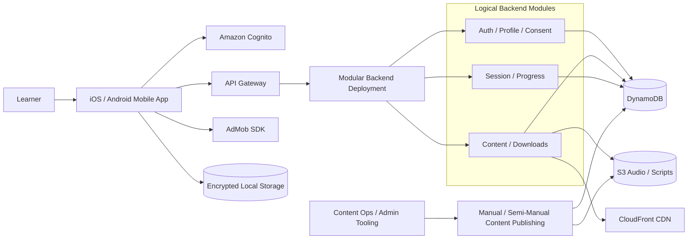
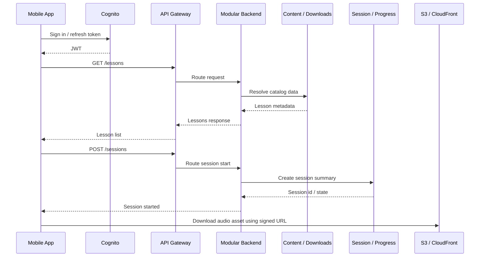
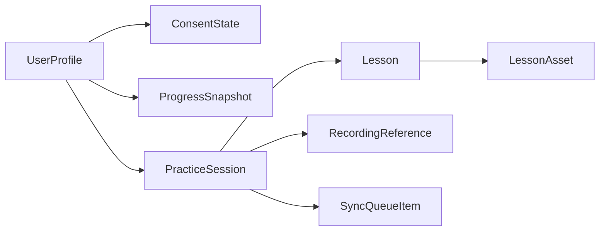

# ShadowSpeak High-Level Design Document

## Document Metadata

| Field         | Value                      |
| ------------- | -------------------------- |
| Project       | ShadowSpeak                |
| Document Type | High-Level Design Document |
| Phase         | 04 - Solution Architecture |
| Date          | 2026-05-14                 |
| Status        | Draft                      |
| Version       | 1.3                        |
| Owner         | Architecture               |

## Source Basis

This HLD is derived from:

- [Solution Architecture Document](01-Solution-Architecture-Document.md)
- [Functional Requirements Specification](../02-analysis/03-Functional-Requirements-Specification.md)
- [Use Case Specification](../02-analysis/05-Use-Case-Specification.md)
- [User Story Document](../02-analysis/06-User-Story-Document.md)
- [User Flow Diagram](../03-ux-ui-design/01-User-Flow-Diagram.md)
- [Information Architecture Document](../03-ux-ui-design/02-Information-Architecture-Document.md)
- [Wireframe Document](../03-ux-ui-design/03-Wireframe-Document.md)
- [UI Design Specification](../03-ux-ui-design/04-UI-Design-Specification.md)

## Scope

### In Scope

- Logical module decomposition for the ShadowSpeak MVP
- System component definitions and module responsibilities
- Data model overview and relationships
- API contract overview between mobile client and backend modules
- Integration points with Cognito, S3, CloudFront, AdMob, and mobile storage
- Security, performance, and scalability considerations
- Traceability to FRS, use cases, and UI screens

### Out of Scope

- Code-level class design, methods, and internal implementation details
- Low-level database indexing and migration scripts
- Deployment runbooks and production operations procedures
- Future-state AI scoring, social, subscriptions, or leaderboards

## HLD Design Principles

- Keep the backend as one modular deployment with logical internal boundaries.
- Optimize for solo or small-team development speed.
- Keep runtime dependencies minimal and predictable.
- Prefer synchronous REST where it keeps the MVP simple.
- Push complexity out of the runtime path when possible.
- Treat offline behavior as a first-class requirement, not a fallback.
- Preserve a clean extraction path if the product later grows beyond the MVP.

## MVP Architecture Non-Goals

The MVP architecture intentionally does not optimize for:

- independently deployed microservices
- real-time AI scoring
- backend-managed ad serving
- advanced event-driven orchestration
- large-scale analytics pipelines
- automated content publishing workflows
- complex multi-region deployment strategies
- enterprise-grade observability systems

## High-Level Design Overview

ShadowSpeak MVP consists of a cross-platform mobile client, a single modular backend deployment on AWS, managed authentication, cloud-hosted lesson assets, local offline storage, and client-side ad delivery.

The design intentionally avoids premature service fragmentation:

- one API edge
- one backend deployment
- a few logical backend modules
- one CDN-backed audio delivery layer
- one local offline queue on the device

## Technology Stack Overview

| Layer            | Recommended Stack                               | Notes                                                                                                                                                                                  |
| ---------------- | ----------------------------------------------- | -------------------------------------------------------------------------------------------------------------------------------------------------------------------------------------- |
| Mobile client    | React Native + TypeScript                       | Single codebase for iOS and Android                                                                                                                                                    |
| Backend runtime  | Python 3.12 + FastAPI on AWS Lambda             | Chosen for strong API ergonomics, lightweight serverless deployment characteristics, simplified request validation via Pydantic, and lower operational friction during MVP development |
| API edge         | Amazon API Gateway                              | REST JSON over HTTPS                                                                                                                                                                   |
| Authentication   | Amazon Cognito                                  | JWT-based sign-in and refresh                                                                                                                                                          |
| Operational data | Amazon DynamoDB                                 | Shared schema or small table set acceptable in MVP                                                                                                                                     |
| Audio assets     | Amazon S3 + CloudFront                          | Direct CDN-backed delivery                                                                                                                                                             |
| Offline storage  | Encrypted SQLite or Realm                       | Local-first queue and playback metadata                                                                                                                                                |
| Observability    | CloudWatch Logs + alarms, Crashlytics or Sentry | X-Ray optional post-MVP                                                                                                                                                                |
| CI/CD            | AWS CDK or Terraform, GitHub Actions or similar | Keep deployment automation lightweight                                                                                                                                                 |

### System Component Diagram

## Module Decomposition

### 1. Auth / Profile / Consent Module

#### Responsibility

- Authenticate the learner through Cognito
- Persist profile data
- Store age gate decisions
- Store privacy and ad consent
- Manage settings tied to the user account

#### Boundaries

- Owns only user identity metadata and legal state
- Does not store lesson content or session recordings
- Does not manage audio assets or reminders directly

#### Technology Stack

- Python 3.12 + FastAPI
- API Gateway
- Amazon Cognito
- DynamoDB
- AWS KMS

#### Key Data Structures

| Entity       | Purpose                                           |
| ------------ | ------------------------------------------------- |
| UserProfile  | Basic account profile and display preferences     |
| ConsentState | Age gate, privacy consent, ad consent, timestamps |
| UserSettings | Playback, reminder, and account preferences       |

#### Core API Contracts

| Endpoint   | Method   | Purpose                                |
| ---------- | -------- | -------------------------------------- |
| `/me`      | `GET`    | Fetch current profile and settings     |
| `/me`      | `PUT`    | Update profile and account preferences |
| `/consent` | `GET`    | Read current consent state             |
| `/consent` | `PUT`    | Persist age gate and consent decisions |
| `/account` | `DELETE` | Request account deletion               |

#### Dependencies

- Cognito JWT validation
- Shared DynamoDB table or small table set
- CloudWatch Logs for auditability

#### Authorization Model

Authorization is enforced primarily at the application layer using:

- Cognito JWT claims
- Cognito groups
- module-level authorization checks

AWS IAM isolation between logical backend modules is intentionally lightweight during the MVP stage to reduce operational complexity.

---

### 2. Content / Downloads Module

#### Responsibility

- Serve lesson catalog metadata
- Support filtering and recommendation surfaces
- Provide lesson detail data
- Issue signed URLs for audio/script downloads
- Mark lessons as downloaded or available offline

#### Boundaries

- Owns lesson metadata and asset access metadata
- Does not manage learner progress
- Does not manage recording uploads beyond asset-related access

#### Technology Stack

- Python 3.12 + FastAPI
- API Gateway
- DynamoDB
- Amazon S3
- CloudFront
- AWS KMS

#### Key Data Structures

| Entity            | Purpose                                                             |
| ----------------- | ------------------------------------------------------------------- |
| Lesson            | Lesson metadata, level, topic, duration, availability, thumbnailUrl |
| LessonAsset       | Audio/script asset reference, checksum, version                     |
| DownloadGrant     | Signed download entitlement and expiry                              |
| OfflineLessonFlag | Marks whether a lesson is available offline for the user            |

#### Core API Contracts

| Endpoint                       | Method | Purpose                                               |
| ------------------------------ | ------ | ----------------------------------------------------- |
| `/lessons`                     | `GET`  | Return lesson list with filters                       |
| `/lessons/{id}`                | `GET`  | Return lesson detail                                  |
| `/home/recommendation`         | `GET`  | Return the recommended lesson or next action          |
| `/downloads/{lessonId}/url`    | `POST` | Generate signed asset URL                             |
| `/downloads/{lessonId}/verify` | `POST` | Confirm successful offline asset access or completion |

#### Dependencies

- DynamoDB lesson metadata
- S3 asset storage
- CloudFront CDN for playback/download

---

### 3. Session / Progress Module

#### Responsibility

- Start and complete practice sessions
- Persist session summaries
- Track progress and streaks
- Accept offline sync payloads
- Reconcile locally queued progress after reconnect

#### Boundaries

- Owns session and progress state only
- Does not own lesson metadata
- Does not own ad serving or content delivery

#### Technology Stack

- Python 3.12 + FastAPI
- API Gateway
- DynamoDB
- Local encrypted storage on the client

#### Key Data Structures

| Entity             | Purpose                                          |
| ------------------ | ------------------------------------------------ |
| PracticeSession    | Session lifecycle metadata and completion status |
| ProgressSnapshot   | Lesson completion, streak, minutes practiced     |
| SyncQueueItem      | Locally queued offline item awaiting sync        |
| RecordingReference | Local or uploaded recording pointer              |

#### Core API Contracts

| Endpoint                  | Method  | Purpose                        |
| ------------------------- | ------- | ------------------------------ |
| `/sessions`               | `POST`  | Start a session                |
| `/sessions/{id}`          | `PATCH` | Update active session state    |
| `/sessions/{id}/complete` | `POST`  | Finalize a completed lesson    |
| `/progress`               | `GET`   | Fetch current progress summary |
| `/progress/history`       | `GET`   | Fetch practice history         |
| `/progress/sync`          | `POST`  | Sync offline progress payloads |

#### Dependencies

- Shared DynamoDB schema or small table set
- Client-side offline queue
- CloudWatch Logs for sync diagnostics

---

### 4. Manual / Semi-Manual Content Publishing

#### Responsibility

- Prepare lesson content
- Generate or ingest scripts and audio assets
- Validate checksums
- Publish assets and metadata

#### Boundaries

- Outside the learner runtime path
- May remain manual or semi-manual during MVP
- Can later be automated with Step Functions or similar orchestration

#### Technology Stack

- AWS S3
- DynamoDB
- Python scripts or manual admin tooling
- Future: Step Functions if content volume grows

#### MVP Position

During MVP, content ingestion and publishing may remain partially manual to reduce operational complexity.

---

## Module Interaction Model

### Runtime Flow

1. The mobile app authenticates with Cognito.
2. The mobile app calls API Gateway.
3. API Gateway routes to the modular backend deployment.
4. The backend routes to the appropriate logical module.
5. The module reads or writes DynamoDB, S3, or CloudFront metadata as needed.
6. The mobile app stores offline data locally when connectivity is unavailable.
7. The app syncs queued data later through the progress module.

### Interaction Diagram

## Data Model Overview

### Shared Schema Strategy

The MVP can use one shared DynamoDB schema or a small number of tables. Logical domain boundaries remain in code even if tables are shared.

### Primary Data Entities

| Entity             | Description                                  | Owned By                 |
| ------------------ | -------------------------------------------- | ------------------------ |
| UserProfile        | User account metadata and preferences        | Auth / Profile / Consent |
| ConsentState       | Age gate, privacy consent, ad consent        | Auth / Profile / Consent |
| Lesson             | Lesson metadata and browse fields            | Content / Downloads      |
| LessonAsset        | Audio and script asset references            | Content / Downloads      |
| DownloadGrant      | Temporary signed access state                | Content / Downloads      |
| PracticeSession    | Session lifecycle and completion summary     | Session / Progress       |
| ProgressSnapshot   | Lesson completion, streak, minutes practiced | Session / Progress       |
| SyncQueueItem      | Offline payload waiting to be synced         | Session / Progress       |
| RecordingReference | Local recording reference metadata           | Session / Progress       |

### Relationships

- A `UserProfile` has one active `ConsentState`.
- A `UserProfile` has many `ProgressSnapshot` records.
- A `Lesson` has one or more `LessonAsset` records.
- A `PracticeSession` belongs to one `UserProfile` and one `Lesson`.
- A `SyncQueueItem` references a `PracticeSession` or `ProgressSnapshot`.

### Core Access Patterns

Examples of expected MVP access patterns include:

- get user profile by `userId`
- get consent state by `userId`
- list lessons by level or topic
- fetch lesson details by `lessonId`
- fetch user progress summary by `userId`
- fetch recent practice history by `userId`
- sync offline progress batch by `userId` and `clientMutationId`

### MVP Recording Storage Strategy

Practice recordings are local-first during MVP.

Recordings are not uploaded by default unless explicitly required by a future feature, explicit learner action, or later AI evaluation workflows.

This minimizes infrastructure cost, privacy exposure, storage complexity, and upload reliability concerns.

### Logical ER Overview

## API Contract Overview

### Frontend to Backend

| Area              | Request Pattern                | Notes                                                |
| ----------------- | ------------------------------ | ---------------------------------------------------- |
| Authentication    | Cognito JWT + refresh token    | The app obtains identity outside the backend modules |
| Catalog           | REST `GET` requests            | Lightweight and cache-friendly                       |
| Session lifecycle | REST `POST` / `PATCH` requests | Idempotent where possible                            |
| Progress sync     | REST `POST` requests           | Accept offline batches                               |
| Downloads         | REST to fetch signed URLs      | Asset bytes come from S3/CloudFront                  |

### Representative Contract Rules

- Requests must include a valid Cognito JWT after sign-in.
- Session completion requests must be idempotent.
- Sync requests must tolerate retries.
- Download URL responses must be short-lived and time-bound.
- Error responses should use consistent JSON error codes and user-safe messages.

### Error Contract Summary

| Error | Condition                     | User Outcome                        |
| ----- | ----------------------------- | ----------------------------------- |
| 401   | Missing or expired token      | Prompt sign-in                      |
| 403   | Age gate or consent denied    | Block and guide to compliance state |
| 404   | Lesson or session missing     | Show not found state                |
| 409   | Duplicate or conflicting sync | Reconcile and retry                 |
| 422   | Invalid input                 | Show validation error               |
| 500   | Unexpected server issue       | Show retryable error state          |

## Security Considerations

### Authentication Flow

1. The learner signs in through Cognito.
2. Cognito returns a JWT and refresh token.
3. The mobile app calls API Gateway with the JWT.
4. API Gateway or backend middleware validates the token.
5. Backend modules authorize access based on the user identity and consent state.

### Authorization Model

Authorization is enforced primarily at the application layer using:

- Cognito JWT claims
- Cognito groups
- module-level authorization checks

AWS IAM isolation between logical backend modules is intentionally lightweight during the MVP stage to reduce operational complexity.

### Security Controls

| Control            | Design Choice                                  |
| ------------------ | ---------------------------------------------- |
| Transport security | TLS 1.2+ end to end                            |
| AuthN              | Cognito OAuth2 / PKCE                          |
| AuthZ              | JWT-based authorization                        |
| Storage encryption | KMS-backed S3 and DynamoDB encryption          |
| Local storage      | Keychain / Keystore and encrypted local DB     |
| Asset access       | Short-lived signed URLs                        |
| Audit              | CloudWatch Logs and structured consent records |

### Content Protection

- Lesson audio is delivered through S3 and CloudFront, not through the app API.
- Signed URLs limit asset exposure.
- Asset checksums support integrity verification.

### Privacy

- Consent and age-gate state must be auditable.
- Recordings should not be written to logs.
- Deletion requests must remove personal and progress data within policy windows.

## Performance and Scalability

### MVP Performance Targets

- Fast startup on mid-range devices
- Low-latency audio playback
- Quick lesson browse and catalog response
- Reliable offline sync after reconnection

### Design Tactics

| Area           | Tactic                                                |
| -------------- | ----------------------------------------------------- |
| Catalog        | Keep browse payloads small and cacheable              |
| Audio delivery | Use CloudFront, not backend proxying                  |
| Session writes | Use idempotent writes and small summaries             |
| Offline usage  | Queue locally first, sync later                       |
| Database       | Keep the number of tables small and the schema simple |

### Scalability Position

- The MVP should scale comfortably for early user growth without a complex distributed design.
- If growth later demands it, the logical modules can be extracted into separate services with limited redesign.
- The current design favors operational simplicity over premature service splitting.

## External Integration Points

| Integration           | Purpose                           | Notes                                |
| --------------------- | --------------------------------- | ------------------------------------ |
| Cognito               | Authentication and token issuance | Managed identity layer               |
| AdMob SDK             | Audio interstitial monetization   | Client-side only                     |
| S3                    | Lesson assets and scripts         | CDN-backed delivery                  |
| CloudFront            | Audio distribution                | Low-latency playback/download        |
| CloudWatch Logs       | Diagnostics                       | Required MVP observability           |
| Crashlytics or Sentry | Mobile crash reporting            | Recommended MVP mobile observability |
| Local notifications   | Reminder scheduling               | Device-native only                   |

## Traceability Matrix

| HLD Component                           | Functional Requirements                           | Use Cases                  | UI / Flow References                                    |
| --------------------------------------- | ------------------------------------------------- | -------------------------- | ------------------------------------------------------- |
| Auth / Profile / Consent                | FR-1, FR-8, FR-9                                  | UC-01, UC-10, UC-11        | Age Gate, Privacy and Ad Consent, Sign In, Settings     |
| Content / Downloads                     | FR-2, FR-7                                        | UC-02, UC-06               | Home, Lesson Catalog, Lesson Detail, Downloaded Lessons |
| Session / Progress                      | FR-3, FR-4, FR-5                                  | UC-03, UC-04, UC-05, UC-08 | Practice Session, Recording Comparison, Progress View   |
| Manual / Semi-Manual Content Publishing | FR-2, FR-7                                        | UC-02, UC-06               | Internal content prep and asset publishing              |
| AdMob Integration                       | FR-6                                              | UC-09                      | Session boundary ad interstitial                        |
| Offline Sync                            | FR-3, FR-4, FR-5, FR-7                            | UC-03, UC-04, UC-06        | Offline Practice Session, Offline Library               |
| Observability                           | NFRs related to logging, monitoring, and recovery | All relevant flows         | All screens and runtime behaviors                       |

## MVP vs Post-MVP Notes

### MVP

- One modular backend deployment
- Synchronous REST for most flows
- Client-side ads only
- Manual or semi-manual content publishing is acceptable
- CloudWatch Logs and alarms are required
- Local offline queue is required

### Deferred Infrastructure Triggers

Introduce asynchronous or event-driven infrastructure only when:

- offline sync retries become unreliable through client-only retry behavior
- content publishing frequency justifies automation
- telemetry or event ingestion volume becomes operationally significant
- background processing complexity increases
- operational workflows become difficult to manage synchronously

### Post-MVP

- Event-driven infrastructure if workload complexity grows
- X-Ray if tracing becomes valuable
- WAF if abuse or bot traffic becomes meaningful
- Automated content publishing orchestration if content volume increases
- Physical service extraction if team size or traffic warrants it

## Revision History

| Version | Date       | Author       | Description                                                                                  |
| ------- | ---------- | ------------ | -------------------------------------------------------------------------------------------- |
| 1.0     | 2026-05-14 | Architecture | Initial HLD draft for modular MVP backend                                                    |
| 1.1     | 2026-05-14 | Architecture | Added explicit stack overview and tightened MVP boundaries                                   |
| 1.2     | 2026-05-14 | Architecture | Added MVP non-goals, access patterns, recording policy, and clearer boundary definitions     |
| 1.3     | 2026-05-14 | Architecture | Added authorization model, deferred infrastructure triggers, and renamed publishing workflow |
