# ShadowSpeak Low-Level Design Document

## Document Metadata

| Field         | Value                      |
| ------------- | -------------------------- |
| Project       | ShadowSpeak                |
| Document Type | Low-Level Design Document  |
| Phase         | 04 - Solution Architecture |
| Date          | 2026-05-14                 |
| Status        | Draft                      |
| Version       | 1.10                       |
| Owner         | Backend Developer          |

## Source Basis

This LLD is derived from:

- [Solution Architecture Document](01-Solution-Architecture-Document.md)
- [High-Level Design Document](02-High-Level-Design-Document.md)
- [Functional Requirements Specification](../02-analysis/03-Functional-Requirements-Specification.md)
- [Non-Functional Requirements Document](../02-analysis/04-Non-Functional-Requirements-Document.md)
- [Use Case Specification](../02-analysis/05-Use-Case-Specification.md)
- [User Story Documents](../02-analysis/06-user-story/)
- [User Flow Diagram](../03-ux-ui-design/01-User-Flow-Diagram.md)
- [Information Architecture Document](../03-ux-ui-design/02-Information-Architecture-Document.md)

## Scope

### In Scope

- Detailed Python class, Pydantic model, and type design for backend modules
- Backend handler logic, validation, and error handling
- DynamoDB access patterns, item models, and query strategies
- Mobile client component structure and local storage design
- API middleware chain, request/response envelopes, and endpoint behavior
- Offline sync queue design and conflict resolution
- Security implementation details, logging, and testing strategy
- Sequence diagrams and state machine diagrams for core flows
- Implementation-level notes for shared-schema and local-first design choices

### Out of Scope

- AWS infrastructure provisioning and deployment automation
- CI/CD pipeline implementation
- Low-level UI styling and visual design details
- Future-state AI scoring, social features, subscriptions, and leaderboards
- Step Functions or event-driven orchestration beyond MVP needs

## MVP Implementation Non-Goals

The LLD intentionally does not optimize for:

- separate deployable backend services for each module
- server-side ad orchestration
- cloud-uploaded recordings by default
- advanced analytics pipelines
- complex offline merge strategies
- multi-region deployment patterns
- elaborate framework abstractions

## Design Principles

- Keep implementation practical for a solo or small team.
- Favor small, testable modules over large frameworks.
- Reuse shared types between mobile and backend where it reduces drift.
- Keep sync and idempotency explicit.
- Use local-first behavior for recordings and progress.
- Avoid over-engineering into separate deployable services.

## Architecture Summary

The MVP uses:

- one React Native mobile client
- one API Gateway entry point
- one modular Python FastAPI backend
- three logical backend modules
- one client-side ad integration
- one local encrypted offline store

## Technology Stack

| Layer           | Stack                                    |
| --------------- | ---------------------------------------- |
| Mobile          | React Native + TypeScript                |
| Backend         | Python 3.12 + FastAPI on AWS Lambda      |
| Auth            | Amazon Cognito                           |
| API             | Amazon API Gateway, REST JSON over HTTPS |
| Data            | Amazon DynamoDB                          |
| Audio assets    | Amazon S3 + CloudFront                   |
| Offline storage | SQLite or Realm with encryption          |
| Ads             | AdMob SDK                                |
| Logging         | CloudWatch Logs, structured JSON         |
| Crash reporting | Crashlytics or Sentry                    |

## 1. Shared Domain Types

### 1.1 Common Enums and Utility Types

> The model sketches in this document are expressed in a compact schema-style notation. In Python, they map to Pydantic models and `typing` aliases.

```python
from typing import Any, Generic, Literal, Optional, Protocol, TypeVar

from pydantic import BaseModel


Id = str
IsoDateTime = str
UserId = str
LessonId = str
SessionId = str
ClientMutationId = str

T = TypeVar("T")


class ApiErrorPayload(BaseModel):
    code: str
    message: str
    details: Optional[dict[str, Any]] = None


class ApiResult(BaseModel, Generic[T]):
    ok: bool
    requestId: str
    data: Optional[T] = None
    error: Optional[ApiErrorPayload] = None


JsonEnvelope = ApiResult
```

### 1.2 Core Domain Models

```python
from pydantic import BaseModel


class ConsentState(BaseModel):
    userId: UserId
    ageVerified: bool
    privacyAccepted: bool
    adConsent: Literal["unknown", "personalized", "non_personalized"]
    consentUpdatedAt: IsoDateTime
    locale: Optional[str] = None


class UserProfile(BaseModel):
    userId: UserId
    displayName: Optional[str] = None
    email: Optional[str] = None
    level: Optional[Literal["beginner", "intermediate", "advanced"]] = None
    reminderTime: Optional[str] = None
    deletionRequestedAt: Optional[IsoDateTime] = None
    deletionStatus: Optional[Literal["active", "deletion_requested", "purged"]] = None
    createdAt: IsoDateTime
    updatedAt: IsoDateTime


class Lesson(BaseModel):
    lessonId: LessonId
    title: str
    level: Literal["beginner", "intermediate", "advanced"]
    topic: str
    durationSeconds: int
    language: str
    isPublished: bool
    thumbnailUrl: str
    audioAssetKey: str
    scriptAssetKey: str
    updatedAt: IsoDateTime


class PracticeSession(BaseModel):
    sessionId: SessionId
    userId: UserId
    lessonId: LessonId
    status: Literal["created", "active", "paused", "completed", "synced"]
    startedAt: IsoDateTime
    expiresAt: Optional[IsoDateTime] = None
    completedAt: Optional[IsoDateTime] = None
    completionPercent: Optional[int] = None
    recordingLocalUri: Optional[str] = None
    clientMutationId: Optional[ClientMutationId] = None


class ProgressSnapshot(BaseModel):
    userId: UserId
    lessonId: Optional[LessonId] = None
    streakDays: int = 0
    minutesPracticed: int = 0
    lastPracticedAt: Optional[IsoDateTime] = None
    completedLessonCount: int = 0
    updatedAt: IsoDateTime


class SyncQueueItem(BaseModel):
    id: Id
    userId: UserId
    type: Literal["session_complete", "progress_update"]
    payload: Any
    clientMutationId: ClientMutationId
    retryCount: int
    nextRetryAt: Optional[IsoDateTime] = None
    status: Literal["pending", "processing", "failed", "synced"] = "pending"
```

### 1.3 MVP Data Notes

- `Lesson.thumbnailUrl` is a CDN URL (e.g. `https://cdn.shadowspeak.app/thumbnails/conversation.webp`). All lessons sharing the same `topic` return the same `thumbnailUrl`. The client caches downloaded thumbnail files by topic key in app data and reuses them across lessons.

- Shared schema is preferred over many small DynamoDB tables if it reduces maintenance.
- Recordings remain local-first and are not uploaded by default.
- `clientMutationId` is required for any write that may be retried.
- Consent and progress writes must be idempotent.

## 2. Backend Module Design

### 2.1 Auth / Profile / Consent Module

#### Responsibilities

- Validate Cognito identity on protected endpoints
- Read and update user profile and settings
- Store age gate, privacy, and ad consent state
- Emit auditable consent-change logs

#### Class Diagram

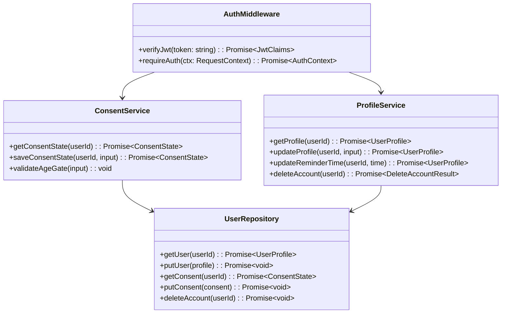

#### Python Model Design

```python
from typing import Literal, Optional, Protocol, TypedDict

from pydantic import BaseModel


class JwtClaims(TypedDict, total=False):
    sub: str
    email: str
    # Cognito exposes the raw JWT claim as "cognito:groups"; normalize it in code.
    cognito_groups: list[str]
    exp: int
    iat: int


class RequestContext(BaseModel):
    requestId: str
    token: Optional[str]
    headers: dict[str, Optional[str]]
    body: object | None = None


class AuthContext(BaseModel):
    userId: str
    claims: JwtClaims
    groups: list[str]


class UpdateConsentInput(BaseModel):
    ageVerified: bool
    privacyAccepted: bool
    adConsent: Literal["unknown", "personalized", "non_personalized"]


class UpdateProfileInput(BaseModel):
    displayName: Optional[str] = None
    level: Optional[Literal["beginner", "intermediate", "advanced"]] = None
    reminderTime: Optional[str] = None


class ConsentServiceProtocol(Protocol):
    async def get_consent_state(self, user_id: str) -> ConsentState: ...
    async def save_consent_state(self, user_id: str, input_data: UpdateConsentInput) -> ConsentState: ...


class ProfileServiceProtocol(Protocol):
    async def get_profile(self, user_id: str) -> UserProfile: ...
    async def update_profile(self, user_id: str, input_data: UpdateProfileInput) -> UserProfile: ...
    async def delete_account(self, user_id: str) -> DeleteAccountResult: ...
```

#### Business Logic

- Reject consent updates if age is not verified.
- Require `privacyAccepted=true` before onboarding can continue.
- Require consent state to be stored with a server timestamp.
- Treat profile updates as partial updates and preserve existing values.

#### Validation Rules

- `ageVerified` must be true before account completion.
- `adConsent` must be one of the supported values.
- `displayName` must be trimmed and length-limited.
- `reminderTime` must match `HH:MM` local time format when present.

#### Error Handling

| Code                | Condition                          | Handling   |
| ------------------- | ---------------------------------- | ---------- |
| `AUTH_UNAUTHORIZED` | Missing or invalid JWT             | Return 401 |
| `CONSENT_REQUIRED`  | Consent missing or age gate failed | Return 403 |
| `VALIDATION_ERROR`  | Bad payload                        | Return 422 |
| `USER_NOT_FOUND`    | Profile missing                    | Return 404 |
| `SYSTEM_ERROR`      | DynamoDB or runtime failure        | Return 500 |

#### Access Pattern Notes

- `GetItem` by `userId` for profile and consent.
- Conditional `UpdateItem` for consent changes.
- Audit log on every consent change.
- See Section 9.7 for the account deletion sequence diagram.

#### Account Deletion Design

- `ProfileService.deleteAccount(userId)` initiates the account deletion lifecycle.
- `UserRepository.deleteAccount(userId)` handles persistence-layer tombstoning and purge scheduling.
- The persisted `UserProfile` shape is extended with `deletionRequestedAt?: IsoDateTime` and a deletion state field so the 30-day grace window is explicit.
- Deletion cascades in this order: user profile, consent record, session records, sync queue items, then local device data.
- Local device purge is requested immediately and retried on the next foreground sync or device-unlock event until completed.

```python
from typing import Literal, Protocol

from pydantic import BaseModel


class DeleteAccountResult(BaseModel):
    userId: UserId
    deletionRequestedAt: IsoDateTime
    purgeAfter: IsoDateTime
    status: Literal["deletion_requested", "purged"]


class UserRepositoryProtocol(Protocol):
    async def delete_account(self, user_id: str) -> None: ...
    async def mark_deletion_requested(self, user_id: str, requested_at: str) -> None: ...
```

---

### 2.2 Content / Downloads Module

#### Responsibilities

- Query lesson catalog and lesson details
- Filter and sort lessons
- Generate signed URLs for audio assets
- Confirm download verification
- Respect publication state and stale-content recovery

#### Class Diagram

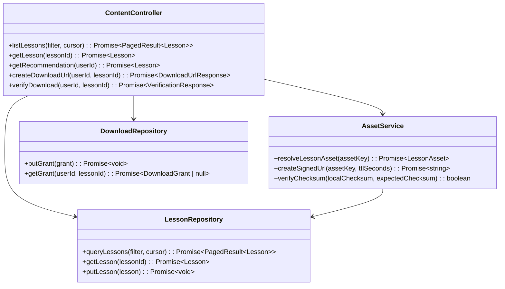

#### Python Model Design

```python
from typing import Generic, Literal, Optional, TypeVar

from pydantic import BaseModel


class LessonFilter(BaseModel):
    level: Optional[Literal["beginner", "intermediate", "advanced"]] = None
    topic: Optional[str] = None
    durationMin: Optional[int] = None
    durationMax: Optional[int] = None
    cursor: Optional[str] = None
    limit: Optional[int] = None


T = TypeVar("T")


class PagedResult(BaseModel, Generic[T]):
    items: list[T]
    nextCursor: Optional[str] = None


class DownloadUrlResponse(BaseModel):
    url: str
    expiresAt: IsoDateTime
    sizeBytes: int


class DownloadGrant(BaseModel):
    userId: UserId
    lessonId: LessonId
    grantedAt: IsoDateTime
    expiresAt: IsoDateTime
    assetKey: str


class LessonAsset(BaseModel):
    assetKey: str
    checksum: str
    version: str
    sizeBytes: int
    contentType: Literal["audio", "script"]


class VerificationResponse(BaseModel):
    lessonId: LessonId
    verified: bool
    offlineAvailable: bool
    expectedChecksum: Optional[str] = None
```

> `LessonAsset` records are resolved by `AssetService` using `Lesson.audioAssetKey` or `Lesson.scriptAssetKey` as the lookup key. Callers do not construct `LessonAsset` directly; they pass the asset key from the parent `Lesson` to `AssetService.createSignedUrl()` or `AssetService.verifyChecksum()`.

#### Business Logic

- Only published lessons are returned to regular learners.
- Download URLs are short-lived and scoped to one asset.
- Download URL responses include `sizeBytes` so the client can perform accurate quota checks before starting a fetch.
- Recommendation endpoint can simply return the newest eligible lesson or a curated daily lesson for MVP.
- Lesson detail must include script metadata and asset references.

#### Validation Rules

- `limit` must be bounded, defaulting to a small page size.
- `durationMin <= durationMax` when both are present.
- `lessonId` must exist and be published.
- Download verification must reject expired or tampered asset access.

#### Error Handling

| Code                   | Condition                 | Handling                              |
| ---------------------- | ------------------------- | ------------------------------------- |
| `LESSON_NOT_FOUND`     | Lesson missing            | Return 404                            |
| `LESSON_NOT_PUBLISHED` | Hidden content            | Return 403 or 404 depending on policy |
| `DOWNLOAD_DENIED`      | No grant or expired grant | Return 403                            |
| `VALIDATION_ERROR`     | Bad filter or input       | Return 422                            |
| `SYSTEM_ERROR`         | DB/S3 failure             | Return 500                            |

#### Access Pattern Notes

- Query lessons by `level` and `topic` using a GSI or composite sort key.
- Get lesson detail by `lessonId`.
- Write a download grant only after signed URL generation.

---

### 2.3 Session / Progress Module

#### Responsibilities

- Create, update, and complete practice sessions
- Store session summaries and progress snapshots
- Reconcile offline sync batches
- Maintain streak and practice totals

#### Class Diagram

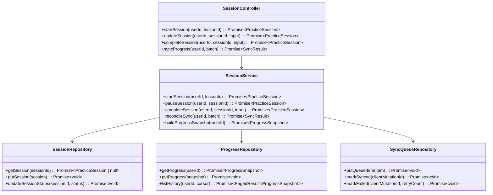

#### Python Model Design

```python
from typing import Literal, Optional

from pydantic import BaseModel


class StartSessionInput(BaseModel):
    lessonId: str


class UpdateSessionInput(BaseModel):
    status: Optional[Literal["active", "paused"]] = None
    completionPercent: Optional[int] = None
    recordingLocalUri: Optional[str] = None


class CompleteSessionInput(BaseModel):
    completionPercent: int
    durationSeconds: int
    recordingLocalUri: Optional[str] = None
    clientMutationId: str


class SyncBatch(BaseModel):
    items: list[SyncQueueItem]


class SyncResult(BaseModel):
    synced: list[str]
    failed: list[str]
```

#### Practice Session State Machine

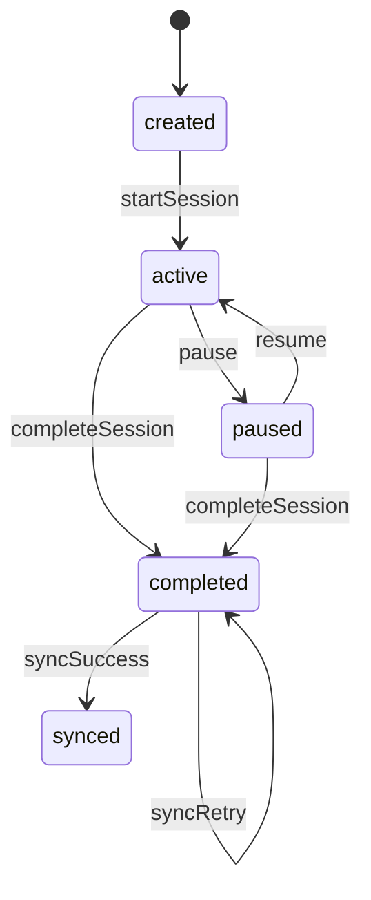

#### Business Logic

- Session starts create a server-side summary immediately.
- Session completion must be idempotent by `clientMutationId`.
- Progress snapshot updates should roll streaks and totals forward only once.
- Offline sync should reconcile in the order of client mutation time.

#### Validation Rules

- Session duration cannot exceed app-defined MVP max.
- `completionPercent` must be between 0 and 100.
- `durationSeconds` must be positive.
- `clientMutationId` is required for completion and sync.

#### Error Handling

| Code                    | Condition                         | Handling                 |
| ----------------------- | --------------------------------- | ------------------------ |
| `SESSION_NOT_FOUND`     | Missing session                   | Return 404               |
| `SESSION_STATE_INVALID` | Wrong state transition            | Return 409               |
| `SYNC_CONFLICT`         | Duplicate or conflicting mutation | Return 409 and reconcile |
| `VALIDATION_ERROR`      | Invalid payload                   | Return 422               |
| `SYSTEM_ERROR`          | DB failure                        | Return 500               |

#### Access Pattern Notes

- `GetItem` by `sessionId`.
- `PutItem` for new session creation.
- `UpdateItem` for status transitions.
- User progress by `userId` with sort key or GSI for history.
- Sync queue by `userId` and `clientMutationId`.

## 3. Mobile Client Design

### 3.1 Component Hierarchy

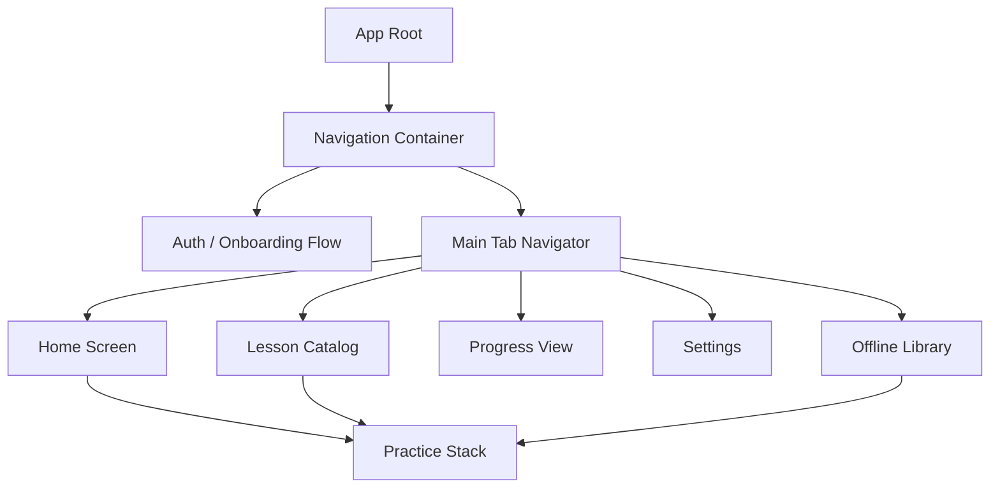

### 3.2 State Management

- Use Zustand for lightweight global state.
- Keep auth, consent, lesson cache, session state, and sync queue in separate stores.
- Use local component state for ephemeral UI state.
- Keep network request state isolated in query helpers.

### 3.3 Native Module Interfaces

- `AudioPlaybackNativeModule` is the cross-platform JavaScript-facing abstraction, while `IosAudioSessionModule`, `AndroidPlaybackModule`, and `RecordingComparisonModule` in Section 3.3.1 are the platform-specific native implementations that back this abstraction.

```ts
export interface AudioPlaybackNativeModule {
  play(assetUri: string): Promise<void>;
  pause(): Promise<void>;
  resume(): Promise<void>;
  stop(): Promise<void>;
  setPosition(positionMs: number): Promise<void>;
}

export interface RecordingNativeModule {
  startRecording(outputPath: string): Promise<void>;
  stopRecording(): Promise<{ fileUri: string; durationMs: number }>;
  getLevelMeter(): Promise<number>;
}

export interface LocalNotificationModule {
  scheduleReminder(time: string, title: string, body: string): Promise<void>;
  cancelReminder(id: string): Promise<void>;
}
```

### 3.3.1 Audio Playback & Background Audio Design

#### iOS Audio Session

- Use `AVAudioSessionCategoryPlayback` for background playback on the lesson player.
- Include `allowBluetooth` and `allowBluetoothA2DP` so audio routes correctly to Bluetooth headsets.
- Keep the session active across lock-screen transitions so playback continues when the app is backgrounded.
- When recording comparison starts, temporarily switch to a record-capable session and then restore playback-only mode after capture ends.

#### Android Audio Focus and ExoPlayer

- Request audio focus with `AudioFocusRequest` before playback begins.
- Configure ExoPlayer with speech-oriented `AudioAttributes` and background playback enabled through a foreground service.
- Keep the player wired to a `MediaSession` so lock-screen media controls remain available.
- Prefer ducking for transient interruptions and resume full volume when focus returns.

#### Lock Screen Controls and Bluetooth Routing

- iOS publishes track metadata and transport state via `MPNowPlayingInfoCenter`.
- Android exposes transport state and metadata through `MediaSession`.
- Bluetooth A2DP is used for normal playback routing; Bluetooth SCO is only used when microphone capture is active.
- Ducking should reduce volume rather than stopping playback for short, non-fatal interruptions.

#### Audio Buffer Pre-Load Strategy

- Preload lesson metadata and prepare the player before the user presses play.
- Keep the first audio segment and decoder primed while the lesson screen is visible.
- Maintain a warm buffer so first audible output can meet the NFR-2 playback latency target of `<=150ms`.
- If the audio file is already cached locally, skip network resolution and open the file immediately.

#### Dual-Track Playback for Recording Comparison

- FR-4 comparison mode uses two synchronized tracks: the native lesson track and the user recording track.
- The tracks share a monotonic timebase and are corrected for drift during playback.
- The comparison UI supports `solo_native`, `solo_user`, and `simultaneous` playback modes.
- The synchronization tolerance is `+/-500ms`.

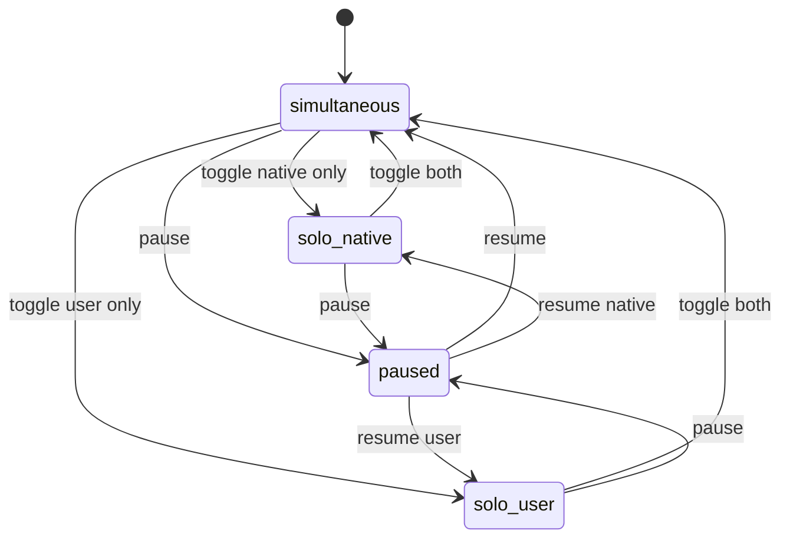

#### Native Module Interfaces

```ts
export type AudioRoute =
  | "speaker"
  | "wired_headphones"
  | "bluetooth_a2dp"
  | "bluetooth_sco";

export type PlaybackMode = "solo_native" | "solo_user" | "simultaneous";

export type AudioSessionConfig = {
  backgroundPlayback: boolean;
  allowBluetooth: boolean;
  allowBluetoothA2DP: boolean;
  duckOthers: boolean;
};

export type NowPlayingMetadata = {
  title: string;
  subtitle?: string;
  artworkUri?: string;
  durationMs?: number;
  elapsedMs?: number;
};

export interface IosAudioSessionModule {
  configurePlaybackSession(config: AudioSessionConfig): Promise<void>;
  activateSession(): Promise<void>;
  deactivateSession(): Promise<void>;
  publishNowPlaying(metadata: NowPlayingMetadata): Promise<void>;
}

export interface AndroidPlaybackModule {
  requestAudioFocus(): Promise<boolean>;
  abandonAudioFocus(): Promise<void>;
  configureExoPlayer(options: AudioSessionConfig): Promise<void>;
  publishMediaSession(metadata: NowPlayingMetadata): Promise<void>;
}

export interface RecordingComparisonModule {
  prepareDualTrackPlayback(
    nativeAudioUri: string,
    recordingUri: string,
  ): Promise<void>;
  setPlaybackMode(mode: PlaybackMode): Promise<void>;
  syncPlayback(offsetMs: number): Promise<void>;
  getCurrentRoute(): Promise<AudioRoute>;
}
```

### 3.3.2 Local Reminder Notifications - Flow Design

#### Zustand Store Shape

```ts
export type NotificationPermissionStatus =
  | "unknown"
  | "granted"
  | "denied"
  | "blocked";
export type NotificationRecoveryState =
  | "idle"
  | "denied"
  | "recovery_prompt"
  | "settings_redirect";

export type NotificationPreferencesState = {
  reminderEnabled: boolean;
  reminderTime: string; // format: HH:MM in device local time, e.g. "08:00"
  permissionStatus: NotificationPermissionStatus;
  recoveryState: NotificationRecoveryState;
  scheduledNotificationId?: string;
};
```

#### Permission Recovery and Deeplink Routing

- The reminder permission flow transitions `denied -> recovery_prompt -> settings_redirect` when the user refuses notification access.
- `recovery_prompt` explains why reminders matter and offers a settings shortcut rather than blocking the app.
- Notification taps should deep-link into the relevant practice flow, typically restoring the last lesson or today’s practice target.
- The deeplink handler must preserve the navigation intent even on a cold start from the notification tray.

#### Notification Module Notes

- Schedule and cancel operations should be idempotent so repeated taps do not create duplicate reminders.
- The reminder schedule should be revalidated after a time-zone or device clock change.
- Zustand persistence should restore the notification preference state after app restart.

### 3.4 Offline Storage Schema

```ts
export type CachedLessonRow = {
  lessonId: LessonId;
  title: string;
  level: string;
  topic: string;
  thumbnailUrl: string;
  durationSeconds: number;
  audioAssetPath: string;
  scriptAssetPath: string;
  audioChecksum: string; // verified against LessonAsset.checksum after download
  scriptChecksum: string; // verified against LessonAsset.checksum after download
  sizeBytes: number; // used by StorageQuotaManager for accurate quota accounting
  downloadedAt: IsoDateTime;
};

/**
 * Thumbnails are cached in app data under `thumbnails/<topic>.webp`.
 * The path is derived from `Lesson.thumbnailUrl` when downloaded.
 * All lessons sharing the same topic reuse the same cached file.
 */
export type ThumbnailCacheRow = {
  topic: string; // cache key, matches Lesson.topic
  localPath: string; // e.g. "thumbnails/conversation.webp"
  sourceUrl: string; // the CDN URL it was fetched from
  downloadedAt: IsoDateTime;
};

export type PendingSyncRow = {
  id: Id;
  userId: UserId;
  clientMutationId: ClientMutationId;
  type: string;
  payloadJson: string;
  retryCount: number;
  nextRetryAt?: IsoDateTime;
  status: "pending" | "failed" | "synced";
};

export type SessionDraftRow = {
  sessionId: SessionId;
  lessonId: LessonId;
  status: "created" | "active" | "paused" | "completed";
  completionPercent?: number;
  recordingLocalUri?: string;
  updatedAt: IsoDateTime;
};

export type RecordingReferenceRow = {
  sessionId: SessionId;
  fileUri: string;
  checksum?: string;
  createdAt: IsoDateTime;
};

export type AdCounterRow = {
  userId: UserId;
  dateKey: string; // format: YYYY-MM-DD in device local time
  shownCount: number;
  updatedAt: IsoDateTime;
};
```

#### Offline Storage Quota Enforcement

```ts
export interface StorageQuotaManager {
  checkAvailable(requiredBytes: number): boolean;
  evictLeastRecentlyUsed(): Promise<void>;
}
```

- The per-user offline storage cap is `500 MB`.
- Eviction removes the least-recently-used downloaded lessons first.
- The quota manager should run before large downloads and again after download completion if the cache is close to the cap.
- If quota cannot be recovered, the download flow should transition to an `insufficient_storage` state.
- `AdCounterRow` is keyed by `(userId, dateKey)` and is the authoritative source for daily frequency capping enforced by `AdIntegrationController.canShowAd()`.

```ts
export type DownloadStorageState =
  | "idle"
  | "checking"
  | "evicting"
  | "downloading"
  | "insufficient_storage"
  | "complete";
```

### 3.5 Client Error Handling

- Show skeletons for lesson lists and progress hydration.
- Persist local drafts immediately before network sync.
- Retry sync with exponential backoff.
- Show permission recovery states for microphone, storage, and notifications.
- Keep practice screens usable even when sync fails.

### 3.6 Ad Integration Design

#### AdMob Initialization and Consent Integration

- AdMob initializes once the app has loaded the persisted consent state.
- `ConsentService` is the source of truth for personalized versus non-personalized requests.
- If consent allows personalization, the client requests personalized ads.
- If consent is denied, unknown, or not yet resolved, the app uses a non-personalized request or suppresses the request if required by policy.
- Ad initialization is client-only and must not block the rest of the app shell.

#### Initialization Sequence

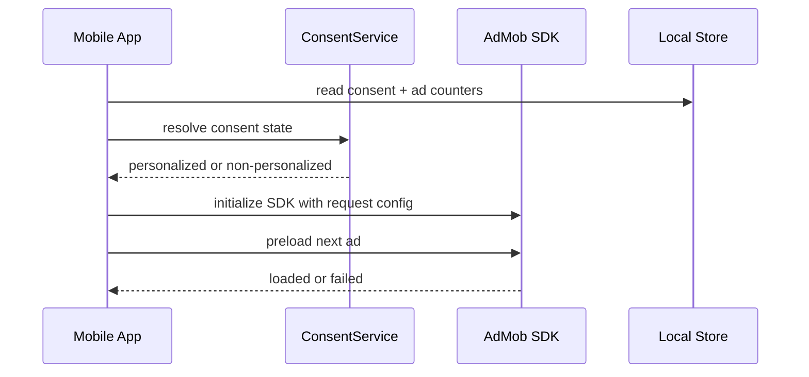

#### Ad Load and Show Lifecycle

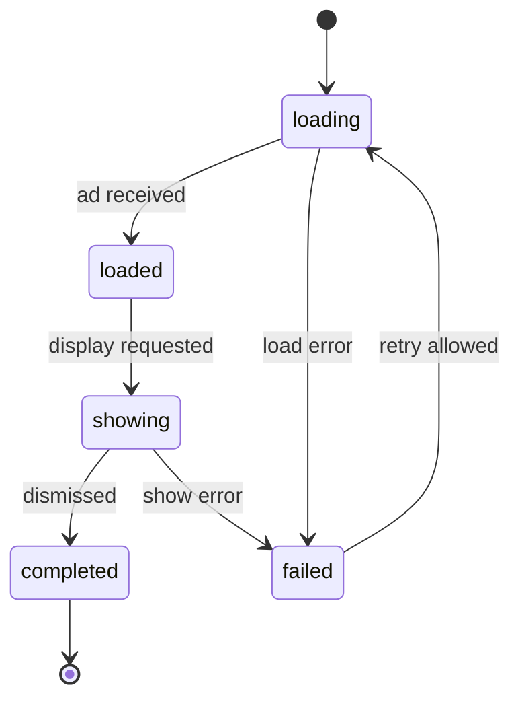

#### Frequency Capping

- The client enforces a hard cap of `2` ads per user per day.
- The counter is persisted locally and keyed by the user ID plus the device-local date.
- The cap is checked before any show request, not after the ad has already started.
- If the local cap store is missing or corrupted, the safe behavior is to suppress the ad for that session boundary.

#### Failure Handling

- If an ad fails to load or show, the practice flow continues without interruption.
- No ad failure should block session completion, progress sync, or navigation.
- Failed ad requests can be retried on the next eligible boundary, subject to the daily cap.

```ts
export type AdLifecycleState =
  | "idle"
  | "loading"
  | "loaded"
  | "showing"
  | "completed"
  | "failed";

export type AdConsentMode = "personalized" | "non_personalized";

// AdCounterRow is defined in Section 3.4 and is the single source of truth for the counter shape.

export interface AdIntegrationController {
  initialize(consentMode: AdConsentMode): Promise<void>;
  preloadInterstitial(): Promise<void>;
  canShowAd(counter: AdCounterRow): Promise<boolean>;
  showInterstitial(): Promise<AdLifecycleState>;
}
```

### 3.7 NFR Coverage Notes

- `NFR-1` cold start `<=2.5s`: lazy-load non-critical feature modules, defer heavy native initialization, and hydrate Zustand stores after the first frame.
- `NFR-3` API p95 `<=300ms`: cache lesson catalog reads with a short client TTL, and consider DynamoDB DAX or a read-through cache for hot catalog paths.
- `NFR-4` resumable download: use HTTP `Range` requests for asset resume and verify checksum after the final chunk is written.
- `NFR-9` 10k concurrent users: configure Lambda reserved concurrency per module entry point when using the Lambda deployment shape; use DynamoDB on-demand capacity to absorb burst reads; keep the lesson catalog response cacheable at the API Gateway layer with a short TTL to reduce backend invocations during traffic spikes.
- `NFR-14` WCAG 2.1 AA: all interactive components must declare `accessibilityLabel` and `accessibilityRole`; tap targets must be at least 44x44pt on iOS and 48x48dp on Android; text must support dynamic type scaling without truncation; test with iOS VoiceOver and Android TalkBack before each release.
- `NFR-20` crash rate `<=0.5%`: add a global React Native error boundary and an unhandled promise rejection handler so the app degrades instead of terminating.

## 4. API Layer Design

### 4.1 Middleware Chain

1. Request ID assignment
2. Structured request logging
3. JWT verification
4. Consent check
5. Input validation
6. Rate limiting
7. Handler execution
8. Response formatting

### 4.2 Response Envelope

```python
from typing import Optional, TypeVar

T = TypeVar("T")


def success(data: T, requestId: str) -> JsonEnvelope[T]:
    return JsonEnvelope(ok=True, data=data, requestId=requestId)


def failure(error: ApiErrorPayload, requestId: str) -> JsonEnvelope[None]:
    return JsonEnvelope(ok=False, error=error, requestId=requestId)
```

### 4.3 Example Handler Logic

```python
from fastapi import APIRouter, Query, Request


router = APIRouter()


@router.get("/lessons", response_model=JsonEnvelope[PagedResult[Lesson]])
async def list_lessons_handler(
    request: Request,
    cursor: Optional[str] = Query(default=None),
    limit: Optional[int] = Query(default=None),
) -> JsonEnvelope[PagedResult[Lesson]]:
    ctx = await auth_middleware(request)
    await consent_guard(ctx.userId)
    lesson_filter = LessonFilter(cursor=cursor, limit=limit)
    page = await content_controller.list_lessons(lesson_filter, cursor)
    return success(page, requestId=ctx.requestId)
```

### 4.4 Pagination and Sorting

- Use cursor-based pagination.
- Return a small page size by default.
- Sorting is by published order or lesson recency.
- Filters should be stable and reproducible.

## 5. DynamoDB Design

### 5.1 Table Strategy

MVP may use a shared schema or a few tables. A practical split is:

- `ShadowSpeakUsers`
- `ShadowSpeakLessons`
- `ShadowSpeakSessions`
- `ShadowSpeakSyncQueue`

### 5.2 Access Patterns

| Access Pattern              | Table     | Key Pattern                                                 |
| --------------------------- | --------- | ----------------------------------------------------------- |
| Get user profile            | Users     | `PK=user#{userId}`                                          |
| Get consent state           | Users     | `PK=user#{userId}`                                          |
| List lessons by level/topic | Lessons   | `GSI1PK=level#{level}` / `GSI1SK=topic#{topic}#publishedAt` |
| Get lesson detail           | Lessons   | `PK=lesson#{lessonId}`                                      |
| Start session               | Sessions  | `PK=user#{userId}`, `SK=session#{sessionId}`                |
| List recent history         | Sessions  | `GSI1PK=user#{userId}` / `GSI1SK=completedAt`               |
| Sync offline batch          | SyncQueue | `PK=user#{userId}`, `SK=mutation#{clientMutationId}`        |

### 5.3 TTL and Capacity Notes

- Sync queue items can use TTL after successful reconciliation.
- Session audit items can be retained per retention policy.
- On-demand capacity is appropriate for MVP unless costs justify provisioned auto-scaling.

### 5.4 Data Retention Design

- Session records use a DynamoDB `expiresAt` attribute and a 2-year retention period per the FRS.
- Sync queue items receive a TTL after successful reconciliation so the queue does not grow indefinitely.
- The GDPR/CCPA purge pipeline is triggered by `deleteAccount` and must complete within the 30-day grace window.
- The purge workflow should mark user-scoped items for deletion first, then rely on TTL as the safety net for any residual records.
- Affected tables should map their TTL behavior explicitly:
  - `ShadowSpeakUsers`: tombstone records with a 30-day purge window after `deletionRequestedAt`.
  - `ShadowSpeakSessions`: `expiresAt` set to 2 years by default, or accelerated to the deletion grace window when account deletion is requested.
  - `ShadowSpeakSyncQueue`: short post-reconciliation TTL, plus forced purge during account deletion.

| Data Type               | Retention Period                               | Purge Mechanism                                                |
| ----------------------- | ---------------------------------------------- | -------------------------------------------------------------- |
| User profile            | Until account deletion or active use           | `deleteAccount` tombstone, then hard delete or TTL purge       |
| Consent record          | Until account deletion or active use           | Cascade delete from profile lifecycle                          |
| Session record          | 2 years                                        | DynamoDB `expiresAt` TTL, with early purge on account deletion |
| Sync queue item         | Until reconciliation or short post-sync window | TTL after successful reconciliation                            |
| Local device cache      | Until user signs out or deletes account        | Client-side storage clear                                      |
| Downloaded lesson cache | Until user removes lesson or quota eviction    | LRU eviction plus optional user purge                          |

## 6. Offline Sync Design

### 6.1 Sync Flow

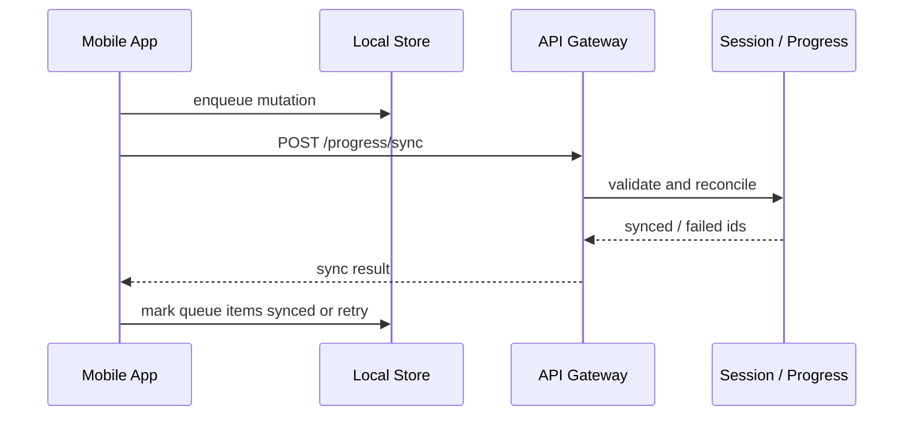

### 6.2 Conflict Resolution

- Use `clientMutationId` for idempotency.
- Prefer last-write-wins for simple progress metadata.
- Do not overwrite a newer synced completion with an older retry.
- Keep sync operations deterministic and small.

### 6.3 Retry Logic

- Retry failed syncs with exponential backoff.
- Cap retries to avoid battery drain.
- Surface a non-blocking warning if the queue grows too large.

## 7. Security Implementation Details

### 7.1 JWT Validation Middleware

```python
from fastapi import Request


async def auth_middleware(request: Request) -> AuthContext:
    token = extract_bearer_token(request.headers.get("Authorization"))
    claims = await verify_cognito_jwt(token)
    return AuthContext(
        userId=claims["sub"],
        claims=claims,
        groups=claims.get("cognito:groups", claims.get("cognito_groups", [])),
    )
```

### 7.2 Signed URL Generation

- Generate S3 presigned URLs server-side.
- TTL should be short, typically minutes rather than hours.
- Only authorized users should receive asset URLs.
- Verify checksums after download.

### 7.3 KMS Encryption Approach

- Use KMS-backed encryption for sensitive server data.
- Keep local secrets in Keychain / Keystore.
- Avoid logging PII or raw tokens.

### 7.4 Audit Logging

```python
from typing import Literal

from pydantic import BaseModel


class ConsentAuditLog(BaseModel):
    eventType: Literal["consent_update"]
    userId: UserId
    ageVerified: bool
    privacyAccepted: bool
    adConsent: str
    timestamp: IsoDateTime
    requestId: str
```

## 8. Error Handling and Logging

### 8.1 Error Classification

| Category   | Example                                                      |
| ---------- | ------------------------------------------------------------ |
| Validation | invalid filter, malformed payload                            |
| Auth       | missing token, expired token                                 |
| Business   | lesson unpublished, consent denied, invalid state transition |
| System     | DynamoDB error, S3 error, unexpected exception               |

### 8.2 Log Format

```python
from typing import Any, Literal, Optional

from pydantic import BaseModel


class LogEntry(BaseModel):
    level: Literal["debug", "info", "warn", "error"]
    requestId: str
    module: str
    action: str
    userId: Optional[str] = None
    lessonId: Optional[str] = None
    sessionId: Optional[str] = None
    message: str = ""
    context: dict[str, Any] | None = None
```

### 8.3 Client Error Handling Pattern

- Show retry CTA for system failures.
- Show validation messages inline.
- Keep onboarding failures recoverable.
- Cache the last successful data set to avoid blank screens.

## 9. Sequence Diagrams

### 9.1 Onboarding Flow

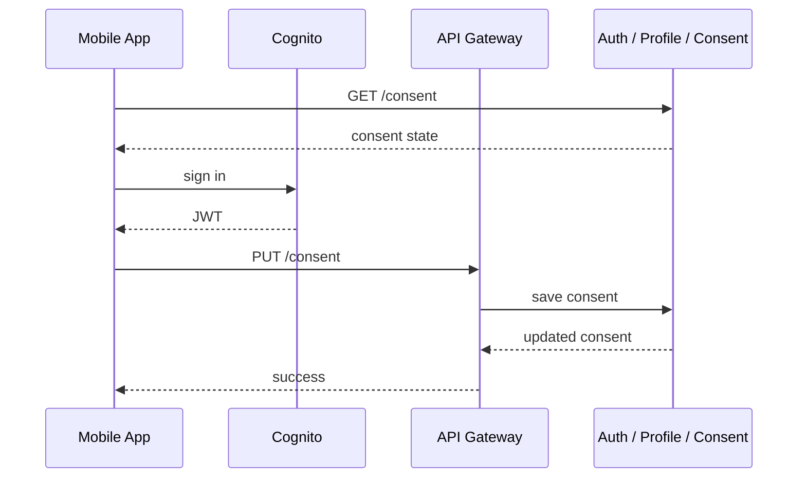

### 9.2 Browse → Download → Practice Flow

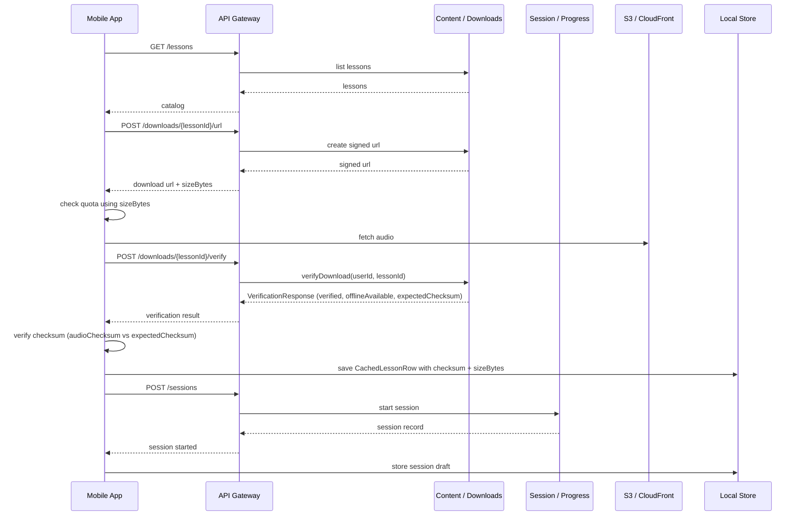

### 9.3 Sync Reconciliation Flow

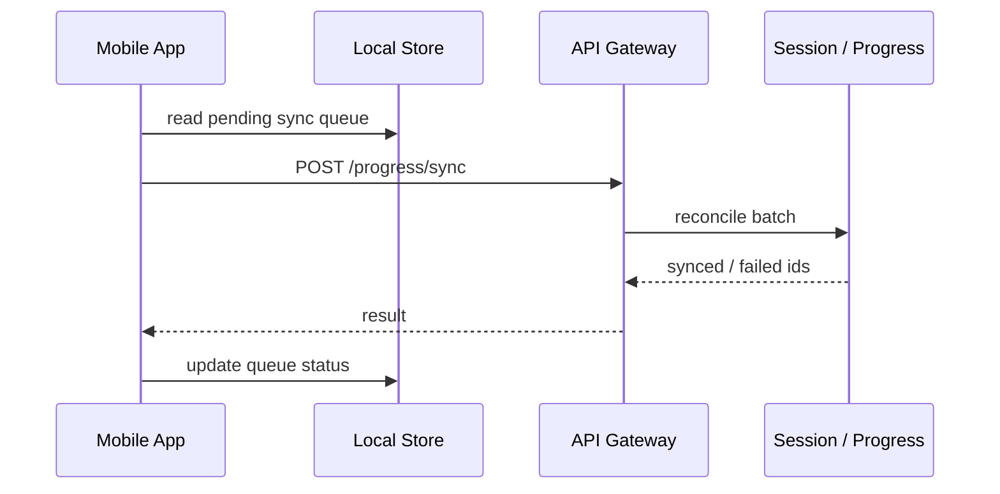

### 9.4 UC-04 Recording Comparison Flow

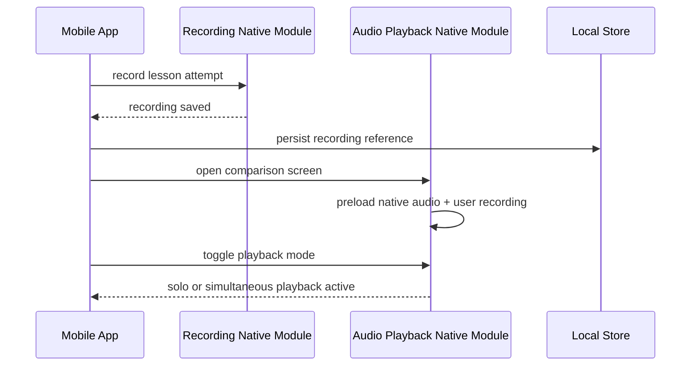

### 9.5 UC-07 Reminder Notification Schedule/Cancel Flow

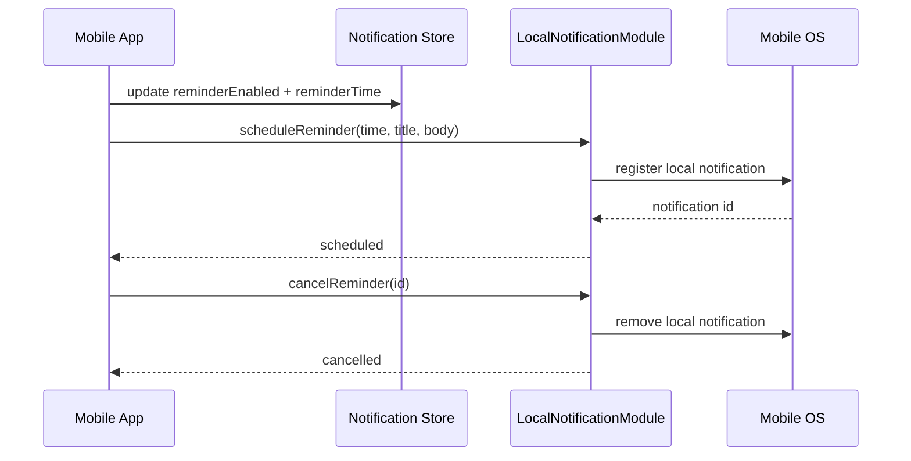

### 9.6 UC-09 Ad Serving at Session Boundary

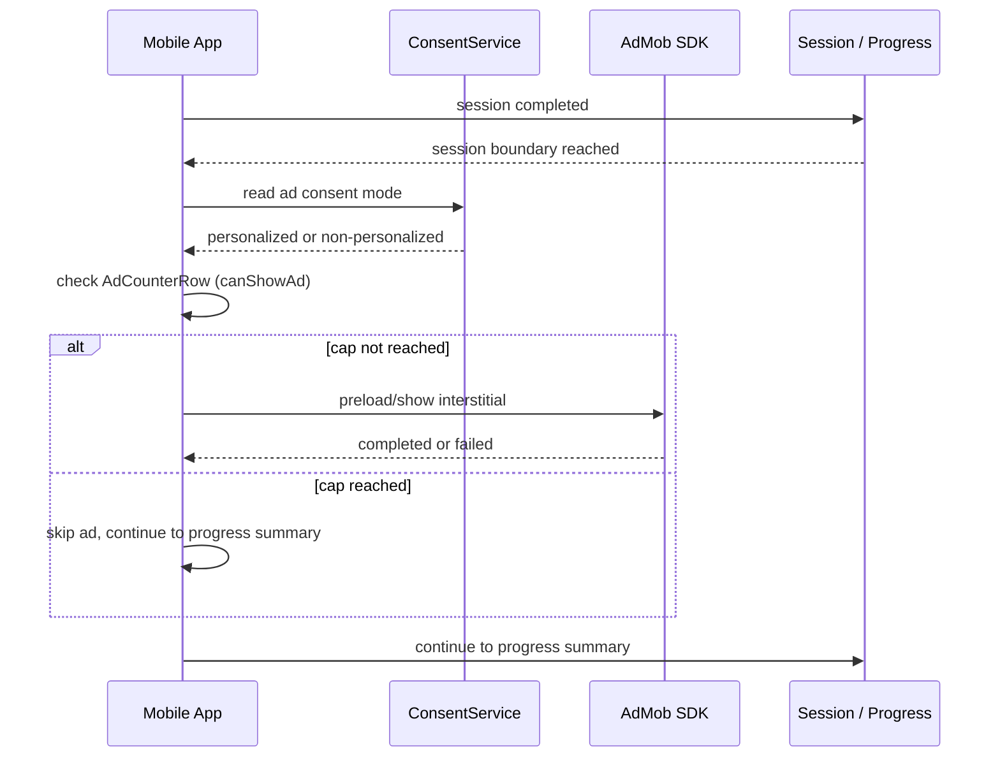

### 9.7 Account Deletion Flow

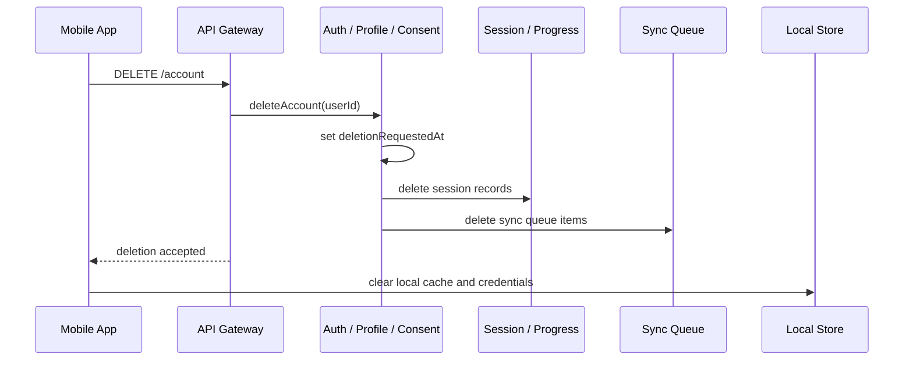

## 10. Testing Strategy

### 10.1 Unit Tests

- Auth middleware token parsing
- Consent validation and state transitions
- Lesson filter validation
- Signed URL creation
- Session state transition logic
- Sync reconciliation and idempotency
- Ad frequency capping counter logic
- Account deletion cascade order
- Notification permission state transitions

### 10.2 Integration Tests

- Cognito token verification against mocked JWTs
- DynamoDB repository reads and writes
- S3 presigned URL generation
- Offline sync batches with repeated retries
- Content browse and session completion flows
- AdMob consent-mode initialization
- Account deletion end-to-end cascade across DynamoDB tables
- Reminder schedule and cancel with OS permission grant and denial

### 10.3 Mock Strategy

- Mock Cognito verification in unit tests.
- Use local DynamoDB emulation for repository tests.
- Stub S3 URL generation where needed.
- Keep client tests isolated from network and storage side effects.

## 11. Traceability Matrix

| LLD Component            | HLD Component                           | Functional Requirements | Use Cases                  | UI / Flow References                                    |
| ------------------------ | --------------------------------------- | ----------------------- | -------------------------- | ------------------------------------------------------- |
| Auth / Profile / Consent | Auth / Profile / Consent Module         | FR-1, FR-8, FR-9        | UC-01, UC-10, UC-11        | Age Gate, Privacy and Ad Consent, Sign In, Settings     |
| Content / Downloads      | Content / Downloads Module              | FR-2, FR-7              | UC-02, UC-06               | Home, Lesson Catalog, Lesson Detail, Downloaded Lessons |
| Session / Progress       | Session / Progress Module               | FR-3, FR-4, FR-5        | UC-03, UC-04, UC-05, UC-08 | Practice Session, Recording Comparison, Progress View   |
| Mobile client            | Client app architecture                 | FR-1 through FR-9       | UC-01 through UC-11        | All mobile screens                                      |
| Offline sync             | Session / Progress Module + local store | FR-3, FR-4, FR-5, FR-7  | UC-03, UC-04, UC-06        | Offline Practice Session                                |
| Monetization             | AdMob SDK integration                   | FR-6                    | UC-09                      | Session boundary ad interstitial                        |
| Account Deletion         | Auth / Profile / Consent Module         | FR-8                    | UC-10                      | Settings -> Delete Account                              |
| Reminder Notifications   | Mobile Client (Notification Module)     | FR-8                    | UC-07                      | Settings -> Reminder Preferences                        |

## 12. Revision History

| Version | Date       | Author            | Description                                                 |
| ------- | ---------- | ----------------- | ----------------------------------------------------------- |
| 1.10    | 2026-05-14 | Backend Developer | Initial LLD draft for MVP modular backend and mobile client |
