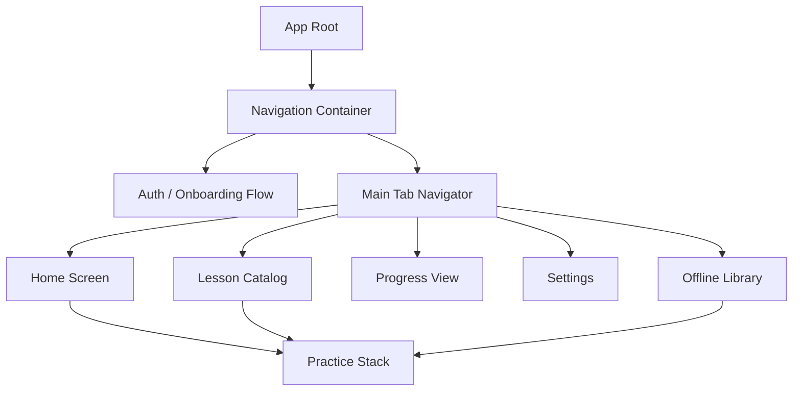
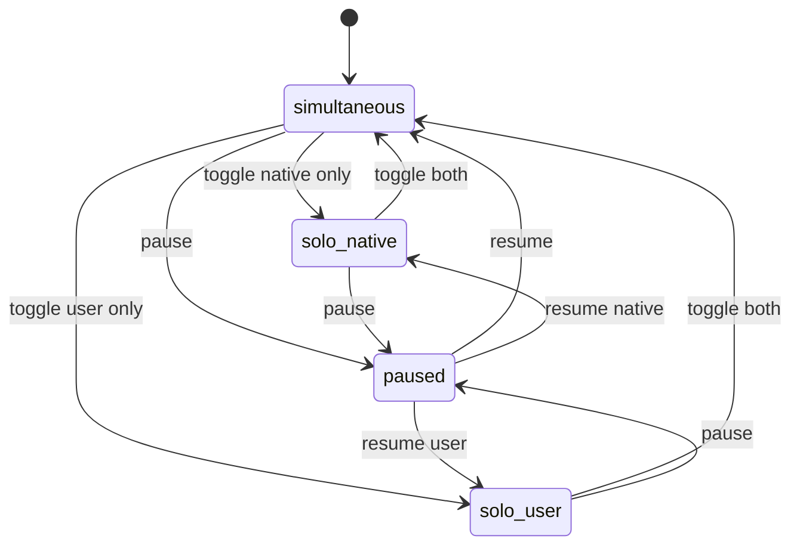
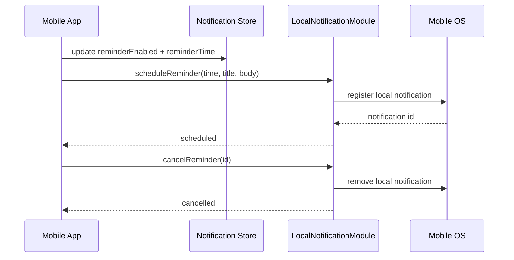
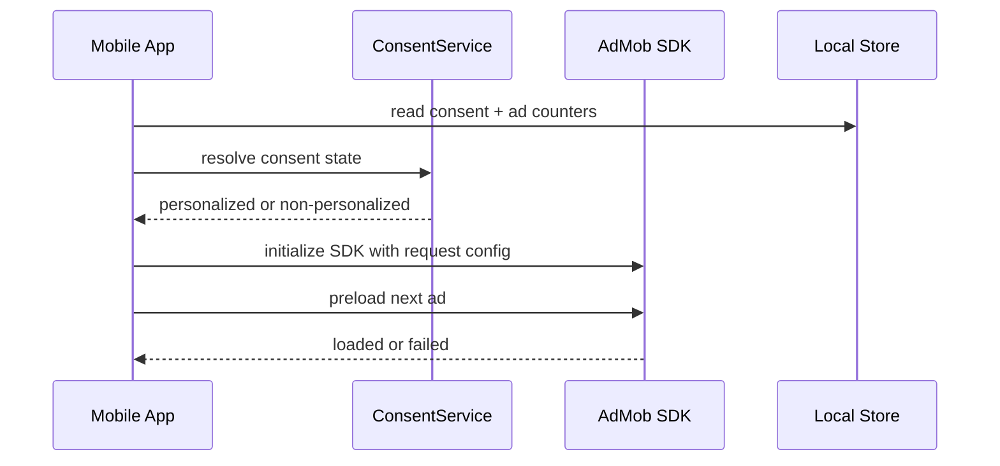
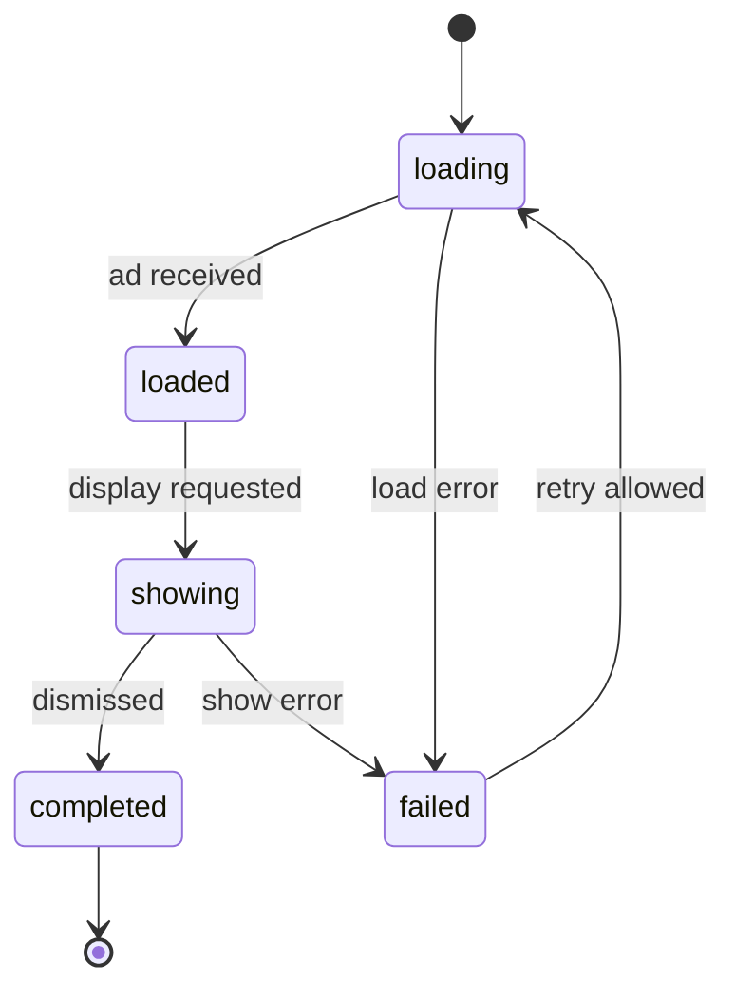
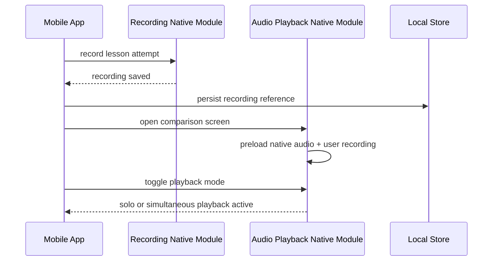

# ShadowSpeak Low-Level Design — Mobile Client

## Document Metadata

| Field         | Value                          |
| ------------- | ------------------------------ |
| Project       | ShadowSpeak                    |
| Document Type | Low-Level Design Document      |
| Phase         | 04 - Solution Architecture     |
| Date          | 2026-05-14                     |
| Status        | Draft                          |
| Version       | 1.0                            |
| Owner         | Mobile Developer               |

> This document covers the **mobile client** (React Native + TypeScript) portion of the LLD. See [03-Low-Level-Design-Backend.md](03-Low-Level-Design-Backend.md) for the backend portion and [07-Mobile-Storage-Design.md](07-Mobile-Storage-Design.md) for the SQLite offline schema.

## Source Basis

This LLD is derived from:

- [Solution Architecture Document](01-Solution-Architecture-Document.md)
- [High-Level Design Document](02-High-Level-Design-Document.md)
- [Low-Level-Design-Backend.md](03-Low-Level-Design-Backend.md)
- [Functional Requirements Specification](../02-analysis/03-Functional-Requirements-Specification.md)
- [User Flow Diagram](../03-ux-ui-design/01-User-Flow-Diagram.md)
- [Wireframe Document](../03-ux-ui-design/03-Wireframe-Document.md)
- [UI Design Specification](../03-ux-ui-design/04-UI-Design-Specification.md)

## Scope

- React Native component hierarchy and navigation
- State management (Zustand)
- Native module interfaces (audio playback, recording, notifications)
- Audio playback and background audio design (iOS + Android)
- Recording comparison dual-track playback
- Local reminder notification flow
- AdMob integration and frequency capping
- Client error handling and NFR coverage

## Technology Stack

| Layer           | Stack                                   |
| --------------- | --------------------------------------- |
| Mobile          | React Native + TypeScript               |
| State           | Zustand                                 |
| Offline storage | SQLite or Realm with encryption         |
| Ads             | AdMob SDK                               |
| Crash reporting | Crashlytics or Sentry                   |
| Audio           | Native modules (AVAudioSession, ExoPlayer) |

## 1. Component Hierarchy



## 2. State Management

- Use **Zustand** for lightweight global state.
- Keep auth, consent, lesson cache, session state, and sync queue in separate stores.
- Use local component state for ephemeral UI state.
- Keep network request state isolated in query helpers.

## 3. Native Module Interfaces

`AudioPlaybackNativeModule` is the cross-platform JavaScript-facing abstraction, while `IosAudioSessionModule`, `AndroidPlaybackModule`, and `RecordingComparisonModule` are the platform-specific native implementations that back this abstraction.

```ts
export interface AudioPlaybackNativeModule {
  play(assetUri: string): Promise<void>;
  pause(): Promise<void>;
  resume(): Promise<void>;
  stop(): Promise<void>;
  setPosition(positionMs: number): Promise<void>;
}

export interface RecordingNativeModule {
  startRecording(outputPath: string): Promise<void>;
  stopRecording(): Promise<{ fileUri: string; durationMs: number }>;
  getLevelMeter(): Promise<number>;
}

export interface LocalNotificationModule {
  scheduleReminder(time: string, title: string, body: string): Promise<void>;
  cancelReminder(id: string): Promise<void>;
}
```

### 3.1 Audio Playback & Background Audio Design

#### iOS Audio Session

- Use `AVAudioSessionCategoryPlayback` for background playback on the lesson player.
- Include `allowBluetooth` and `allowBluetoothA2DP` so audio routes correctly to Bluetooth headsets.
- Keep the session active across lock-screen transitions so playback continues when the app is backgrounded.
- When recording comparison starts, temporarily switch to a record-capable session and then restore playback-only mode after capture ends.

#### Android Audio Focus and ExoPlayer

- Request audio focus with `AudioFocusRequest` before playback begins.
- Configure ExoPlayer with speech-oriented `AudioAttributes` and background playback enabled through a foreground service.
- Keep the player wired to a `MediaSession` so lock-screen media controls remain available.
- Prefer ducking for transient interruptions and resume full volume when focus returns.

#### Lock Screen Controls and Bluetooth Routing

- iOS publishes track metadata and transport state via `MPNowPlayingInfoCenter`.
- Android exposes transport state and metadata through `MediaSession`.
- Bluetooth A2DP is used for normal playback routing; Bluetooth SCO is only used when microphone capture is active.
- Ducking should reduce volume rather than stopping playback for short, non-fatal interruptions.

#### Audio Buffer Pre-Load Strategy

- Preload lesson metadata and prepare the player before the user presses play.
- Keep the first audio segment and decoder primed while the lesson screen is visible.
- Maintain a warm buffer so first audible output can meet the NFR-2 playback latency target of `<=150ms`.
- If the audio file is already cached locally, skip network resolution and open the file immediately.

#### Dual-Track Playback for Recording Comparison

- FR-4 comparison mode uses two synchronized tracks: the native lesson track and the user recording track.
- The tracks share a monotonic timebase and are corrected for drift during playback.
- The comparison UI supports `solo_native`, `solo_user`, and `simultaneous` playback modes.
- The synchronization tolerance is `+/-500ms`.



#### Native Module Interfaces

```ts
export type AudioRoute =
  | "speaker"
  | "wired_headphones"
  | "bluetooth_a2dp"
  | "bluetooth_sco";

export type PlaybackMode = "solo_native" | "solo_user" | "simultaneous";

export type AudioSessionConfig = {
  backgroundPlayback: boolean;
  allowBluetooth: boolean;
  allowBluetoothA2DP: boolean;
  duckOthers: boolean;
};

export type NowPlayingMetadata = {
  title: string;
  subtitle?: string;
  artworkUri?: string;
  durationMs?: number;
  elapsedMs?: number;
};

export interface IosAudioSessionModule {
  configurePlaybackSession(config: AudioSessionConfig): Promise<void>;
  activateSession(): Promise<void>;
  deactivateSession(): Promise<void>;
  publishNowPlaying(metadata: NowPlayingMetadata): Promise<void>;
}

export interface AndroidPlaybackModule {
  requestAudioFocus(): Promise<boolean>;
  abandonAudioFocus(): Promise<void>;
  configureExoPlayer(options: AudioSessionConfig): Promise<void>;
  publishMediaSession(metadata: NowPlayingMetadata): Promise<void>;
}

export interface RecordingComparisonModule {
  prepareDualTrackPlayback(
    nativeAudioUri: string,
    recordingUri: string,
  ): Promise<void>;
  setPlaybackMode(mode: PlaybackMode): Promise<void>;
  syncPlayback(offsetMs: number): Promise<void>;
  getCurrentRoute(): Promise<AudioRoute>;
}
```

### 3.2 Local Reminder Notifications — Flow Design

#### Zustand Store Shape

```ts
export type NotificationPermissionStatus =
  | "unknown"
  | "granted"
  | "denied"
  | "blocked";
export type NotificationRecoveryState =
  | "idle"
  | "denied"
  | "recovery_prompt"
  | "settings_redirect";

export type NotificationPreferencesState = {
  reminderEnabled: boolean;
  reminderTime: string; // format: HH:MM in device local time, e.g. "08:00"
  permissionStatus: NotificationPermissionStatus;
  recoveryState: NotificationRecoveryState;
  scheduledNotificationId?: string;
};
```

#### Permission Recovery and Deeplink Routing

- The reminder permission flow transitions `denied -> recovery_prompt -> settings_redirect` when the user refuses notification access.
- `recovery_prompt` explains why reminders matter and offers a settings shortcut rather than blocking the app.
- Notification taps should deep-link into the relevant practice flow, typically restoring the last lesson or today's practice target.
- The deeplink handler must preserve the navigation intent even on a cold start from the notification tray.

#### Notification Module Notes

- Schedule and cancel operations should be idempotent so repeated taps do not create duplicate reminders.
- The reminder schedule should be revalidated after a time-zone or device clock change.
- Zustand persistence should restore the notification preference state after app restart.

#### Sequence Diagram: Reminder Schedule/Cancel Flow



## 4. Offline Storage Schema

See [07-Mobile-Storage-Design.md](07-Mobile-Storage-Design.md) for the full SQLite schema and storage quota manager design.

The key offline data structures managed by the mobile client are:

- `CachedLessonRow` — downloaded lesson metadata with checksums
- `ThumbnailCacheRow` — cached thumbnail references keyed by topic
- `PendingSyncRow` — queued offline progress for later sync
- `SessionDraftRow` — local practice session state
- `RecordingReferenceRow` — local recording file references
- `AdCounterRow` — daily ad frequency counter

## 5. Client Error Handling

- Show skeletons for lesson lists and progress hydration.
- Persist local drafts immediately before network sync.
- Retry sync with exponential backoff.
- Show permission recovery states for microphone, storage, and notifications.
- Keep practice screens usable even when sync fails.

## 6. Ad Integration Design

### 6.1 AdMob Initialization and Consent Integration

- AdMob initializes once the app has loaded the persisted consent state.
- `ConsentService` is the source of truth for personalized versus non-personalized requests.
- If consent allows personalization, the client requests personalized ads.
- If consent is denied, unknown, or not yet resolved, the app uses a non-personalized request or suppresses the request if required by policy.
- Ad initialization is client-only and must not block the rest of the app shell.

#### Initialization Sequence



#### Ad Load and Show Lifecycle



### 6.2 Frequency Capping

- The client enforces a hard cap of **2** ads per user per day.
- The counter is persisted locally and keyed by the user ID plus the device-local date.
- The cap is checked before any show request, not after the ad has already started.
- If the local cap store is missing or corrupted, the safe behavior is to suppress the ad for that session boundary.

### 6.3 Failure Handling

- If an ad fails to load or show, the practice flow continues without interruption.
- No ad failure should block session completion, progress sync, or navigation.
- Failed ad requests can be retried on the next eligible boundary, subject to the daily cap.

```ts
export type AdLifecycleState =
  | "idle"
  | "loading"
  | "loaded"
  | "showing"
  | "completed"
  | "failed";

export type AdConsentMode = "personalized" | "non_personalized";

export interface AdIntegrationController {
  initialize(consentMode: AdConsentMode): Promise<void>;
  preloadInterstitial(): Promise<void>;
  canShowAd(counter: AdCounterRow): Promise<boolean>;
  showInterstitial(): Promise<AdLifecycleState>;
}
```

## 7. Sequence Diagrams

### 7.1 Recording Comparison Flow (UC-04)



## 8. NFR Coverage Notes

- **NFR-1** cold start `<=2.5s`: lazy-load non-critical feature modules, defer heavy native initialization, and hydrate Zustand stores after the first frame.
- **NFR-3** API p95 `<=300ms`: cache lesson catalog reads with a short client TTL, and consider DynamoDB DAX or a read-through cache for hot catalog paths.
- **NFR-4** resumable download: use HTTP `Range` requests for asset resume and verify checksum after the final chunk is written.
- **NFR-14** WCAG 2.1 AA: all interactive components must declare `accessibilityLabel` and `accessibilityRole`; tap targets must be at least 44x44pt on iOS and 48x48dp on Android; text must support dynamic type scaling without truncation; test with iOS VoiceOver and Android TalkBack before each release.
- **NFR-20** crash rate `<=0.5%`: add a global React Native error boundary and an unhandled promise rejection handler so the app degrades instead of terminating.

## 9. Revision History

| Version | Date       | Author          | Description                                                  |
| ------- | ---------- | --------------- | ------------------------------------------------------------ |
| 1.0     | 2026-05-14 | Mobile Developer | Initial LLD draft for MVP mobile client — extracted from unified LLD |
